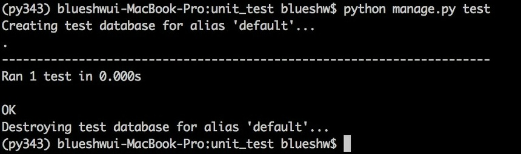
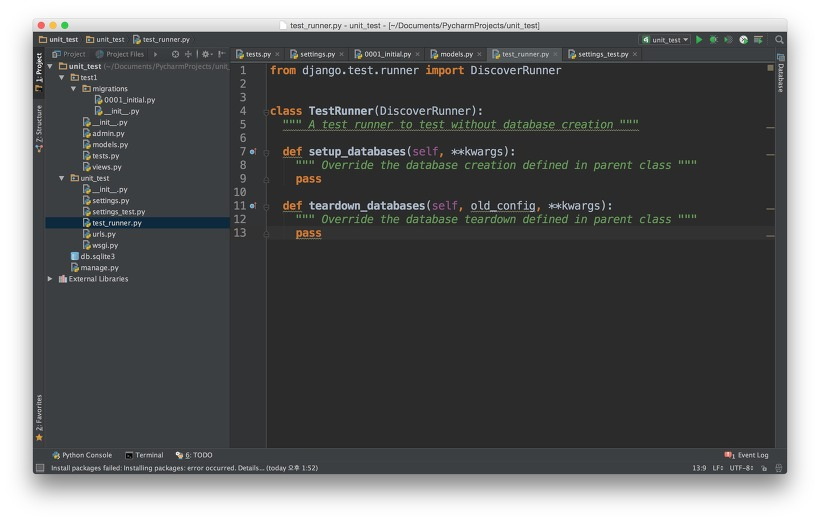
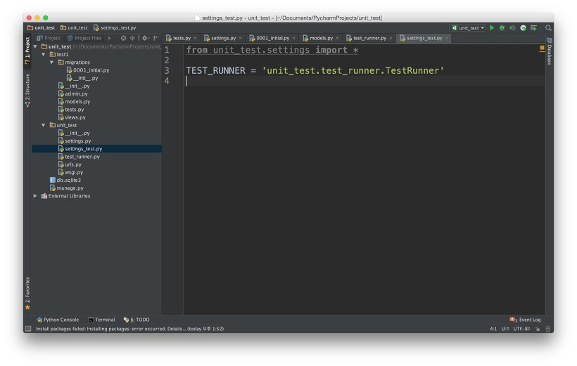
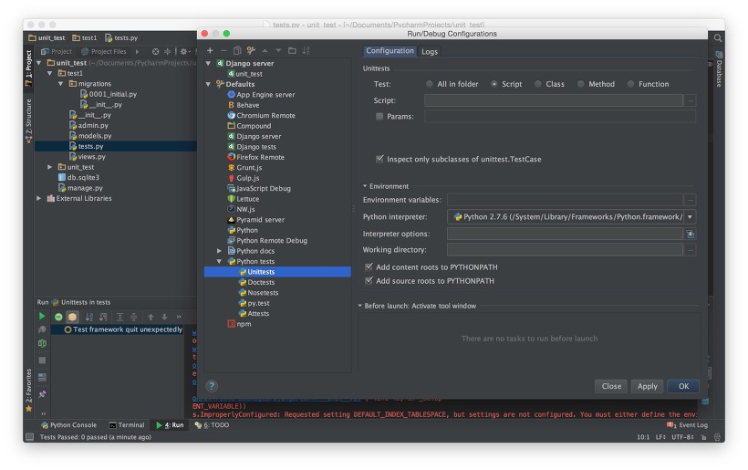

장고 프로젝트 역시 다른 웹 프레임워크와 마찬가지로 모듈의 로직을 검증하기 위한 유닛테스트가 존재합니다.
테스트를 위한 추가적인 모듈을 설치해서 좀더 편리하게 유닛테스트를 진행할 수도 있지만,
일단은 장고에서 기본적으로 지원하는 테스트 기능을 이용해서 테스트 해보았습니다.

그런데, 장고에서 유닛테스트를 진행해보면, 한가지 문제가 발생합니다.
바로 검증 데이터를 저장하기 위한 테스트 DB 를 생성한다는 점인데요.

저도 사실 이 테스트 DB 가 생성되는 이유는 잘 모르겠습니다.
테스트 DB 가 새로운 테스트를 실행될 때마다 매번 지워졌다 새로 생성 되기 때문이죠.
만약 테스트 데이터를 보존해서 테스트 결과를 누적하기 위함이라면 몰라도 실행할 때마다 사라지는 테스트 DB 를 굳이 만들어 내는 이유가 무엇인지 궁금하네요.

```
proj/
	app/
		migrations/
		__init__.py
		admin.py
		models.py
		tests.py
		views.py
```

앱을 새로 만들게 되면 위와 같이 다섯 개의 파일과 migrations 라는 폴더가 생성됩니다.
그 중에서 tests.py 파일이 바로 테스트 코드를 작성할 파일입니다.

```
import unittest

class UnitTest(unittest.TestCase):
def test(self):

	...

	self.assertEqual(x, y)
```

위와 같이 테스트 코드를 작성한 후 테스트를 실행해봅니다.

```
python managy.py test
```

그러면, 아래와 같은 결과 화면을 볼 수 있습니다.



Creating test database 이후, Destroying test database 를 진행합니다.
장고의 모델과 실제 DB 의 sync 가 잘 맞는 경우에는 위처럼 테스트 DB 가 만들어 졌다가 테스트 완료 후 삭제해도 아무 문제가 없지만,
기존 프로젝트를 장고로 마이그레이션 했거나 실제 데이터와 장고 모델을 다르게 사용하는 경우(불필요한 조인 미등록 등)에는
유닛테스트로 만들어진 DB 가 실제 DB 와 차이가 있어 테스트가 실패하는 경우가 발생할 수 있습니다.

이런 문제 때문에 장고에서도 테스트 DB 가 생성되지 않는 방법으로 유닛테스트를 진행할 필요가 있습니다.

```
proj/
	app/
	common/    # 프로젝트 생성시 기본으로 생성되는 폴더
		__init__.py
		settings.py
		urls.py
		wsgi.py
		settings_test.py    # 추가
		test_runner.py    # 추가
```

프로젝트를 만들게 되면, 기본적으로 setting 과 url 등을 다루기 위한 기본 파일들이 생성됩니다.
여기에 DB 생성을 막기 위해서 test_runner.py 와 setting_test.py 두 파일을 만들어 줍니다.

### test_runner.py



test_runner.py 파일에는 장고 유닛테스트에서 사용되는 runner 를 재정의하는 클래스인 TestRunner 를 정의합니다.
TestRunner 클래스가 상속받는 DiscoverRunner 클래스가 바로 테스트 DB 를 생성을 담당하는 클래스입니다.
새롭게 정의한 TestRunner 에서 위의 세 메서드를 재정의하여 비어두면, 테스트 시 테스트 DB 의 생성이 없어도 테스트가 가능해집니다.

### settings_test.py



settings_test.py 은 settings.py 의 모든 항목을 가져옴과 동시에,
test_runner.py 파일에서 정의한 TestRunner 클래스를 테스트 러너로 지정하는 파일입니다.

위의 두 파일을 생성하면 이제 준비는 끝났습니다.
이제 다시한번 테스트를 진행해 보겠습니다.
처음 실행했던 테스트 명령과는 조금 달라졌습니다.
테스트를 진행할 구체적인 앱을 지정해 주었고(test1), TestRunner 를 재지정한 settings_test.py 를 테스트를 위한 환경으로 지정해주었습니다.

```
python manage.py test test1 --settings='unit_test.settings_test'
```

아래와 같은 결과를 출력합니다.
위에서 처럼 Creating test database 와 Destroying test database 과정이 없는 것을 확인할 수 있습니다.


지금까지는 터미널에서 장고 테스트를 진행하는 과정이었습니다.
한가지 팁으로 pycharm 에서 장고 테스트를 진행하기 위한 설정에 대해서 설명드리겠습니다(Pycharm Community 버전 기준).
우선 간단한 메서드를 만들고(생략), tests.py 에 간단한 테스트 코드를 작성합니다.
그리고 실행,


위와 같은 에러를 뱉어내는군요. "Requested setting DEFAULT_INDEX_TABLESPLAE......" 와 같은 에러인데요.
유닛테스트 설정에 환경변수를 설정해주지 않아서 생기는 문제 같습니다.
그래서 Run > Edit Configurations.. 를 열어줍니다.
좌측의 메뉴 중 Defaults > Python tests > Unittests 를 선택하면 아래와 같은 화면이 나타납니다.



그 중에 Environment variables 항목이 있는데, 여기에 DJANGO_SETTINGS_MODULE=unit_test.settings_test 를 입력해줍니다.
그리고 파이썬 인터프리터를 자신이 개발하고 있는 파이썬 버전과 가상환경에 맞게 변경해줍니다(잘 모르시는 분은 가상환경 관련 글 참조).
이제 모든 설정이 끝났습니다.

그럼 테스트 진행!!
아래와 같은 화면이 나타나면 성공한 것입니다.


