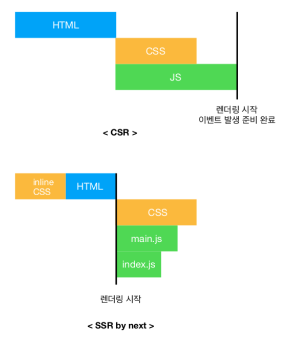

nextjs 로 프로젝트를 진행한지도 반년 가까이 흘렀습니다. [nextjs](https://github.com/zeit/next.js/)는 서버사이드렌더링(SSR)과 code splitting 등을 지원하는 reactjs 전용 프레임워크입니다. 2 년도 채 안되는 시간에 벌써 5.x(곧 버전 6 도 나올것 같네요) 버전까지 등장했습니다. 그만큼 많은 사람들의 관심속에 발전하고 있다는 뜻이겠죠. 사용법은 충분히 익숙해졌지만, 시간에 쫓기고 일정에 쫓기다보니 nextjs 가 동작하는 방식에대한 이해는 부족하다 느껴집니다. nextjs 가 reactjs 코드를 어떻게 빌드하고, SSR 은 어떤 과정을 거치며 브라우저에서 어떻게 동작하는지 살펴보도록 하겠습니다.

우선 프로젝트를 생성합니다.

```
mkdir why-next
cd why-next
npm init
npm install --save next react react-dom
```

그리고 `package.json`파일에 다음의 스크립트를 추가합니다.

```json
{
  "scripts": {
    "dev": "next",
    "build": "next build",
    "start": "next start"
  }
}
```

프로젝트 생성은 여기서 끝입니다. 이 후에는 페이지(pages 폴더에)를 만들어 실행하면 됩니다.

### nextjs 의 빌드과정

nextjs 를 사용하기 위해서 반드시 따라야 할 규칙이 있습니다. pages 폴더(없다면 만들어야함)에 라우팅 url 과 동일한 이름의 컴포넌트를 생성해야 합니다. pages 컴포넌트가 next 라우팅과 동일하게 mapping 되기 때문에 이 규칙은 반드시 지켜야합니다. 예를들어 url 이 `/first`이라면 `pages/first.jsx` 파일을 만들어야합니다. 테스트를 위해 pages/index.jsx 와 pages/second.jsx 파일을 생성합니다.

#### pages/index.jsx

```jsx
import Link from 'next/link'

export default () => (
  <div>
    <h1>Index Page</h1>
    <Link href="/second">
      <a>second2</a>
    </Link>
  </div>
)
```

#### pages/second.jsx

```jsx
export default () => <h1>Second Page</h1>
```

그 다음 실행합니다.

```
npm run dev (dev 환경)
npm run build && npm start (production 환경)
```

위 명령은 package.json 에 `next`라는 명령어를 실행하는 npm 커맨드입니다. 빌드가 진행되고 서버를 실행합니다. 빌드는 아래의 항목을 포함합니다.

> - 자동 코드 트래스파일(babel) 및 번들링(webpack)
> - hot code reloading
> - 서버렌더링 및 pages 폴더의 indexing
> - ./static/ 폴더의 리소스의 /static path 접근

빌드가 완료되면, 프로젝트에 `.next` 폴더가 생성됩니다. `.next` 폴더 구조는 다음과 같습니다.

```
# .map 파일 제외
.next/                    # 빌드 root 디렉토리
  bundles/
    pages/
      _error.js
      (index.js)          # production 환경에서 생성
      (second.js)         # production 환경에서 생성
  dist/                   # 실제 렌더링 되는 파일들이 담긴 폴더
    bundles/
      pages/
        _document.js
        _error.js
        (index.js)          # production 환경에서 생성
        (second.js)         # production 환경에서 생성
  main.js                 # 번들된 javascript 파일
  manifest.js
```

아직 서버에서 실행할 page 자바스크립트가 만들어지지 않았습니다. 이 경우에 모든 렌더링 관련 코드는 main.js 에 포함됩니다. 이는 dev 환경일때만 해당되는 것으로 라우팅 될 때마다 필요한 페이지를 생성합니다. production 환경에서는 page 코드를 미리 준비합니다. 더 빠른 초기 렌더링이 가능하기 때문입니다. dev 환경에서는 빠른 빌드가 주 목적이기 때문에 미리 page 를 생성하지 않습니다. 반면에 production 환경에서는 초기 렌더링을 빠르게 하는것이 주 목적이기 때문에 page 코드를 미리 생성합니다.

브라우저를 열고 `localhost:3000/`를 입력합니다. 다음과 같은 화면이 출력됩니다.


폴더 구조를 다시 보면, .next 폴더 안에 bundles/page/index.js 와 dist/bundles/page/index.js 가 만들어진것을 확인할 수 있습니다.
그리고 url 을 입력할때마다 `.next` 폴더에 `0.[hash].hot-update.js`와 같은 파일이 생성됩니다. 이는 page 코드를 만들때(서버든 클라이언트든) 동적으로 생성되는 js 파일입니다. dev 에만 해당되는 내용으로 production 환경에서는 생성되지 않습니다.

### SSR 은 어떤 과정을 거치나?

SSR 은 말그대로 서버에서 렌더링을 한다는 것입니다. 10 여년전에 많이 유행했던 PHP 나 JSP 가 대표적인 서버렌더링 프레임워크입니다. 유저가 어떤 url 로 데이터를 요청하면 서버는 미리 html 파일을 만들어 클라이언트(브라우저)에게 전달하는 방식입니다. next 에서 SSR 도 크게 다르지 않습니다. 서버(node)를 띄우고 유저가 요청하면 html 을 생성하여 브라우저에 전달합니다. 구조는 동일합니다. 다른점이 있다면, 모든 요청에 대해 서버에서 렌더링을 진행하지는 않고 초기 렌더링만 서버가 담당합니다. 그 이후에는 `next/router`를 이용하여 클라이언트에서 렌더링합니다. next 가 해주는 일은 이게 전부입니다. 간단하지만, 이 방식으로 SPA 의 단점으로 꼽히는 긴 초기 렌더링 시간을 대폭 줄일 수 있습니다.



### 어떤 과정으로 실행되는가?

위 코드를 바탕으로 실행과정을 단계별로 나눠보겠습니다.

1. 유저가 브라우저에 `/index`를 입력합니다.
2. 미리 실행되고 있는 node 서버가 요청을 받고 서버렌더링을 합니다.
3. 만들어진 html 을 브라우저에게 보냅니다.
4. 브라우저가 응답받은 html 을 그립니다.
5. html 에 기능을 부여할 `main.js`파일을 다운로드 받습니다. (라우팅 될 페이지 코드도 함께 번들링되어 있습니다.)
6. 다운로드가 완료되고 `go to second` 링크를 클릭합니다.
7. `/second`로 라우팅하고 second 페이지 코드를 생성합니다. (production 에서는 미리 만들어진 코드를 사용합니다.)

dev 환경에서는 2 번과 7 번에서 서버렌더링 코드가 만들어져 있지 않기 때문에 렌더링하는데 어느정도 시간이 소요됩니다. 하지만 production 환경에서는 미리 모든 페이지의 코드를 만들어두기 때문에 초기 렌더링 시간이 절약됩니다.

### 결론

SSR 이 간단한 개념이지만, 이해하기는 쉽지 않습니다. 개념은 간단하지만 효율적으로 구현하기 위한 기반기술이 많기 때문이라 생각합니다. 사용법만 익혀도 nextjs 프로젝트를 진행하는데 큰 어려움은 없습니다. 하지만 SSR 관련해서 다양한 이슈가 발생했을때 대처하기 위해서는 next 의 동작배경을 잘 알고 있어야 합니다. 초반에 글을 쓸 때는 next 내부 코드를 살펴보며 세밀한 동작 원리를 설명하고 싶었습니다. 코드를 살펴볼수록 이해하는 시간이 길어지고 담을 내용이 많아지는 것 같아 이정도로 마무리하려고 합니다. 잠깐씩 언급했던 세부적인 next 기반 기술은 앞으로 주제를 정해 하나씩 다룰 생각입니다. 잘못 알고 있는 내용이 있다면 지적 부탁드립니다.

### 참고자료

- https://github.com/zeit/next.js/issues/1217
- https://www.codementor.io/tgreco/5-of-the-many-things-to-love-about-zeit-s-next-js-bpszu99g1
- https://www.slideshare.net/dotPKG/nextjs-a-javascript-framework-for-building-next-generation-spa
