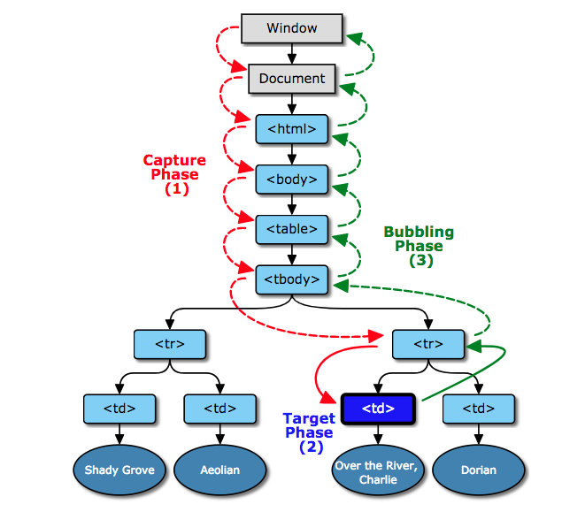

### 이벤트 버블링 / 캡쳐링

특정 DOM 노드에서 발생한 이벤트는 부모 또는 자식으로 전파됩니다. 자기자신(currentTarget)에서 부모로 전파되면 이벤트 버블링(event bubbling)이라 하고, 부모에서 자기 자신으로 전파되면 이벤트 캡쳐링(event capturing)이라 합니다. 이벤트가 발생하면 우선 window 부터 target node 까지 이벤트 캡쳐링합니다`(capture phase(1))`. 그 다음 타켓 노드에 이벤트가 발생`(target phase(2))`하고 마지막으로 이벤트를 한단계씩 상위로 버블링`(bubbling phase(3))`합니다. (이미지 출처: www.w3.org)



이벤트 발생 시점이 다르기 때문에 이벤트 핸들러를 `binding`할때 주의가 필요합니다. 보통은 아래처럼 작성합니다. 세번째 인자가 없거나 `false`면 버블링, `true`면 캡쳐링시에 이벤트가 발생합니다. target 노드는 바인딩 방식과는 상관없이 캡쳐링이 끝나면 이벤트가 발생합니다.

```
// event bubbling
element.addEventListener('click', handler);

// event capturing
element.addEventListener('click', handler, true);
```

모바일에서 가운데 영역을 터치하면 메뉴가 나타나거나 사라지고 좌우를 클릭하면 페이지가 좌우로 이동하는 기능이 있다고 가정합니다. 메뉴가 켜져 있으면 상단에 세개 버튼이 노출됩니다.


가운데 영역을 터치해서 메뉴가 오픈된 상태에서 왼쪽 버튼을 터치합니다. 이 영역은 페이지를 좌측으로 이동하는 영역과 겹쳐있습니다. 터치이벤트가 발생하면 좌측 페이지로 이동하는 이벤트와 `홈` 버튼의 터치 이벤트가 발생합니다. 일반적으로 전체 영역(window or document)은 홈버튼의 부모 노드입니다. 이 때 전체영역과 홈버튼의 이벤트를 어떻게 바인딩(캡쳐링 or 버블링)했냐에 따라 이벤트 발생 순서는 완전히 바뀝니다. 일반적으로 세번째 인자를 쓰지 않고(or false) 바인딩하면, `bubbling` 시점에 이벤트가 발생합니다. target 노드인 leftButton 의 이벤트가 먼저 발생합니다. 그 후에 이벤트가 부모로 버블링되면서 window 의 click 이벤트가 발생합니다.

```
window.addEventListener('click', clickHandler);
leftButton.addEventListener('click', clickBtnHandler);
```

반대로 아래처럼 `capturing` 방식으로 바인딩했다면 최상위 노드가 가장먼저 실행됩니다. 즉, window 의 이벤트가 가장 먼저 발생합니다. 이 후 이벤트가 캡쳐링되면서 target 노드인 leftButton 의 `click` 이벤트가 발생합니다.

```
window.addEventListener('click', clickHandler, true);
leftButton.addEventListener('click', clickBtnHandler, true);
```

### react 에서 이벤트 버블링 / 캡쳐링 사용하기

리액트에서 이벤트 버블링과 캡쳐링 사용은 어렵지 않습니다. click 이벤트의 경우에는 `onClick`은 버블링, `onClickCapture`는 캡쳐링을 사용합니다.

위에서 보았던 예제를 바탕으로 이벤트 캡쳐링/버블링 테스트를 위해 아래처럼 코드를 입력합니다. 코드에서 사용한 `onClick` 속성은 버블링 방식으로 이벤트를 바인딩하기 때문에 자기자신의 이벤트가 먼저 발생하고 부모로 이벤트를 전파합니다. 우선 가운데 영역을 클릭해 상단 메뉴를 열어줍니다. 그리고 왼쪽의 `HOME` 버튼을 클릭합니다. 각 노드의 이벤트가 bubbling 방식으로 동작하기 때문에 `home`이 먼저 출력되고 `left`가 출력됩니다.

#### 이벤트 bubbling

<p data-height="450" data-theme-id="0" data-slug-hash="QrjmBG" data-default-tab="js,result" data-user="blueshw" data-embed-version="2" data-pen-title="event bubbling  in react" class="codepen">See the Pen <a href="https://codepen.io/blueshw/pen/QrjmBG/">event bubbling  in react</a> by Hyunwoo Seo (<a href="https://codepen.io/blueshw">@blueshw</a>) on <a href="https://codepen.io">CodePen</a>.</p>
<script async src="https://static.codepen.io/assets/embed/ei.js"></script>

#### 이벤트 capturing

이번에는 캡쳐링을 살펴보겠습니다. 이벤트 캡쳐링과 버블링을 비교하기 위해 `menuBox`에 이벤트를 추가합니다. background 와 home 버튼은 `onClickCapture`로 바인딩(캡쳐링)하고, menuBox 에는 `onClick`으로 바인딩(버블링)합니다. 위에서 이벤트가 발생하는 순서는 `캡쳐링 -> 타겟노드 -> 버블링`이므로 가장먼저 `left`가 출력됩니다. 그 다음은 타켓노드의 이벤트가 발생해서 `home`이 출력됩니다. 타켓노드 이후에 이벤트가 버블링 되고 menuBox 에 `click menu`가 출력됩니다.

<p data-height="450" data-theme-id="0" data-slug-hash="pVjLmW" data-default-tab="js,result" data-user="blueshw" data-embed-version="2" data-pen-title="event capturing in react" class="codepen">See the Pen <a href="https://codepen.io/blueshw/pen/pVjLmW/">event capturing in react</a> by Hyunwoo Seo (<a href="https://codepen.io/blueshw">@blueshw</a>) on <a href="https://codepen.io">CodePen</a>.</p>
<script async src="https://static.codepen.io/assets/embed/ei.js"></script>

#### 정리

이벤트는 `캡처링 -> 타겟노드 -> 버블링`의 순서로 발생합니다. 캡처링은 가장 상위(window)에서 먼저 이벤트가 발생하고 자식으로 한단계씩 전파합니다. 타켓노드까지 이벤트가 전파된 후에는 반대로 한단계씩 부모로 전파됩니다. 각 노드에서 바인딩(binding)된 이벤트 핸들러가 capture 방식이라면 이벤트 캡쳐링시에 실행되고, 반대로 bubbling 방식이라면 이벤트 버블링시에 실행됩니다. target 노드에 바인딩된 핸들러는 capture 의 사용 유무와 상관없이 이벤트 캡쳐가 끝나면 실행됩니다.

### 참고자료

- https://www.w3.org/TR/DOM-Level-3-Events/#dom-event-architecture
