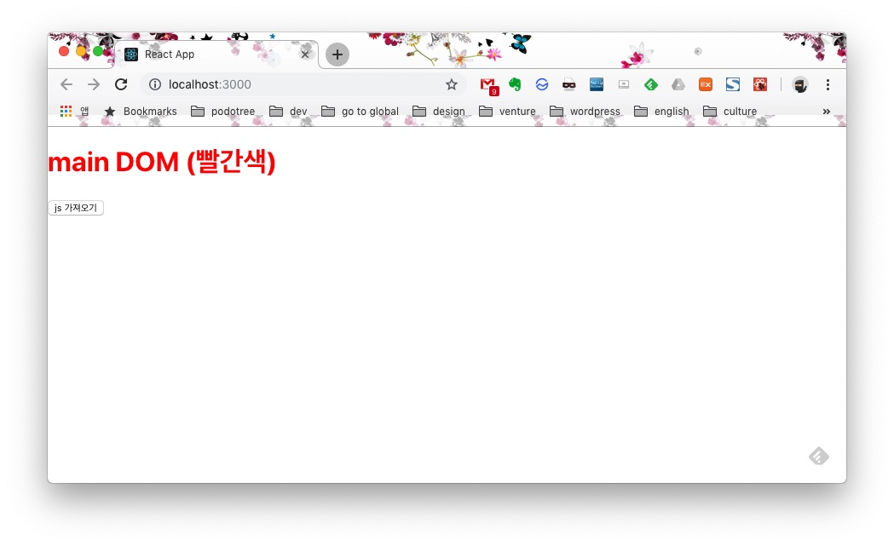
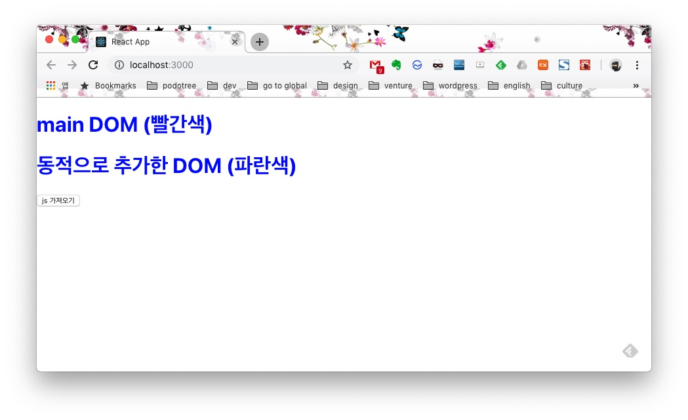
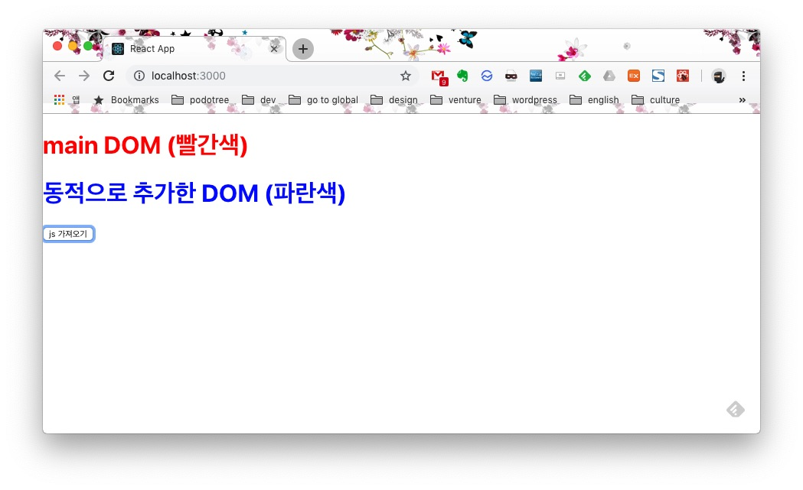
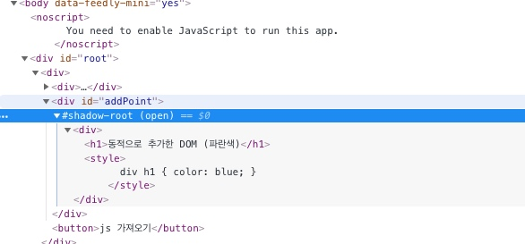

최근 몇년간의 웹 생태계는 마치 전쟁터와 같았다. 아니, 지금도 전쟁중이다. 각종 도구들부터 시작해서 웹 프레임워크까지, 한시라도 눈을 떼면 뒤쳐져버리기 일쑤다. 요즘, 국내에서도 프론트엔드 개발자라면 리액트(react)나 뷰(vue) 둘 중 하나는 다루는것 같다(angularJS는 조금 멀어지는 느낌이다). 현업에서 사용하지 않더라도 기회가 되면 언제든 사용하려고 한다. 프론트엔드 커뮤니티나 컨퍼런스에서도 리액트나 뷰의 얘기로 떠들썩하다. 나 또한 회사에서 열혈히 리액트를 사용하고 있다.

그렇다. 리액트 정말 잘 사용해서 개발하고 있다. 그런데, 갑자기 웹 컴포넌트가 필요해졌다. 도대체 어떤 상황이기에 웹 컴포넌트가 필요했을까(반드시는 없다, 리액트로도 충분히 해결할 수 있을것이다)?

### 상황

> - 동적으로 자바스크립트 a.js를 서버로부터 다운로드 받는다.
> -> appendDOM.js에는 추가할 DOM정보가 있고 appendDOM이라는 함수를 호출한다(appendDOM함수는 domHelper.js에 미리 구현해둔다).
> -> DOM에는 HTML 코드 뿐 아니라 javascript, css 코드도 있다.
> -> javascript, css 코드는 인라인으로 삽입되어 있고 파싱하기 힘들만큼 크다.
> -> 다운받는 js파일은 콘텐츠마다 다르며 css 코드도 다르다(즉, 예측 불가능하다).
> -> css 코드에 따라 메인 DOM의 스타일이 영향받을 수 있는 위험이 있다.

아래처럼 네개의 파일이 있다. 실제 프로젝트 내에는 `Main.js`, `domHelper.js`, `Main.css` 세개만 있고 `appendDOM_1234.js`는 서버로부터 동적으로 다운로드 받는다.

```
Main.js 
domHelper.js
Main.css
appendDOM_1234.js // 동적으로 서버에서 받아온다. id(1234)에 따라 콘텐츠(DOM)도 다르다.
```

#### Main.js
```
import React, { Component } from "react";
import "./domHelper";
import "./Main.css";

class Main extends Component {
  getJsFile = () => {
    // 서버에서 동적으로 js파일을 가져온다.
    // 여기서는 유사하게 dynamic import를 사용했다.
    import("./appendDOM.js");
  };
  render() {
    return (
      <div>
        <div>
          <h1>main DOM (빨간색)</h1>
        </div>
        <div id="addPoint" />
        <button onClick={this.getJsFile}>js 가져오기</button>
      </div>
    );
  }
}
export default Main;
```

#### domHelper.js
``` 
window.appendDOM = function(data) {
  const dom = data;
  const addPoint = document.querySelector("#addPoint");
  addPoint.innerHTML = dom;
};
```
appendDOM.js가 추가되면 `appendDOM()` 함수가 호출된다.

#### Main.css 
```
h1 {
  color: red;
}
```

#### appendDOM.js (_1234 생략)
```
const data = `
  <div>
    <h1>동적으로 추가한 DOM (파란색)</h1>
    <style>
      h1 { color: blue; }
    </style>
  </div>
`;
window.appendDOM(data);
```

이런 상황이다.

npm start로 앱을 실행해보면 아래처럼 보일 것이다.



`js 가져오기` 버튼을 눌러보자. 그럼 아래처럼 `main DOM (빨간색)` text의 글자색이 파란색 바뀐다.



위 사례처럼 메인 DOM의 스타일이 영향받을 수 있음을 알면서도 그냥 `element.innerHTML = data`로 밀어넣었다. 문제가 발생하면 그때그때 스타일과 메인 DOM의 요소를 수정하는 식으로 해결했다. 하지만, 이건 근본적인 문제 해결책이 아님을 알고 있었다. 이렇게 수정하기 시작해서는 끝도 없이 이어질것이라 생각했다. 다운받은 콘텐츠를 파싱(parsing)해서 요소(html, javascript, css)를 분리할수도 있었다. 하지만, 콘텐츠의 길이를 가늠할 수 없는 상황에서 모든 요소를 파싱하는것은 무리라 판단했다.

### 해결

`웹 컴포넌트(Web Component)`의 `쉐도우 돔(Shadow DOM)`을 이용하기로 했다. 일반적으로 DOM내 사용하는 CSS는 선언된 위치와 상관없이 모든 DOM 요소에 적용된다. 예를 들어 DOM 중간에 선언된 `<style>`태그 내에 다음과 같은 코드가 있다고 생각해보자

```
div { background: black }
```

이러면 모든 div 태그의 배경색이 검정색(black)이 되어 브라우저를 암흑으로 만들어 버릴 것이다. 왜 DOM 가운데 선언한 스타일 하나 때문에 모든 DOM이 고통받아야 하는걸까? 

쉐도우 돔을 이용하면 이 문제를 간단히 해결할 수 있다. 쉐도우 돔은 DOM의 특정 영역을 메인 DOM과 분리시켜 `캡슐화` 한다. DOM 요소가 캡슐화되면 쉐도우 돔 내부의 스타일은 그 안에서만 적용된다. 아무리 `body { ... }`으로 넣어도 외부의 `body`에 적용되지 않는다. 이렇게 얘기하면 거창해보일지 모르겠지만, 실제 사용법은 매우 간단하다. 단지 `element.attachShadow()` API하나만 사용하면 된다. 그러면, 완전히 격리된 DOM을 만들어낼 수 있다. 

위의 프로젝트에서는 domHelper.js의 appendDOM 함수만 바꿔주면 해결된다. `addPoint.attachShadow({mode: 'open'})`만 추가하면 쉐도우 돔이 만들어진다. {mode: 'open'}`은 지금은 몰라도 되니 넘어가자.  

#### domHelper.js (쉐도우 돔 사용)
``` 
window.appendDOM = function(data) {
  const dom = data;
  const addPoint = document.querySelector("#addPoint");
  addPoint.attachShadow({mode: 'open'}).innerHTML = dom;
};
```
 
다시 `js 가져오기` 버튼을 눌러보자. 이제 제대로 스타일이 적용된 화면을 볼 수 있다.



이제 개발자 도구를 열어 DOM이 어떤 구조로 만들어졌는지 살펴보자. 



DOM을 추가한 곳에 `#shadow-root (open)`이라고 되어있다. 이제 이 안에 어떠한 스타일을 추가하더라도 외부에 영향을 주지는 않는다. 반대도 마찬가지다.

### 문제
쉐도우 돔은 비교적 최신 스펙(몇년 지났지만...)이라 모든 브라우저에 적용되지는 않는다(이놈의 IE, [쉐도우 돔 지원 여부 확인](https://caniuse.com/#search=shadow%20dom%20v1)). 회사에서 진행중인 프로젝트는 IE10이상, 안드로이드 4.4이상 지원하고 있기 때문에, IE 지원을 위한 추가 작업이 필요하다. 다행히 [웹 컴포넌트를 위한 polyfill](https://github.com/webcomponents/webcomponentsjs)이 있어 추가해주면 좀 더 많은 브라우저에서 쉐도우 돔을 사용할 수 있다.

### 결론
웹 컴포넌트는 점점 표준으로 자리잡아가고 있다. IE가 이제 역사속으로 사라질 날이 가까워 옴에 따라(한국은 언제쯤??) 앞으로 점점 웹 컴포넌트의 위상이 높아질 것 같다. [2016년 구글 I/O 발표](https://www.youtube.com/watch?v=J4i0xJnQUzU&feature=youtu.be) 처럼 어쩌면 DOM이 가장 지속가능하고 간결한 프레임워크가 아닐까 싶다. 리액트가 됐든, 뷰(vue)가 됐든 각종 웹 프레임워크들은 훌륭한 솔루션임에는 틀림없다. 하지만 앱의 규모가 커지면 커질수록 점점 프레임워크에 의존적인 코드가 양산되고 리소스가 증가한다. 증가된 리소스는 자연스레 사용자에게 전가될 수 밖에 없다. 웹 컴포넌트를 사용하면 이런 리소스는 훨씬 가벼워진다. 그렇다고 당장 웹 컴포넌트로 전환하기에는 해결해야할 문제들이 많다. 하지만 언젠가 브라우저 벤더들이 공통으로 모든 표준을 따라 브라우저를 만들어 낸다면 앞으로는 서드파티 프레임워크에 의존하지 않고 표준 스펙만으로 웹앱을 만들 수 있는 날이 올지도 모르겠다.

### 참고자료
- https://www.webcomponents.org/
- https://github.com/nhnent/fe.javascript/wiki/July-17---July-21,-2017
- https://github.com/yamoo9/WebComponent
- https://caniuse.com/#search=shadow%20dom%20v1
- https://github.com/webcomponents/webcomponentsjs
- https://www.youtube.com/watch?v=J4i0xJnQUzU&feature=youtu.be