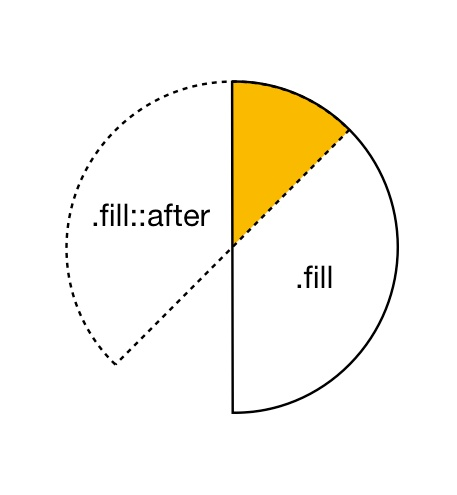

웹 서비스를 이용하다보면 간혹 룰렛 형태의 뽑기 게임을 볼 때가 있다. 주로 적립금(캐시)이나 상품을 주기위한 목적으로 만든다. 그런데 이런 룰렛 게임을 하나의 원형 이미지만으로 만드는 경우가 많다. 일회성으로 사용할때면 아무 문제 없지만, 당첨되는 금액(or 상품)이 매번 달라지는 경우라면 그때마다 매번 이미지를 바꿔줘야하는 문제가 있다. 디자이너의 앓는 소리가 들리는것 같다. 

퀄리티를 조금(?) 포기하자. 아니면 시간을 충분히 확보하자. 그렇다면 css와 js만으로도 꽤 괜찮은 룰렛 게임을 만들 수 있다. css와 js만으로 만들수 있다는 말은 금액이나 상품이 달라지더라도 룰렛 자체를 바꿀 필요가 없다는 뜻이다. 각 룰렛 영역에 들어가는 이미지나 text만 바꾸는것으로 간단히 해결된다. 만약 서버에서 룰렛을 그리는데 필요한 데이터를 내려준다면, 프론트 엔지니어는 이벤트가 바껴도 아무런 추가 작업을 해주지 않아도 되는 상황을 맞이할수도 있겠다.

우선 결과물부터 보자.

<iframe src="https://codesandbox.io/embed/css-roullete-znic6?fontsize=14" title="css-roulette" allow="geolocation; microphone; camera; midi; vr; accelerometer; gyroscope; payment; ambient-light-sensor; encrypted-media" style="width:100%; height:500px; border:0; border-radius: 4px; overflow:hidden;" sandbox="allow-modals allow-forms allow-popups allow-scripts allow-same-origin"></iframe>

아래 버튼을 누르면 룰렛이 돌아간다. 그리고 이미 정해진(?) 위치에 가서 멈춘다(개선해야한다). 실제 운영하는 서비스 정도의 퀄리티는 아니지만, 그럴듯하다. 아이콘이나 이미지 등이 추가되다면 훨씬 그럴듯한 형태의 룰렛이 만들어질것 같다.

룰렛을 만들면서 사용한 몇가지 css 요소를 살펴보자.

### clip
pie chart 형태의 일부를 칠하기위해 `clip`을 사용한다. clip은 특정 영역만 보이도록 지정할 수 있는 css 속성이다. `rect(<top>, <right>, <bottom>, <left>)`를 사용해서 특정 영역을 지정한다(deprecated 됨, clip-path 권장). 이외에도 다양한 방식으로 pie chart를 만들수 있다. canvas나 clip-path등을 사용할수도 있고 또다른 창의적인 방법을 생각할수도 있다. 

clip을 이용해서 색을 채우기위해 우선 400x400px의 빈 원을 그린다. 그리고 우측 반원만 보이도록 `clip: rect(0px, 400px, 400px, 200px);` 속성을 넣어준다. 같은 class의 `.fill::after` 선택자(또는 하위 div로 만들어도 된다)를 이용하여 또다른 원을 만든다. 이번에는 반대쪽(왼쪽)이 보이도록 `clip: rect(0px, 200px, 400px, 0px);`)속성을 넣어준다. 마지막으로 after 영역을 `45deg만큼 rotate`한다. 그러면, 아래 그림처럼 겹쳐진 부분만 색을 칠할수 있다.

코드를 살펴보자.

~~~html

  

    

    

    ...
  

  ...

~~~

### text (content)
원과 동일한 높이(height: 370px, padding-top: 30px)로 가운데 정렬된 text를 만들자. 적절히 font 크기와 두께를 준다. 그 다음, 각 영역안에 잘 맞도록 회전 시켜준다. (`transform: rotate(xxdeg))`)

~~~html

  

    ...
    

    

    ...
  

  ...

~~~

### 회전 (rotation)
마지막으로 버튼을 눌렀을때 룰렛이 회전하도록 `animation`을 적용하자. 버튼을 클릭(click)하면 `0deg`에서 `7045deg(몇바퀴??)`까지 회전하도록 하고 animation-duration을 8초로 설정한다.

~~~html

  

    ...
  

  ...
  <button class="trigger">뽑기</button>

~~~

### 개선할점
* 연속 뽑기가 가능하도록 수정하자.
* clip 대신에 `clip-path`를 사용하자. 굳이 after 영역을 추가해서 rotate할 필요없다. `.fill` 영역에 clip-path 하나만으로 충분할 것 같다.
* `rotation keyframe`을 동적으로 만들자. rotate값을 동적으로 변하도록 구현하여 값에따라 특정 금액(or 상품)이 선택되도록 만들수 있겠다. 
* rotation animation의 `timing-function`을 조절하자. 마지막에 좀더 천천히 돌아가면 훨씬 긴장감이 느껴질것 같다.
* transform의 rotate대신, `rotate3d`를 사용하자. 하드웨어가속(GPU사용)이 적용되어 사양이 떨어지는 단말에서 애니메이션이 훨씬 부드럽게 동작한다.