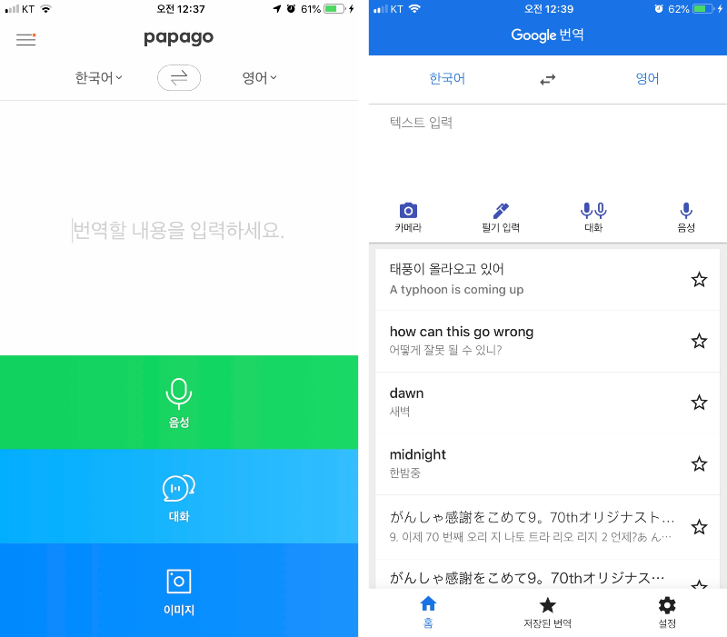

영어가 참 안 는다. 나름대로 열심히 하고 있다 생각하는데, 정말 안 는다. 어학연수나 유학중인 사람들 만큼 실력이 일취월장하는건 바라지도 않는다. 현실적으로 불가능하기도 하다. 고작해야 출퇴근 시간의 쉐도잉과 퇴근 후 전화영어가 전부기 때문이다(가끔 집에서도 쉐동잉한다). 시간으로 따져도 대략 일주일에 12~15시간 남짓밖에 안될것 같다. 외국에 거주한다면, 단 하루면 그 정도로 영어에 노출될 수 있다. 그러니 비교할 바 아니다. 그렇다 하더라도 내가 영어 공부에 투자하는 시간 만큼 어느정도 눈에 보이는 성과가 있으면 좋겠는데, 이게 말처럼 쉽지 않다. 아마 영어로 고통받는 한국의 많은 사람들도 비슷하지 않을까? 그래서인지 몰라도 학원가의 영어학원 빌딩이 제일 크다(그냥 눈에 띄는 걸지도..).  

눈에 띄는 성과가 없다보면 방법에 문제가 있다고 생각할 수 있다. 잘못된 공부 방법 때문에 진전이 없다는 말이다. 그런 생각이 들면, 좀 더 효율적이고 나은 방법을 찾아보게 된다. 찾다보면 알겠지만, 영어 공부하는데는 정말 다양한 학습법이 존재한다. 가끔은 사기가 아닌가 싶을 정도로 과장된 경우도 많다(예를들면 3주면 자막없이 미드본다... 같은..). 영어에 딱히 왕도가 없다보니 이렇게 많은 방법이 등장하는것 같다. 

나는 주로 유튜브를 통해 정보를 얻는 편이다. 유튜브에도 영어 학습법에 관해 꽤 많은 콘텐츠가 존재한다. 내가 본것만해도 대략 10개 이상은 되는것 같다. 영어 학습법이 얼마나 다양한지 `미드 쉐도잉`을 예로 들어보자. 미드 쉐도잉 할때는 `무조건 많이 듣는게 좋다`는 유튜버가 있다. 반면에 아무리 많이 듣는다고 들리지 않는게 들릴리 없다면서 `대본 리딩`을 먼저 해야한다는 유튜버도 있다. 또한 쉐도잉을 하기전에 `문법 공부`를 먼저 해야한다는 유튜버가 있는 반면 처음부터 문법 공부보다는 그저 `외우고 따라하는게 중요`하다는 유튜버도 있다. 쉐도잉을 하다보면 문법은 자연스레 익힐수 있다는 주장이다. 사실 서로 다른말을 하고 있지만, 다 맞는 말이다. 각각의 주장을 한 유튜버들은 이미 어느정도 영어에 능숙하기 때문에 자신의 학습법이 최고라 말할 수 있다. 하지만, 그건 자신에게 적합한 방법을 찾았기 때문일 뿐이다. 자신이 성공한 방법이라해서 모든 사람에게 최고일 수는 없다. 사람들의 영어 실력은 천차 만별이고 부족한 부분도 모두 다르기 때문에 각각에게 효율적인 방법은 다를 수 밖에 없다. 

나는 일주일에 세번 튜터링으로 전화영어 수업을 한다. 20분밖에 안되는 짧은 시간이지만 그래도 외국인과 대화를 나누다보면 자극도 되고 아주 약간이지만 말하는게 점점 자연스러워진다. 지금까지 대략 30회차 정도 진행했다. 그런데 수업을 하다보면 비슷한 패턴과 잘 아는 쉬운 표현만 사용해서 문장을 만드는게 아닌가하는 느낌이 든다. 실제로 몇몇 튜터들에게 그런 지적을 받기도 했다. 좀 더 다양한 표현을 사용해라, 같은 단어만 사용하지 마라 등.. 말은 쉽다. 언어라는건 내 머리속에 축적된 수많은 영어 데이터베이스에서 어떤어떤 문장을 가져오라고 질의하는것과 비슷하다고 생각한다. 하지만 애초에 적합한 질의를 만드는것 조차 어려울 때도 많고, 축적된 데이터 양이 너무 적어 질의 결과가 없는 경우도 많다. 그러다보면, 쉬운 영어만 생각나고 쉬운 문장만 내뱉는 자신을 발견한다.

그러다 우연히 시청하던 영상에서 어떤 유튜버의 말이 뇌리에 딱 꽂혔다. 말이라는건 결국 머리속 생각에서부터 시작되기 때문에 `영어로 생각하는 연습`을 하라는 것이다. 사람이 어떤 행동을 할때는 머리속에서 먼저 생각하고 그다음 행동으로 옮긴다. 이 시작을 한국말이 아닌 영어로 해보라는 거다. 말도 잘 못하는데 영어로 생각을 하라고?? 처음에는 이게 가능할까 싶어 몇번 시도해봤다. 아침에 샤워하는동안 오늘 해야할 일을 영어로 만들어 보기도 하고, 문득 떠오르는 것들을 영작해보기도 했다. 그런데 참... 문장을 만드는것부터 쉽지 않다보니 한 문장 한 문장 만드는데 정말 오래 걸렸다. 만든 문장이 정확한지는 검증조차 할 수 없었다. 시간이 너무 오래 걸리고 진척이 없다보니, 이러다간 아무것도 안될것 같았다. 

그러다 또 우연히 어떤 유튜버를 통해 꽤 괜찮은 방법을 알게되었다. 바로 `번역기`를 사용하라는 것이다. 번역기 앱을 사용하면 머리속에 떠오르는 문장을 바로바로 영어문장으로 만들어볼 수 있다. 머리속에 떠오른 것을 영어로 직접 작문하다보면 내가 아는 표현 내에서만 만들기 쉽다. 즉, 문장 수준이 매우 낮아진다. 또한 몇가지 표현만으로 문장을 만들려고 하다보니 다양한 표현을 익히는데 방해가 되기도 한다. 그런데 번역기 앱을 사용해서 생각한걸 말하고 나오는 문장을 바로 따라하다보면 자연스레 다양한 표현을 익힐수 있을것 같았다. 또한 내가 만든 문장이 맞는 표현인지 생각할 필요도 없다. 이미 어느정도 검증된 문장을 알려주기 때문이다. 이거다 싶었다.

여기서 잠깐 번역기 얘기를 해보자. 지금 현 시점에서 `구글번역`이 최고긴하다. 나도 구글번역에 많이 의존한다. 하지만, 사용해 본 사람은 알겠지만, 그다지 유저 편의를 생각했다는 느낌은 들지 않는다. 그래서 예전에 한번 써보았던 `파파고(papago)`의 인턴페이스가 나름 괜찮았던것 같아서 다시 설치해보았다. 구글번역에 비해서는 번역 가능한 언어가 많이 적긴하다. 하지만, 나는 어차피 영어와 한글만 사용할거니까 번역 가능 언어 수는 아무런 문제가 없었다. 하지만 파파고의 UI(인터페이스)와 UX(사용자 경험)가 확실히 더 깔끔하고 간결했다. 적어도 내 기준에는 그랬다. 예를들어 보자. 두가지 앱 모두 `음성`이라는 버튼이 있는데, 구글번역은 한번 번역이 끝나면 음성 페이지에서 벗어나고 결과를 메인 페이지에서 보여준다. 그리고 다시 음성 버튼을 눌러야 음성 인식 페이지로 이동한다. 반면에 파파고는 음성 페이지에 진입하면 한번 번역이 끝나도 페이지에 그대로 머무른다. 결과 또한 같은 페이지에서 계속 노출된다. 연속해서 번역을 사용한다면 파파고의 UX가 훨씬 나은것 같다.

내가 파파고를 사용해보기로 한 또다른 이유 중 하나는 생각보다 번역 품질이 우수하다는 점이다. 파파고 엔지니어들을 무시하는건 아니지만 많은 사람들이 구글의 엔지니어들이 훨씬 뛰어나다고 생각한다. 그렇기 때문에 당연히 구글번역 앱의 번역 품질이 더 나을거라 짐작한다. 하지만 직접 사용해보니  파파고의 번역이 더 맘에 들었다. 어느 문장이 더 낫다고 말할 수준은 안되서 감히 쉽게 평가하지는 못하겠다. 하지만, 내 직감은 아무튼 그랬다. 

번역기 앱에 관한 얘기는 이쯤 해두고, 다시 영어 이야기로 돌아가보자. 그동안 쉐도잉을 해왔지만, 그렇게 큰 진전이 있었다고 보긴 어렵다. 확실히 귀가 조금 열린것 같은 느낌(느낌만은 아니길 빈다)이 들긴 하지만, 그 정도 뿐이다. 어떤 유튜버가 추천하는 방식대로 쉐도잉 후 몇가지 문장을 추출하고 각 문장별로 유사한 문장을 만들어보는 방법도 해봤다. 하지만, 문장을 아무리 많이 만들어 보아도 전화영어 수업을 할 때 거의 써보진 못했다. 뭐가 문제일까? 외국에 살아본 경험이 거의 없는 나같은 한국인은 영어로 직접 생각 가능한 단계는 아니다. 그렇기 때문에 머리속으로 `한국말로 생각 => 영어 작문` 단계를 반드시 거쳐야만한다. 그런데 내가 미드를 통해 익힌 문장들이 아무리 많아도 지금 당장 하려는 말에 적합한 표현을 찾지 못하면 아무런 의미가 없다.

번역기 앱을 사용하면 이 문제를 해결할 수 있다. 지금 당장 내가 떠오른 말을 바로 영어 문장으로 바꿀 수 있기 때문이다. 혹자는 아무 생각없이 번역기로 만든 문장은 금방 사라지기 때문에 별 도움이 안될꺼라 말할지도 모른다. 하지만, 영어는 언어다. 머리속으로 문법을 생각하고 단어를 결정해서 말을 만드는게 아니다. 자연스럽게 나와야한다. 떠오르는 순간 바로 내뱉어야 한다. 이를 위해서는 반복이 필수다. 우선은 비슷한 문장을 계속 떠올리고 번역기 앱으로 문장을 만든다. 그리고 그렇게 떠올린 문장을 전화영어 수업에서 지속적으로 사용한다. 한두번 사용하다 그치면 금방 사라지기 때문에 진짜 별 도움 안되겠지만, 계속 반복해서 사용하다보면 어느덧 그 문장은 내 영어 데이터베이스에 제대로 축적될 것이다. 지금 단계는 고작 `한국말로 생각 => 파파고 번역` 정도의 수준이겠지만, 계속하다보면 언젠가는 곧바로 `영어로 생각`하는 단계가 될 수도 있지 않을까.
