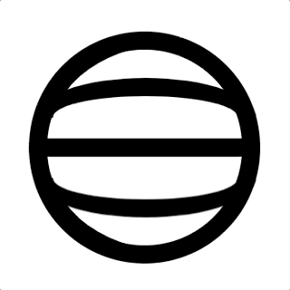
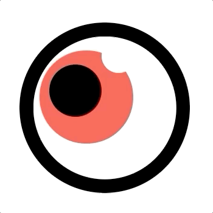

if kakao가 매우 성황리에(?) 마무리되었다. 공식적인 if kakao 행사가 두번째임에도 불구하고 꽤 완성도 있었다 생각한다. 특히 `카카오페이지(!!!)`의 [리액트: 그것마저 결정해주마](https://mk.kakaocdn.net/dn/if-kakao/conf2019/conf_video_2019/1_104_01_m1.mp4)와 `카카오뱅크`의 [프론트엔드 기술로 동료들 삶의 질 높여주기](https://mk.kakaocdn.net/dn/if-kakao/conf2019/conf_video_2019/1_104_03_m1.mp4) 세션이 아주 흥미로웠다. 첫번째 리액트 세션은 리액트로 프로젝트를 진행할때 너무 많은 작업 방식과 라이브러리 홍수 속에서 옥석을 골라내는 방법과 코딩 방식을 제안해주었다. 그리고 두번째 카카오 뱅크 세션에서는 동료들의 불편함을 프론트 기술로 해소했던 몇가지 프로젝트를 보여주었는데, 보는내내 감탄사가 절로 나왔다. 특히 직원의 위치와 휴가 여부 등의 정보를 full-3D로 구현한 `floor`가 가장 인상깊었다. 

훌륭하게 컨퍼런스를 마무리했음에 틀림없지만, 그래도 아쉬운점은 있었다. 2일간 진행했음에도 불구하고 다양성이 너무 부족했다. 1일차 세션은 프론트, 서버, DB 등의 세션으로 구성되었고, 2일차의 세션은 블록체인과 AI 등의 신기술로만 채워졌다. 아무리 블록체인과 AI 기술이 요즘의 트렌드라고 할지라도 너무 한쪽으로 치우쳐 있다는 느낌은 지울수 없었다. 나는 1일차에만 참석했는데, 프론트 개발자로서 들을만한 세션은 손에 꼽을 정도였다(3~4개 정도?). 두번째로 아쉬웠던 점은, 바로 if kakao 홈페이지다. 보통 퀄리티는 디테일로 결정된다. 그런데, if kakao 홈페이지에는 그다지 노력을 기울인 느낌이 없었다. 잠깐 사용할 홈페이지에 뭐 그리 집착하냐 할지 모르지만, 나는 이런게 바로 디테일이라 생각한다. 

[if kakao 2019 홈페이지](https://if.kakao.com/2019/)에 접속해보면 가운데 아래와 같은 메인 배너가 보인다. 홈페이지에 접속해보면 알겠지만, 아래처럼 정지된 이미지는 아니고 몇가지 애니메이션이 동작한다.


처음에 이 이미지를 보고, 어떻게 만들었는지 조금 궁금했다(그리 어렵지도 않을것 같았지만..). 그런데, 개발자 모드를 켜고 소스를 살펴본 순간, 좀 놀랐다. css와 javascript로 애니메이션을 구현한게 아니라, 그냥 `gif`였다!!! 명색이 `개발자` 컨퍼런스의 홈페이지를 구축하면서 크게 복잡하지도 않은 애니메이션을 만드는데, gif를 쓰다니. 실망스러웠다. 물론 시간이 부족하고 인력이 부족했겠지만(?), 그렇다 하더라도 맨 처음 보이는 화면에 조금더 신경 썼어야 하지 않았을까.. 요즘 [애플 홈페이지](https://www.apple.com/kr/)를 보면서 프론트 기술을 정말 잘 이용했다 생각하고 있던터라, 실망이 더 컸는지도 모르겠다. 그래서.. 한번, 직접 만들어 보기로 했다. 

일단 결과물부터 보자.

<p class="codepen" data-height="265" data-theme-id="0" data-default-tab="css,result" data-user="blueshw" data-slug-hash="OJLaNMM" style="height: 265px; box-sizing: border-box; display: flex; align-items: center; justify-content: center; border: 2px solid; margin: 1em 0; padding: 1em;" data-pen-title="if kakao 2019 logo with pure css, js">
  <span>See the Pen <a href="https://codepen.io/blueshw/pen/OJLaNMM">
  if kakao 2019 logo with pure css, js</a> by Hyunwoo Seo (<a href="https://codepen.io/blueshw">@blueshw</a>)
  on <a href="https://codepen.io">CodePen</a>.</span>
</p>
<script async src="https://static.codepen.io/assets/embed/ei.js"></script>

위에서 사용한 몇가지 새로운 요소에 대해 알아보자.

### SVG

SVG는 `Scalable Vector Graphics`로, 번역하자면 `확장 가능한 벡터 그래픽`이다. 래스터 그래픽(Raster Graphics)이 아닌 벡터기 때문에 이미지가 커져도 퀄리티는 그대로 유지된다. 또한 path로 이미지를 그리기 때문에 이미지가 커져도 용량이 늘지 않는다. 요즘은 회사 프로젝트에도 작은 이미지는 대부분 SVG를 사용한다. 훨씬 용량이 작기 때문이다(단순할수록 용량이 작다). 회사에서 SVG를 사용하고 있지만, 사실 SVG를 잘 활용하는 수준은 아니다. 디자이너가 생성한 이미지 소스에서 SVG를 다운받는게 전부기 때문이다. SVG를 이용한 애니메이션 같은게 (아직은) 없기 때문에 직접 SVG를 다루지 않는다.

<p align="center">
  
</p>

처음에는 위처럼 `자전하는 지구` 이미지를 보고 쉽게 만들 수 있을거라 생각했다. 딱히 어떤 방식으로 작업할지 고민한건 아니었지만, 웬지 모르게 어렵지 않을것 같은 느낌이었다(단순해서 그런듯). 그런데, 막상 작업을 시작하니까 어떻게 시작해야 할지 감을 잡기 너무 어려웠다. 몇가지 시도 끝에 결국 SVG를 사용했는데, 다음과 같은 과정을 거쳤다. 

첫번째로 `border`를 사용했다. top, left, bottom border를 잘 이용하면 좌측면에 다양한 곡율이 적용된 도형을 만들 수 있다. 하지만, 애니메이션을 구현할때 문제가 발생했다. 좌측면은 크게 문제가 없었는데, 좌측에서 우측으로 넘어가는 순간, left border를 right로 바꿀때가 문제였다. 전혀 자연스럽게 동작하지 않았다. 몇번 시도해 보았지만 border로 만드는건 결국 포기.

두번째는 아래서 눈(eye)를 구현할때 사용한 `clip-path`를 이용했다. clip-path의 ellipse를 잘 이용하면 위와 비슷하게 구현 가능할것 같았다. 하지만 이 역시 선 두께를 일정하게 유지하면서 좌측에서 우측으로 넘어가는 과정을 자연스럽게 만들기가 까다로웠다. 그래서 두번째도 포기.

웬만해서는 SVG를 사용하고 싶지 않았다. 잘 모르기도 하지만, 웬지 모르게 CSS로 충분히 만들수 있을것 같다는 오기 때문이었다. 그러나 시간은 점점 흐르고 해결책을 찾지 못했다. 그러다가 포기하고 결국 SVG를 사용하기로 했다(진짜 오래 걸렸다ㅠㅠ). 그렇다고 SVG를 사용하면 뚝딱 만들 수 있는 수준도 아니었다. 개념도 충분히 숙지하지 못한 상태였기 때문에 SVG와 관련된 문서들을 먼저 읽었다. 비슷한 형태를 검색해서 가져다 써도 되지만, 다음에 또 같은 문제에 부딪히기 싫었기 때문이다. 그래서 간단한 개념을 먼저 익힌뒤 SVG를 만들었다. 일단, 선은 border로 간단히 구현했기에 그대로 두고 움직이는 세로선을 만드는데 SVG를 사용했다. 코드는 다음과 같다.

```html
<div class="vertical">
  <svg width="19vw" height="19vw" viewBox="0 0 100 100" xmlns="http://www.w3.org/2000/svg">
    <path d="M 50 0 C -15 12, -15 88, 50 100" stroke="black" stroke-width="8" fill="transparent">
      <animate attributeType="XML" attributeName="d" 
                from="M 50 0 C -15 10, -15 90, 50 100" to="M 50 0 C 115 10, 115 90, 50 100"
                dur="3s" repeatCount="indefinite" begin="1s"/>
    </path>
  </svg>
</div>
```

실제로는 세 개의 선이 움직이기 때문에 비슷한 코드가 세개 있다. 세 개의 세로 곡선이 순차적으로 나와야 하기 때문에 마지막 begin으로 delay를 제어한다. 이 외 코드는 모두 동일하다(참고로 위의 코드는 두번째 곡선의 코드다). 복잡한 곡선을 만드는게 아니라 path 자체는 굉장히 간단하다. 위에서 사용한 path를 그리는 `d` 속성을 살펴보자.

```
d="M 50 0 C -15 12, -15 88, 50 100"

  M: move to (50 0 은 x로 50, y로 0을 뜻함)
  C: Cubic Bézier Curve (-15 12는 M 위치의 제어점, -15 88은 마지막의 50 100의 제어점을 의미한다)
```
참고로 위 숫자들은 기본적으로 `px`를 뜻하지만, `viewBox`를 지정해서 사용하면 커지거나 작아지게 할 수 있다. 나머지 다른 속성들은 [SVG d속성 문서](https://developer.mozilla.org/ko/docs/Web/SVG/Attribute/d#Path_commands)에서 확인하자. 그리고 직접 C를 그리는건 쉬운일이 아니므로 [SVG 패스 생성기 모음](https://css-tricks.com/tools-visualize-edit-svg-paths-kinda/)에서 적절한 도구를 선택하자. 

path 태그를 좀더 살펴보자. 우선 stroke에 너비와 색상을 준다. 그리고 fill은 transparent로 처리한다. fill을 사용해서 구현하려면 path가 길어져 더 복잡해진다. path를 구현했으니 이제 animation을 만들자. svg에서 애니메이션을 구현하는 태그는 여러개 있다. animate, animateColor, animateMotion, animateTransform 등이 있는데, 지금은 animate만 사용해서 구현한다. 속성이 상당히 많지만([SVG core 속성 reference](https://developer.mozilla.org/en-US/docs/Web/SVG/Attribute#Core_attributes)), 지금 필요한건 많지 않다. 위 `animate` 태그에서 사용한 속성을 설명하면 다음과 같다. 크게 어렵지 않다. 직관적으로 이해되는 수준이다. 

> d속성을 `from`에서 부터 `to`까지 `dur`시간 동안 이동하고, `repeatCount`만큼 반복하도록 설정한다. 추가로 `begin` 속성을 줘서 처음 delay를 조절한다.

### clip-path

<p align="center">
  
</p>

지난번에 [룰렛 만들기](https://blueshw.github.io/2019/06/27/roulette/)를 하면서 사용했던 `clip`은 `deprecated`된 CSS 요소다. 아직까지 사용하는데 문제는 없지만, 두가지 단점이 있다. clip을 쓰기 위해서는 반드시 `position: absolute`를 넣어줘야 하고, 직사각형 형태밖에 사용하지 못한다. 그래서 활용도가 떨어진다. 룰렛 만들기 포스팅을 보면 알겠지만, 피자 조각 모양의 도형을 만들기 위해 `border-radius: 50%`를 적용한 두 직사각형을 rotate한 다음 겹치는 부분의 색을 칠한다. 이 과정을 6번 반복하고 각 조각의 rotate를 다르게 설정한다. 살짝 복잡하다. 그런데, `clip-path`를 사용하면 훨씬 쉽게 만들수 있다. clip-path를 사용할때 path를 직접 만들어줄 수도 있다(SVG와 원리는 거의 같다). 하지만, [CSS clip-path maker](https://bennettfeely.com/clippy/) 사이트를 이용하면 필요한 clip-path를 손쉽게 만들 수 있다. 

눈이 깜빡이는 애니메이션을 만들기 위해서 clip-path 속성의 `ellipse` 메서드를 이용하였다. 코드를 살펴보자. css는 clip-path를 사용한 부분만 살펴보자. 나머지 css는 길어질것 같으니 [codepen](https://codepen.io/blueshw/pen/OJLaNMM)에서 직접 확인하자.

```html
<div class="circle-wrap right">
  <div class="circle eye-wrap">
    <div class="eye">
      <div class="eye-orange-wrap">
        <div class="eye-orange"></div>
        <div class="eye-white"></div>            
      </div>
      <div class="eye-black"></div>
    </div>
  </div>
</div>
```

```css
.eye-wrap {
  ...
  background: black;
  ...
}
.eye {
  ...
  overflow: hidden;
  display: flex;
  align-items: center;
  justify-content: center;
  background: white;
  -webkit-clip-path: ellipse(50% 50% at 50% 50%);
  clip-path: ellipse(50% 50% at 50% 50%);
  animation: cover 4s linear 1s infinite;
}
@keyframes cover {
  0% {
    -webkit-clip-path: ellipse(50% 50% at 50% 50%);
    clip-path: ellipse(50% 50% at 50% 50%);
  }
  2% {
    -webkit-clip-path: ellipse(50% 0% at 50% 50%);
    clip-path: ellipse(50% 0% at 50% 50%);
  }
  4% {
    -webkit-clip-path: ellipse(50% 50% at 50% 50%);
    clip-path: ellipse(50% 50% at 50% 50%);
  }
}
```
`.eye-wrap` 부분은 꽉찬 검정색 원이다. 그리고 그 아래 `.eye`는 꽉찬 하얀색 원이다. 그리고 이 부분에 clip-path를 이용한 애니메이션을 구현한다. 참고로 clip-path는 해당 element에서 path의 안쪽 영역만 노출하는데, 여기서는 `타원`을 나타내는 ellipse 메서드를 사용한다. 그러면 타원 안쪽 영역만 노출된다. ellipse 메서드는 다음과 같이 사용한다.

```
clip-path: ellipse(x크기, y크기 at x중심점, y중심점);
```

그리고 `keyframes`로 만든 애니메이션 구현부를 살펴보자. animation이 시작할때(0%)는 clip-path를 `ellipse(50% 50% at 50% 50%)`로 설정한다(원래 element와 동일). 이때는 눈을 뜨고 있는 상태다. 그리고 2%(총 4초 animation이므로, 2%면 0.08초 정도다)에서 clip-path를 `ellipse(50% 0% at 50% 50%);`로 변경한다. 이때는 눈을 완전히 감고 있는 상태다. 즉, 검정색만 보인다. 마지막으로 4%(0.16초)에서 clip-path를 원래대로 돌려준다. 그러면 0.16초안에 눈을 깜빡이고, 나머지 3.84초 동안 뜬 상태를 유지하는식의 애니메이션이 완성된다. 

### 결론

생각보다 훨씬 힘들었다. 물론 잘 다뤄보지 않은 `svg`나 `clip-path` 같은 요소들 때문일수도 있다. 하지만 역시 애니메이션을 많이 다뤄보지 않아 경험이 부족한 탓이 큰것 같다. 어떤 애니메이션이 떠올랐을때 이런 저런 요소를 사용해서 만들면 되겠다는 통찰을 만들기 위해서는 다양한 방법을 익히고 지속적으로 연습하는게 중요하다.

### 참고자료

* css clip-path maker: https://bennettfeely.com/clippy/
* MDN SVG 튜토리얼: https://developer.mozilla.org/ko/docs/Web/SVG/Tutorial
* SVG의 d속성 문서: https://developer.mozilla.org/ko/docs/Web/SVG/Attribute/d#Path_commands
* svg 생성기 모음: https://css-tricks.com/tools-visualize-edit-svg-paths-kinda/
