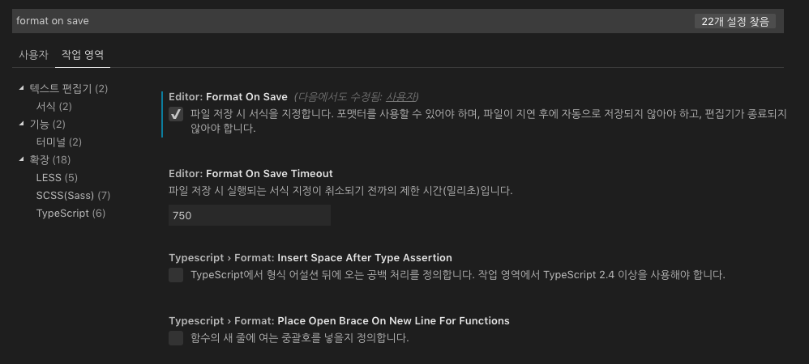
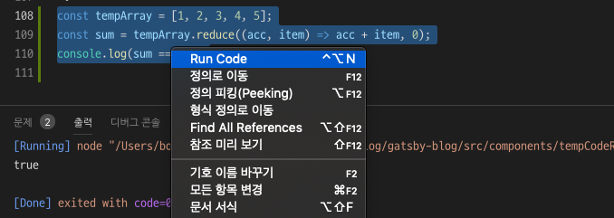
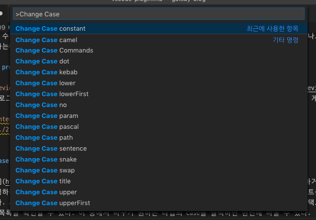
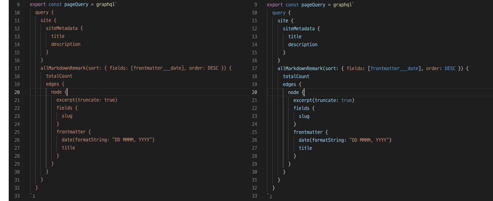

요즘 프론트엔드 개발자들은 `VSCode`(Visual Studio Code)를 가장 많이 사용한다. 그렇다보니 버그 수정이나 기능추가가 상당히 빠르다. 또한 Typescript와의 호환성도 훌륭하다. 아마도 MS에서 둘다 만들었기 때문이라 생각한다. 그리고 VSCode의 최고의 장점은 무료라는 점이다. 서버개발자들 사이에서 많이 사용되는 Jetbrain사의 `IntelliJ`도 역시 훌륭한 IDE지만, 개인적으로 구매해서 사용하기에는 좀 많이 비싸편이다.

나도 대부분 VSCode로 개발한다. 회사에서도 물론이고, Gatsby로 만든 블로그도 VSCode에서 만든다. 글도 VSCode로 쓴다. 왜냐하면 `markdownlint`와 `Markdown Preview Enhanced` 같은 plugin을 쓰면 markdown 문법에러를 바로 체크할 수 있고, 글을 작성하면서 바로 확인할 수 있기 때문에 충분히 편하다. 이 뿐만 아니라 VSCode에는 유용한(어쩌면 필수적인) plugin들이 넘쳐난다. 하지만, 좋은 플러그인이라고 전부 설치하면 자칫 에디터가 무거워질 수 있기 때문에 꼭 필요한 플러그인만 설치해서 사용하길 권장한다.

### Prettier - Code formatter

[Prettier(프리티어)](https://marketplace.visualstudio.com/items?itemName=esbenp.prettier-vscode)는 거의 필수로 설치해야할 플러그인이다. 물론 혼자 작업할때는 필요성을 못느낄 수 있다. 하지만, 혼자 작업하더라도 일관된 형식의 코드를 짜는게 가독성면에서 훨씬 낫다. Gatsby로 블로그 만들때야 상관없지만, 팀 내에서 공통으로 프로젝트를 진행하는 경우라면(모두 VSCode를 사용한다면) 소스코드로 관리하는것이 낫다. `설정` 화면에서 `작업영역` 탭을 클릭한 다음 필요한 설정을 선택하자. 그러면, 자동으로 `.vscode/settings.json` 파일이 만들어진다.



```json
{
  "editor.formatOnSave": true,
  "javascript.format.enable": false,
}
```

파일을 저장할때마다 formatting하도록 설정하고, 기본 javascript formatter는 비활성화 시켰다. 추가로 아래와 같은 옵션을 지정할 수 있다. [옵션목록](https://github.com/prettier/prettier-vscode#settings)을 참고하여 자신(또는 팀)의 입맛에 맞도록 옵션을 조절하자.

```json
{
  "prettier.jsxSingleQuote": true,
  "prettier.jsxBracketSameLine": true,
  "prettier.printWidth": 100,
}
```

또한 prettier 모듈을 설치하면 다른 팀원이 VSCode를 쓰지 않더라도 formatting을 강제할수 있다. 우선 prettier 모듈을 설치한다. (참고로 VSCode만 쓴다면 prettier 모듈을 따로 설치할 필요는 없다. plugin에 prettier dependency가 포함되어 있기 때문이다. 그래서 별도의 모듈 설치 없이도 `.prettierrc.json`에 각종 옵션을 적용할 수 있다.)

```shell
npm i -D prettier
```

그 다음, `.prettierrc.json` 파일을 프로젝트 루트에 생성하고 다음과 같이 입력한다.

```json
{
  "trailingComma": "es5",
  "tabWidth": 2,
  "semi": true,
  "singleQuote": true
}
```

### ESLint

[ESLint](https://marketplace.visualstudio.com/items?itemName=dbaeumer.vscode-eslint)는 가장 많이 사용하는 JS 문법 체크 도구다. 얼마전까지 Typescript를 사용하려면 TSLint라는 별도의 lint 모듈을 설치해야 했지만, 이제 esLint 하나로 Typescript도 지원한다.

ESLint plugin은 eslint dependency를 포함하지 않기 때문에 eslint를 설치해야한다. 그리고 몇가지 모듈을 더 추가한다.

> - `babel-eslint`: babel에서 사용가능한 실험적인 api나 문법을 eslint에게 허용하도록 도와주는 parser다.
> - `eslint-plugin-react`: react 문법을 허용하도록 도와주는 plugin이다.

```shell
npm i -D eslint babel-eslint eslint-plugin-react
```

plugin을 설치했다면 편집기에서 잘못된 코드를 입력해보자. 아래와 같이 에러가 나오는걸 확인할 수 있다.
`.eslintrc.js`를 만들어 옵션을 설정하자.
(만약 일일이 rule 설정이 어렵거나 귀찮다면, airbnb의 설정을 가져오자. 방법은 [여기](https://github.com/airbnb/javascript/tree/master/packages/eslint-config-airbnb)를 참고)

```json
{
  "parser": "babel-eslint",
  "rules": {
    // 내 gatsby blog에 prop-types을 사용하지 않아 이 부분을 비활성화 했다.
    // 참고로 0은 off, 1은 warn, 2는 error를 의마한다.
    "react/prop-types": 0
  },
  "extends": ["eslint:recommended", "plugin:react/recommended"],
}
```

작업중인 js 파일을 열고, 잘못된 코드를 입력해보자. 화면에서 즉시 에러가 나타남을 확인할 수 있다. Gatsby 프로젝트에서 설치 및 설정은 [여기](https://www.gatsbyjs.org/packages/gatsby-plugin-eslint/)를 참고하자.

#### Prettier X eslint 통합하기

Prettier와 eslint를 통합하면 formatting관련 오류를 eslint 에러로 보여주거나, 서로 충돌하는 부분들이 있을때 eslint로 통합하는 등의 처리를 할 수 있다. 우선 두가지 모듈을 설치하자. 각 모듈은 다음과 같은 기능을 한다.

> - `prettier`: 통합하기 위해서는 VSCode plugin과는 별도로 설치를 해줘야한다.
> - `eslint-plugin-prettier`: Prettier를 eslint의 plugin으로 추가해주는 모듈
> - `eslint-config-prettier`: eslint와 Prettier의 format관련 설정이 충돌하면 eslint의 설정을 비활성화 해준다.

```shell
npm i -D prettier eslint-plugin-prettier eslint-config-prettier
```

다음으로 .eslintrc 설정파일에 prettier 관련 설정을 추가한다.

```json
{
  "extends": ["plugin:prettier/recommended"]
}
```

이제 format 관련 에러가 발생하면 `eslint(prettier/prettier)`라는 메세지를 확인할 수 있을 것이다.

### Code Runnder

[Code Runner](https://marketplace.visualstudio.com/items?itemName=formulahendry.code-runner)를 사용하면 간단한 코드를 확인할 때 유용하다. 기존에는 간단한 코드를 확인하기 위해서는 js 파일을 만들어 node로 실행하거나, 크롬같은 브라우저의 `console탭`을 이용했었다. 하지만, Code Runner를 사용하면 지금 작업하고 있는 영역에서 간단하게 실행 가능하다. 예를 들어보자.



작업 중인 `js/jsx` 파일에서 코드 조각을 작성한다. 그리고 코드를 선택하고 마우스 우측 버튼을 클릭하면 가장 위에 `Run Code` 메뉴가 보인다. 클릭하면 아래 `출력` 탭에 결과가 나타나는 걸 확인 할 수 있다.

### markdownlint

[markdownlint](https://marketplace.visualstudio.com/items?itemName=DavidAnson.vscode-markdownlint)는 Gatsby로 글을 쓸 때 유용하다. 특히, 코드 조각을 여러개 작성할때 가끔 ` ``` `를 빠뜨리곤 한다. markdownlint를 사용하면 문제 있는 부분이 바로 눈에 보이므로, 오류가 날 확률이 훨씬 줄어든다.

프로젝트 root 폴더에 `.markdownlint.json` 파일을 만들면 사용자가 원하는 옵션을 추가할 수 있다.

```
{
  "no-bare-urls": false,
  "line-length": false,
  "no-inline-html": false,
  "fenced-code-language": false
}
```

또다른 방법으로 `Prettier`와 `gatsby-remark-prettier`를 사용하면, 저장할때마다 자동으로 fommatting하도록 할 수 있다([사용법](https://www.gatsbyjs.org/packages/gatsby-remark-prettier/?=pretiier)). 나도 사용해봤는데, 내 경우에는 좀 맞지 않아서 제거해버렸다. 나는 좀더 자유로운 형식으로 글쓰기를 원하는데, prettier가 생각지도 못한 부분까지 바꿔버리는 경우가 더러 있었기 때문이다.

### markdown preview Enhanced

[markdown preview Enhanced](https://marketplace.visualstudio.com/items?itemName=shd101wyy.markdown-preview-enhanced)를 사용하면, VSCode에서 작성중인 포스팅을 바로 확인할 수 있다. 물론 각자 블로그의 CSS가 다르기 때문에 실제 렌더링된 모습과는 다르겠지만, 기본적인 요소를 확인하기에는 나쁘지 않은 선택이다. 게다가, 위치에 따라 알아서 스크롤되기 때문에 비교하면서 작업하기에 좋다.

<p align="center">
  
</p>

### change-case

[change-case](https://marketplace.visualstudio.com/items?itemName=wmaurer.change-case)는 코드를 작성하거나 수정할때 유용하다. 예를들어 변수이름(camelCase)을 상수(CONSTANT)로 바꿔줘야할때 일일이 타이핑하다보면 실수할 때가 있다. 이럴때 change-case를 사용해보자. 실수없이 이름을 바꿀 수 있다. 또다른 예로, 타입스크립트를 사용한다면 snake_case로 넘어온 API 결과 데이터를 한번에 camelCase로 바꾸고 싶을때가 있다. 이때 change-case를 사용하면 한꺼번에 간단히 변경할 수 있다. 사용법을 한번 알아보자. 바꾸고 싶은 이름(들)을 마우스로 드래그해서 선택(selection, 다중 선택도 가능)한다. 그 다음 `ctrl + shift + p`를 눌러 `Change case` 또는 `case`를 쳐보면, 아래와 같은 목록을 확인할 수 있다. 이 중에서 바꾸기 원하는 타입의 case를 클릭하면 한번에 바꿀 수 있다.



### GraphQL for VSCode

[GraphQL for VSCode](https://marketplace.visualstudio.com/items?itemName=kumar-harsh.graphql-for-vscode)는 Gatsby 프로젝트에서 유용하다. 기본적으로 GraphQL은 하이라이팅을 지원하지 않는다. 안그래도 눈에 잘 안들어오는 GraphQL 문법이 더 난해하게 보일 수 있다. 그러때 이 plugin을 설치하면 가독성이 훨씬 좋아진다.



### 결론

이 외에도 react 관련 snippet이나, css 하이라이팅 등 자신이 주로 사용하는 모듈에 적합한 plugin들도 유용하게 사용 가능하다. 어떤 IDE, Editor든 마찬가지겠지만, plugin을 잘 사용하면 생산성이 훨씬 좋아진다. 그렇다고 무분별하게 사용하다가는 프로그램이 무거워져 버벅이는 현상을 겪게될지도 모른다. VSCode는 각 작업환경별로 plugin을 설정할 수 있기 때문에 반드시 필요한 plugin만 활성화해서 사용하도록 하자.

### 참고자료

- eslint-config-airbnb github page: https://github.com/airbnb/javascript/tree/master/packages/eslint-config-airbnb
- gatsby-plugin-eslint: https://www.gatsbyjs.org/packages/gatsby-plugin-eslint/
- velopert's ESLint + Prettier: https://velog.io/@velopert/eslint-and-prettier-in-react
- ID PRAVUS's ESLint + Prettier: https://pravusid.kr/javascript/2019/03/10/eslint-prettier.html  