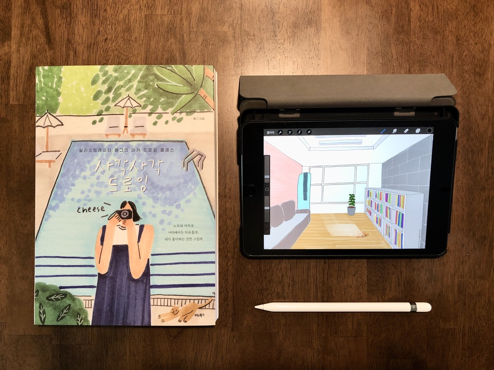

어릴적 그림 그리는 화가가 되고 싶었다. 아마 초등학교 다닐때부터 중학교 다닐때 까지의 꿈이었던걸로 기억한다. 이후, 고등학생이 되면서 우주물리학자, 교육부장관(?) 등이 후보로 나왔다. 그러나 화가만큼 오랫동안 지속되지는 못했다. 어렸을적 나는 전문적인 그림 수업을 듣지는 않았다. 몇개월 정도 미술학원에 다니긴 했지만 그게 전부다. 학원과 상관없이 나는 그림 그리는게 좋았다. 누가 시키지 않아도 혼자서 그림을 그렸다. 주변에서 좀 잘 그린다는 칭찬도 꽤 받아봤다. 물론 내 기억이 진실이라는 보장은 없지만 말이다(지금 그려보면 잘 못그리는데.. 역시 좋은 기억만 남는건가..).

중학생 이후 화가의 꿈을 접고선 그림은 거의 그리지 않았다. 대한민국 대부분의 고등학생처럼 입시에 매달렸다. 좋아했던 것, 좋아하는 것은 내 고민의 일부가 아니었다. 점수를 얻고 점수에 맞게 진학하는것, 그게 다였다. 하지만, 운이 좋았던것일까. 1년 후에 학과 중 하나를 선택할 수 있는 대학에 진학했고, 그렇게 내 진로는 1년 미뤄졌다. 지금 생각해보면 그 1년은 내게 꽤 소중한 시간이었던것 같다. 그때 만큼 어린시절에 나와 내가 좋아하던것에 대해 상기했던적은 없었으니 말이다. '어린시절의 나는 그림 그리는걸 좋아했고, 만드는걸 좋아했었지. 그래 나는 건축으로 진로를 결정해야겠다'. 나는 `건축`을 길로 정했다.

건축과에 들어와보면 알겠지만, 절반은 말하고 절반은 만들고 그린다. 실제로 미대에 다니다가 편입한 사람들도 꽤 있다. 그래서 건축에 뜻이 있는 사람들이라면 다들 왠만큼 잘 그린다. 지금은 대부분 컴퓨터로 도면을 그리고 그래픽 작업을 하지만, 예전에는 손으로 다 그렸다. 평면도는 물론이고 조감도나 투시도도 모두 손으로 그렸다. 그것도 연필 하나로. 당시 건축가에게 그림 그리는 기술은 필수로 지녀야할 기본 소양이었다. 지금은 컴퓨터로 모든 결과물을 그리긴 하지만, 서로 토론할때는 여전히 그림으로 대화를 주고받는다. 그만큼 건축이라는 직종이 그림과 뗄레야 뗄수 없는 관계다. 대학을 다닐 당시에도 나 역시 그림을 꽤 그렸다. 오해하지는 말자. 잘 그렸다는 말이 아니다. 꽤 많이 그렸다는 뜻이다. 지금은 어디갔는지도 모르겠지만, 어딘가 꽂혀있을 내 포트폴리오(Portfolio)에는 당시에 그렸던 내 그림들이 꽤 많이 수록되어 있다.

건축을 포기하고 개발자의 길로 들어서면서 그림과는 담을 쌓았다. 아예 안그렸다. 잘 그리지도 못했지만, 그림을 그릴만한 여유도 없었던것 같다. 그러다 처음 아이패드를 구매했을 때(대략 7년 전) `prcreate`란 앱을 유료로 구매하면서 그림에 대한 욕구가 다시 꿈틀거렸다. 하지만, 당시에는 손이나 동그란 스타일러스 펜 등을 이용해 그림을 그렸어야 했다. 해본 사람은 알겠지만 사용감이 완전 별로다. 다양한 물감, 최신식 팔렛트는 모두 갖춰져 있지만, 붓 없이 손으로 그림을 그리라는 것과 같았다. 상황이 그렇다보니 패드로 그림을 그린다는 생각은 자연스레 사라졌다. 그렇게 7년동안 한번도 procreate는 열어보지 않았다.

그 사이 갤럭시 노트도 출시되고 애플펜슬도 출시되었다. 이제는 폰이나 패드에서도 필압을 감지할 수 있게 되었다. 필압을 감지할 수 있다는 말은 아이패드와 같은 전자기기에서도 진짜 그림을 그릴수 있다는 말과 같다(완전 같다고는 못하겠다). 마침, 최근에 아이패드 미니 5세대를 구매했다. 애플펜슬도 샀다. 딱히 그림을 그려야겠다고 생각하고 애플펜슬을 산건 아니다. 중고로 샀는데 판매자가 껴서 팔았을 뿐. 아무튼 애플펜슬이 생기다보니 갑자기 그림도 그리고 싶어졌다. 게다가 1세대 애플펜슬임에도 불구하고 감이 꽤 괜찮다. 패드에 필름 없이 사용하면 조금 미끌거리긴 하지만, 종이 느낌이 나는 필름을 사서 붙이니 그럭저럭 종이에 그림그리는 맛이 난다.

  &#60;my family's playground, 191020&#62;

요즘은 꽤나 기분이 쳐져 있다. 넷플릭스로 드라마를 봐도 그때 뿐이고 게임은 더더욱 안한다. 그나마 읽던 책도 요즘은 잘 안 읽는다. 영어공부는 꾸준히 하지만, 실력 향상이 느껴지지 않아 이 또한 슬럼프에 빠졌다. 회사일도 꽤 많다. 피로는 풀리지도 않는다. 몸이 무거우니 기분도 다운된다. 문득, TV에서 가끔 보이던 미술 치료가 생각났다. 심한 우울증을 앓고 있던 사람들(주로 연예인)에게 그림을 그리기 시작하면서 우울증도 치료되고 나아가 전시회까지 열기도 한다는 거다(전시회까지 하는건 대부분 연예인이긴 하다).

그래. 아이패드로 그림이나 그려볼까? 딱히 다운된 기분을 `업` 해보자고 시작하려는 의도는 아니지만, 뭔가 그리다보면 기분이 좀 나아지지 않을까? 하지만, 막상 패드로 그림을 그리려고 하니 좀 막막했다. 일종의 가이드가 있으면 좋지 않을까? 요즘은 패드로 그림그리기 수업을 하는 클래스도 꽤 많다고 한다. 클래스를 수강할만한 시간적 여유는 없는터라, 어느 유튜버가 추천한 책 중에서 하나를 골랐다.

`사각사각 드로잉 노트`, 표지도 이쁘고 제목도 귀엽다. 마카로 간단한 사물이나 풍경 또는 인물을 그리는 법을 알려준다. 그리는 순서도 알려주기 때문에 초보자에게 괜찮은 책인것 같다. 책에서 알려준 방법대로 하나씩 그려보았다. 처음에는 아이가 나보고 책에 나오는 꽃을 자꾸 그려달라 했다. 귀찮았다. 그런데, 하나씩 그리다 보니 꽤 할만했다. 재미 있었다. 그래. 이왕 하는거 제대로 한번 해보지 뭐. 오랜만에 맘 먹고 그림을 그리기로 했다. 아이를 재우고 새로산 책과 아이패드를 놓고 애플펜슬을 집어들었다. 처음 제대로 그려보는거라 쉽진 않았다. procreate 사용법이 미숙한 탓일수도 있고 아이패드 미니가 좀 작아서 그럴지도 모르겠다. 아무튼 그렇게 몇시간을 지웠다 다시 그리기를 반복하면서 마침내 첫 작품(?)을 그려냈다. 비율이나 색감 등이 썩 맘에 들진 않지만(우리집이 너무 좁아 보여 ㅠㅠ), 그래도 시작치곤 나쁘지 않아 보인다(내 생각엔 그렇긴 한데..). 앞으로 좀 더 그리는 기술(?)을 연마해서 점점 나은 작품이 탄생하길 기대해본다.