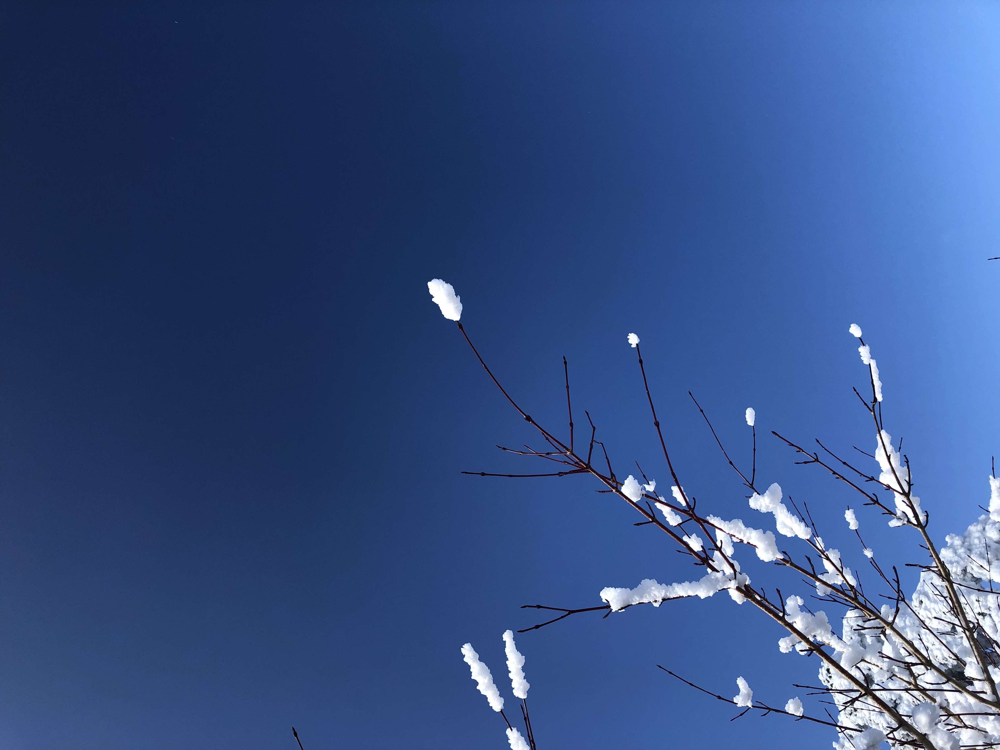

매년 겨울산에 오른다. 횟수로 5년째, 6년간 딱 한번 제외하고 매년 겨울산에 올랐다. 한라산 두번, 덕유산, 설악산에 이어 이번에는 태백산. 원래 이번 겨울에는 등산 계획이 없었지만, 태백산에 눈이 왔다는 소식을 듣자마자 곧바로 버스표를 예약했다. 등산 당일, 코로나 바이러스 탓인지는 몰라도 버스는 한산했다. 승객도 나 포함 5명정도. 오랜만에 조용히 등산할 수 있을지도 모르겠다고 내심 기대됐다. 버스에 오르자마자 폭풍수면. 느낌상으론 10분이었지만 3시간 정도 후 태백 터미널에 도착했다. 태백이 워낙 작은 도시기도 하지만, 시간이 이른 탓인지 바이러스 여파인지는 몰라도 한산한 느낌잉었다. 시내가 이정도라면 산에도 사람은 없을것 같았다. 우선 산에서 먹을 간식과 김밥 등을 샀다. 그리고 택시를 잡았다. 버스도 있긴하지만 시간이 애매했고, 내려와서 약속도 있었기에 택시가 낫다고 생각했다. 게다가 당일로 돌아와야했기 때문에 최대한 시간을 아껴야했다. 

택시로 15분 만에 등산로 입구인 유일사에 도착했다. 그런데, 맙소사. 태백을 방문한 사람은 다 여기 있는건가? 꽤 넓은 공간임에도 주차장은 이미 만차였다. 등산로 입구에도 사람들이 가득했다. 삼삼오오 모여 수다를 떨거나, 커피를 마시거나, 준비운동에 한창이었다. 등산로 입구가 좁긴 했지만, 대충 세어도 한 300명? 조용하게 등산할 수 있을거라는 희망이 사라지는 순간이었다. 이렇게 많은 사람들과 등산해야한다니. 줄서서 올라갈 판이었다. 

태백산도 1500m가 넘는 꽤 높은 산이다. 하지만, 높이와는 다르게 등산 난이도는 낮은편에 속한다. 시작점이 대략 800m 정도라서 실제 오르는 높이는 700m 정도기 때문이다. 등산 시간도 왕복 4시간이면 충분하다. 즐겨 산에 오르지 않는 사람이라면 4시간이 어느정도인지 감이 없을수도 있겠다. 참고로 한라산은 8시간 정도, 설악산은 코스에 따라 다르지만 대략 10시간 걸린다. 4시간이면 좀 빡센 동네 산 오르는 정도 될까. 그래도 언제든 산에 갈때는 보수적으로 준비해야한다. 특히 겨울이라면 더욱 철저히 준비가 필요하다.

눈 때문에 더 좁아진 등산로를 줄서서 오른지 한시간쯤 지났을까? 서서히 수목의 높이가 낮아지고 아름다운 눈꽃이 모습을 드러냈다. 곳곳에서 감탄하는 소리와 떠드는 소리가 들려왔다. 다들 핸드폰 앞에서 포즈를 취하고 기분 좋게 하하호호 웃고 있었다. 누군가는 눈꽃이 활짝 핀 나무 앞에서 사진을 찍고 멀리 눈으로 덮인 능선을 배경으로 사진을 찍기도 했다. 눈꽃이 활짝 피었고 날씨가 좋았기 때문에 사진 찍기에는 최고의 날이었다. 태백산 주목이나 장군봉 비석같이 상징적인 장소 앞에는 인증샷을 찍으려는 사람들로 긴 줄이 이어졌다. 나는 워낙 사진찍히는걸 싫어하는 타입이라 굳이 사람들이 많이 찍는곳에서 사진 찍을 생각은 없었다. 또한 남들이 다 하는건 절대로 안한다. 아무리 멋있어 보이는 수목과 풍경이라해도 많은 사람이 몰려 있으면 눈에만 담아두고 그대로 지나갔다. 

  &#60; 남들 다 찍는 사진은 싫다 &#62;

요즘 세상에 사진 찍는 행위는 전혀 특별하지 않다. 3~4살 아이부터 70이 넘는 노인들까지 누구나 쉽게 사진을 찍는다. 카메라 달린 스마트폰은 누구나 가지고 있기 때문이다. 장소, 시간은 상관없다. 언제 어디서든 핸드폰을 꺼내든다. 너무 쉽고 간편하게 사진으로 남기고 싶은 순간을 기록할 수 있게 되었다. 예전에는 사진 한 장 한 장이 모두 돈이었다. 그래서 한 컷을 찍더라도 심혈을 기울여 셔터를 눌렀다. 이리저리 구도를 바꿔보기도하고, 결정적 순간을 위해 때를 기다리기도 했다. 찍고나서도 사진을 현상할때까지는 결과물을 알 수 없었기 때문에 기다리는 묘미도 있었다. 하지만 지금은 완전히 달라졌다. 너무 쉽게 찍고 너무 쉽게 지운다. 아무렇게나 버튼(셔터가 아니다)을 누르고 바로 확인한다. 맘에 안든다 싶으면 고민없이 지운다. 어차피 기록되는 사진은 0과 1로 이뤄진 디지털 정보기 때문에 핸드폰 디스크 용량만 충분하다면 공짜나 다름없다. 그렇게 찍어댄 수십장 혹은 수백장의 사진 중에 우연히 건진 몇장의 사진을 자랑이랍시고 인스타에 올린다. 좋아요가 늘어나고 댓글이 달린다. 하지만 그것도 잠시. 며칠만 지나면 이 사진도 타임라인 저 멀리 사라져버린다. 사진은 그렇게 소비된다.

이제 우리는 어딜가든 핸드폰을 먼저 꺼내든다. 하루에도 수십장에서 수백장씩 버튼을 눌러대고 사진을 생산한다. 수 많은 사진은 핸드폰에 저장되고, 클라우드에 저장된다. 너무 많은 사진이 생산되기 때문에 가끔 스마트폰 속 앨범을 훑어볼때면 찍은 기억마저 생각나지 않을만큼 생소한 사진도 발견한다. 사진 한 장이 곧 돈인 시절에는 찍은 사진 자체가 많지 않았다. 그래서 집집마다 책으로된 앨범 몇권씩 가지고 있었다. 여자친구라도 놀러 올때면 오래된 앨범을 꺼내들고 어린시절 사진 하나에 즐거워했다. 하지만 지금은 너무 많은 사진이 너무 많은 공간에 존재한다. PC에도 있고, 오래 묵혀둔 외장하드에도 있다. 클라우드에도 있고, 스마트폰에도 있다. 어디에 있는지 모르는 사진도 많다. 아예 사라진 사진도 많다. 다만 기억하지 못할 뿐.

그렇다면 사람들은 왜 사진을 찍을까? 당시의 기억을 오롯이 기록하고 싶어서일까? 아니면 내가 그 장소에 있었던걸 다른 사람에게 알리고 자랑하기 위함일까? 물론 사람마다 다르겠지만, 요즘의 사진찍는 행위는 대부분 후자에 가깝다. 인스타같은 SNS에 남기거나 밴드나 단톡방에 공유할 목적으로 사진을 찍는다. 말로 설명하면 힘들고 듣는 사람도 듣기만해선 상상하기 어렵다. 사진 한장이면 말 한마디 하지 않아도 그날의 모습을 생생히 전할 수 있으니까. 하지만 여기에 빠져있는게 있다. 바로, 이야기. 내가 보고 느꼈던것, 풍경과 순간이 내게 전해준 것. 그것들은 사진속에 온전히 담아내기 어렵다. 좋았다, 멋있었다 처럼 간단한 표현들을 덧붙여보지만 그래봐야 짧은 가십거리에 지나지 않는다. 내가 거기 다녀왔다는 것 그 이상 그 이하도 아니다. 사진이야 어차피 구글에 널려있지 않은가? 

내가 그 장소에 있었다는것을 기록(사진)으로 보여주지 않으면 가치가 없는 것일까? 사진으로는 절대 담을 수 없는 그날의 기억(이야기)이 더 중요하건 아닐까? 우리는 끊임없이 뭔가를 찍어댄다. 마치 이 순간을 영원히 기억하고 싶은 것처럼. 하지만 그토록 소중했던 기억은 어디에 존재하는지 모르는 곳에 버려지고 또다시 새로운 기록으로 채운다. 내가 머물렀던 그 순간의 온전한 풍경과 감각, 기억의 형태는 핸드폰(또는 카메라)의 사각 프레임안에 갇혀서 손쉽게 사라진다. 

기억이 중요한가? 기록이 중요한가?
