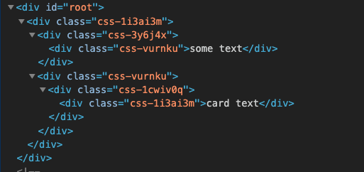

`프론트엔드(Frontend)`의 영역이 점점 커지고 있다. 과거의 프론트엔드는 HTML과 CSS와 약간의 Javascript(이하 JS)를 다루는 영역이었다. 흔히 웹 퍼블리셔의 역할인 UI개발이 주된 업무였다. 하지만, 웹의 기능이 복잡해지고 동적 요구사항이 늘어나면서 과거 방식은 한계에 이르렀다. JS가 다루어야 할 영역은 점점 커졌고, 백엔드의 비즈니스 로직 일부는 프론트로 이전되었다. 이제는 더 이상 서버에서 View를 담당하지 않는다. 서버는 핵심 비즈니스 로직을 작성하고, 필요한 데이터를 프론트에 제공한다.

프론트에서 해야 할 일이 많아지면서 다양한 기술이 등장했다. 리로딩 없이 빠른 속도로 페이지를 전환하기 위한 `SPA(Single Page Application)`, 여러 JS파일을 하나의 파일로 번들링하기 위한 `Webpack`, 현재 브라우저에서 지원하지 않는 문법을 사용하도록 도와주는 `Babel` 등 다양한 기술이 쏟아졌다. `React`나 `Vue` 같은 프론드엔드 전용 프레임워크는 이제 선택이 아닌 필수다. 

프론트엔드를 위한 다양한 기술이 나왔지만, 웹(또는 브라우저)의 동작 방식은 이전과 다르지 않다. 브라우저가 통신으로 요청한 HTML문서를 파싱해서 DOM트리를 만들고, 스타일 시트와 결합해서 렌더트리를 만들어 화면에 그린다. 이때, `HTML(의미)`은 뼈대를 만들고, `CSS(표현)`가 살을 붙이고 옷을 입힌다. 그리고 `JS(동작)`는 이를 살아있게 만든다. 브라우저는 이 세 가지의 상호작용으로 페이지를 그리고 갱신한다.

사실, 위에서 언급했던 새로운 기술 대부분은 개발 편의와 동작 효율을 위한 목적으로 만들어졌다. 최신 문법을 사용하게 해주거나, 컴포넌트 단위 개발을 도와준다. JS파일을 하나로 합쳐서 파일 크기를 줄이고 페이지 속도를 향상한다. 하지만, 기술에 너무 의존하면 기본을 간과할 수 있다. React를 익히고 Webpack 사용법을 익히면 프론트 개발은 가능하다. 하지만, React나 Webpack은 도구일 뿐 언제든 대체될 수 있다. HTML, CSS, JS가 어떻게 동작하는지 그 근본 원리를 이해하는 것이 훨씬 중요하다. 기본이 탄탄하면 도구가 바뀌어도 쉽게 이해하고 익힐 수 있다. 

## HTML(Hyper Text Markup Language)

`HTML`은 웹에서 가장 기본적인 요소(언어)다. 개발자는 브라우저가 알아볼 수 있도록 적절한 태그와 속성을 이용해서 HTML문서를 작성해야 한다. 정답이 없기 때문에 어떻게 작성하든 상관없다. 하지만, 시각 장애인처럼 웹 페이지에 쉽게 접근(눈으로)할 수 없는 사람들에게 정확한 정보를 제공하려면 명확한 의미를 가진 HTML문서를 작성해야 한다.  

아래는 `react + styled-components + rebass` 세 가지 조합으로 작성한 JS코드(React의 JSX로 표현)다. 얼핏 보면, HTML같지만 Box, Text, Card 등 HTML 태그와는 전혀 다른 요소를 사용한다. 

~~~js
import { Box, Text, Card } from 'rebass'

function App() {
  return (
    <Box m={20}>
      <Box mb={30}>
        <Text>some text</Text>
      </Box>
      <Box>
        <Card width={256} sx={{ border: '1px solid tomato' }}>
          <Text m={20}>card text</Text>
        </Card>
      </Box>
    </Box>
  );
}
~~~

브라우저의 개발자 도구에서 결과를 확인해보면 아래와 같이 모두 `div` 태그로 만들어진다. 이는 완전히 개발 중심의 코드다. 개발자 입장에서는 Box, Text, Card 등으로 쉽게 구분할 수 있다. 하지만, 결과물은 그렇지 않다. div만 사용하는 것은 웹 접근성을 위해 좋은 선택이 아니다. div 태그와 기능의 차이는 없지만, `article, section, nav` 등 의미로 구분된 태그를 사용해야 페이지 탐색에 용이하다. 물론, 위 코드에서도 `as`와 같은 속성을 사용해 HTML 태그를 바꿀 수 있다. 하지만, 간과하기 쉽고 tag로 구분하는 것과는 확연한 차이가 있다. 

  &#60; react + styled-components + rebass &#62;

## CSS

CSS는 HTML문서에 디자인을 입힌다. 만약, CSS 없이 HTML만 있는 웹 페이지라면, 화면에는 텍스트만 나열된 페이지가 출력될 것이다. CSS가 없으면 옷을 입지 않은 것과 같다. CSS는 HTML의 요소에 포함되며 각 영역의 색상과 크기 및 일부 동작(Animation)을 정의한다.

요즘은 CSS-in-JS 라이브러리를 많이 사용한다. 쉽게 말해, JS코드에 CSS를 포함하는 방식이다. 선택자(Selector)를 유니크하게 만들어 다른 컴포넌트와 구별함으로써 스타일을 모듈화하고 캡슐화한다. 전통적인 CSS 방식과 비교해 어떤 방법이 더 나은지는 아직도 의견이 분분하다. 사용하는 프레임워크나, 작업방식에 따라서 본인의 니즈에 맞게 선택하면 된다. 

## Javascript(JS)

JS는 HTML문서를 동적으로 만든다. SVG(Scalable Vector Graphics)나 CSS를 이용해도 동적인 페이지를 만들 수 있지만, 한계가 있다. JS는 유저가 발생시키는 이벤트(클릭, 스크롤 등)에 따라 웹 페이지가 적절히 변경되도록 만든다. 모던 JS에서는 서버에서 받은 데이터를 처리하고 비즈니스 로직을 작성하는 역할도 JS가 담당한다. 

프론트엔드의 발전이 곧 JS의 발전이라 해도 틀린 말이 아니다. 그만큼 JS는 달라졌다. 십수 년 전만 해도 서버 개발자에게 천대받는 하찮은(?) 언어였지만, 지금은 서버(ex. nodeJS)에서부터 네이티브(ex. React Native)까지 JS가 쓰이지 않는 곳이 없다. 

## Frontend 바로 알기

경험이 쌓이고, 경력이 쌓이면 일하는데 크게 어려움이 없다. 해오던 방식을 답습하고 반복하면 그만이기 때문이다. 문제가 발생하면 검색해서 적절한 방법을 찾는다. 원인을 파악하고 원리를 이해하면 문제는 반복되지 않는다. 하지만, 시간에 쫓기며 해결한 문제는 또다시 같은 문제에 봉착한다. 이때, 기본 원리를 잘 이해하고 있으면 문제 발생을 사전에 막을 수 있다. 

앞으로 프론트엔드 기반 기술에 관해 포스팅할 생각이다. 문법이나 사용법을 말하는 건 아니다. 기본적인 작동 원리와 상호관계 등 프론트엔드 개발자라면 필수로 알아야 할 지식을 다룰 예정이다. 
