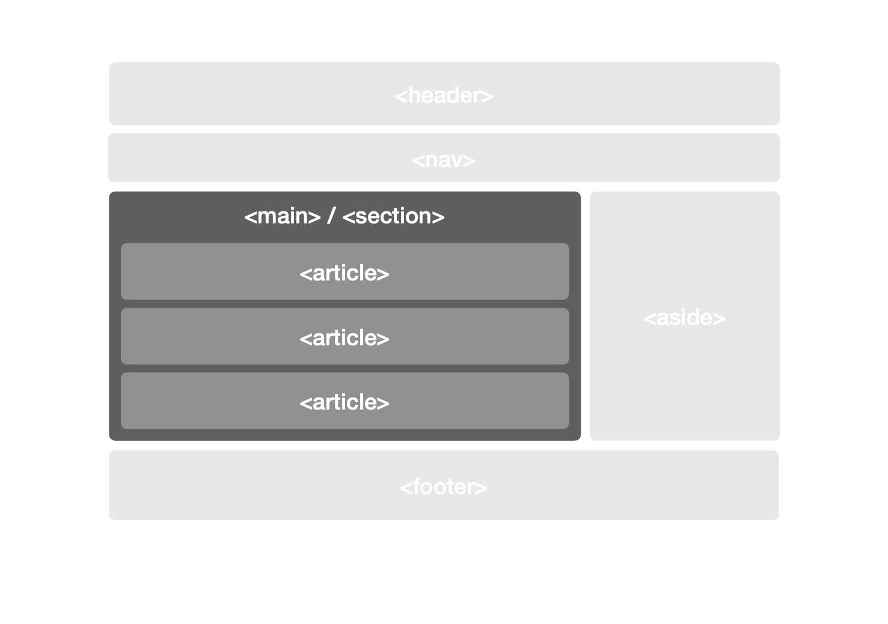
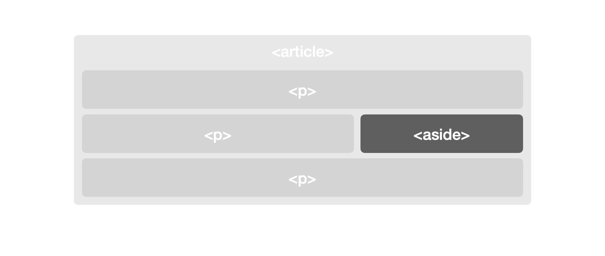

`HTML(Hyper Text Markup Language)`은 웹에서 `의미`를 담당한다. 웹페이지의 뼈대를 만들고 레이아웃을 구성한다. 웹사이트마다 구성은 다르지만, 대체로 헤더(Header), 내비게이션(nav), 콘텐츠(main), 그리고 푸터(footer)의 조합으로 만들어진다. 각 영역은 기능에 따라 구분한다. 헤더에 사이트 이름이나 로고 등을 넣는다. 일종의 간판이다. 내비게이션 영역은 페이지 전환, 로그인 등 사이트의 공통 기능이 들어간다. 글 목록이나 본문 등 실제 내용은 콘텐츠 영역에 들어가고, 푸터에는 회사 정보나 약관 등의 부가정보가 배치된다.

`시맨틱 요소(Semantic Elements)`는 웹을 의미 있게 만드는 역할을 한다. HTML4에서 `HTML5`로 넘어오면서 시맨틱 요소가 많이 추가되었다. HTML4 환경이라면, `
`으로 작성할 코드를 HTML5에서는 `<main>`으로 작성할 수 있다. 많이 간단해졌다. 내비게이션은 \<nav\>를 사용한다. 글의 제목은 \<h1\>~\<h6\>를 사용하고, 헤더 영역은 \<header\>를 사용한다. 본문은 \<article\>과 \<section\>으로 적절히 구분하고, 각 문단은 \<p\>(paragraph)를 사용한다. 버튼은 \<button\>을 사용하고, 사진에 대한 설명은 \<figure\>와 \<figcaption\>을 사용한다. 그 밖에도 의미에 맞춰 사용해야 할 요소가 수 없이 많다. 일부는 HTML4에도 존재했고, 일부는 HTML5에 추가되었다. 

## 웹 접근성

많은 웹사이트가 의미를 가진 요소 사용을 간과한 채 잘못된 방향으로 만들어진다. `영역과 기능에 따라` 적절한 tag를 사용하지 않고 `
와 `만으로 웹페이지를 구성한다. 물론, 이 두 가지 tag만 나열해도 웹페이지를 만들 수 있다. 어차피 디자인은 CSS 영역이기 때문이다. HTML 노드에 어떤 태그가 있더라도 CSS만 제대로 작성하면 디자이너가 그린 것과 똑같은 화면을 만들 수 있다. 일반적 경우라면 아무 문제없다. 다만, `웹 접근성(web accessibility)` 차원에서는 문제가 된다. 웹페이지에 일반적인 방법으로 접근할 수 없는 사람들, 특히 시각장애인의 경우는 볼 수 없기 때문에 스크린 리더와 같이 문서를 소리로 바꿔주는 특수한 장치를 이용해야 한다. 웹사이트를 눈이 아닌 귀로 듣는 경험은 어떨지 상상하기 어렵다. 아마 많이 불편할 것이다. 우리가 상상할 수 없다고 간과해서는 안된다. 웹을 만드는 사람이라면 조금이라도 이 불편함을 해소할 수 있도록 도와야 할 의무가 있다. 구현하기 편하다고, 자기 눈에는 아무 이상 없다고 그냥 지나치면 안 된다. 최소한 요소의 의미와 쓰임새를 알고 제대로 사용해야 한다.

(웹접근성에 관해서는 별도로 쓸 예정이라 이 글에서는 더 이상 다루지 않겠다)

## SEO(검색엔진 최적화)

시맨틱 요소는 접근성 뿐 아니라 `검색엔진 최적화(SEO: Search Engine Optimization)`에도 영향을 준다. 관련 키워드로 검색했을 때 검색 결과 상위에 문서를 노출하려면 SEO 최적화는 필수다. 구글 같은 검색 사이트는 주기적으로 전 세계에 공개된 웹을 `수집(Crawling)`하고 `분석(또는 색인: Indexing)`한다. 구글 검색엔진이 웹사이트에 방문하 때, 미리 제공한 `sitemap.xml` 파일이나 `robots.txt` 파일을 이용해 수집 방법을 결정한다. 소유자 입맛에 맞게 수집 방법을 결정할 수 있도록 `Google Search Console`과 같은 서비스도 제공한다. 

검색엔진이 웹사이트를 방문하면 문서에 포함된 링크를 따라가며 관련 페이지를 모두 방문하고 수집한다. 수집된 문서는 구글 시스템에서 분석 과정을 거친다. 웹사이트에 사용된 태그와 단어의 빈도 등 검색엔진 자체 알고리즘에 따라 주요 키워드를 추출한다. \<div\>와 \<span\>만 사용한 문서는 어떤 부분이 중요한 영역인지 구분이 어렵다. 문서의 제목에 해당하는 \<title\>, 본문 영역 표시 \<main\>, 글 제목 \<h1\> 등 주요 항목을 별도의 태그로 구분한 문서가 더 좋은 점수(실제 점수가 있는 건 아니다)를 획득한다. 즉, 검색 결과 상위에 노출된다. 물론, 검색엔진마다 알고리즘이 다르기 때문에(우리는 알 수 없다) 무엇이 정답이다 말할 수는 없다. 하지만, 상식적으로 생각해도 영역 구분이 확실한 문서가 그렇지 않은 문서보다 더 적절한 키워드를 추출할 것이라 예상할 수 있다. 우리가 웹문서를 의미에 맞게 구성해야 하는 이유다. 

## 주요 Semantic Elements

간과하기 쉽지만 꼭 알아야 할 몇 가지 중요한 Semanctic 요소에 대해 알아보자.

### <u>\<header\>와 \<footer\></u>

`<header>와 <footer>` 모두 문서(전체 웹페이지 또는 특정 영역)의 부가정보를 표기하는 데 사용한다. \<header\>에 문서의 제목, 로고, 작성자, 작성일과 같은 메타 정보를 배치한다. 그리고 \<footer\>에는 회사 정보나 소유자의 소셜미디어 정보, 약관 등 문서와 관련이 적은 부가정보를 배치한다.

\<header\>, \<footer\> 모두 웹사이트 부가정보를 표기할 때 사용하지만, 아래처럼 본문(\<article\> 또는 \<section\>)내 부가정보를 표기할 때도 사용할 수 있다. 

~~~HTML
<article>
  <header>헤더 정보</header>
    
본문내용

    
본문내용

  <footer>푸터 정보</footer>
</article>
~~~

\<header\> 와 \<footer\>는 중첩해서 사용할 수 없다는 점에 주의해야 한다.

### <u>\<nav\></u>

`내비게이터(navigator)`를 의미한다. 사이트 전체 흐름을 제어하는 기능을 담당한다. 페이지 이동 등의 주요 메뉴가 배치된다. 구조에 따라 문서 상단이나 측면에 위치하기도 한다. 전체 페이지의 흐름을 담당하기 때문에 문서의 변화와 상관없이 항상 노출하는 경우가 많다.

### <u>\<main\>과 \<article\>과 \<section\> </u>

세 가지 태그는 본문 영역을 구획할 때 주로 사용한다. 

`<main>`은 문서에서 오직 한 번만 사용한다. 본문을 뜻하며, 콘텐츠 내용 전체를 감싼다. 그에 비해 <article\>과 \<section\>은 좀 더 자유롭다. 내가 사용할 때는 `<article>`은 내용으로 나누고, `<section>`은 형식으로 나눈다. 하나의 \<article\> 안에 여러 개의 \<section\>이 있을 수 있고, 반대의 경우도 가능하다.

블로그 페이지를 예로 들어보자.

- article 내 여러 개의 section을 배치하는 경우

> 글 본문 페이지에서 사용할 수 있다. `글 전체를 article`, `각 단락을 section`으로 구분한다.
 
- section 내 여러 개의 article을 배치하는 경우

> 글 목록 페이지에서 사용할 수 있다. `글 목록 전체를 section`, `목록 중 하나를 article`로 구분한다.

### <u>\<aside\></u>

`<aside>`는 본문 옆에 구성한다. 보통은 본문과 직접적으로 관련 없는 내용이 배치된다. 블로그에서 측면의 카테고리 목록이나 태그 목록 등이 포함된 영역이 이에 해당한다. 하지만, \<aside\>를 본문 내에서도 사용할 수 있다. \<article\> 혹은 \<section\>에 \<aside\>가 위치하면, 본문 내용과 관련된 부가정보를 노출한다. 주석이나 각주 등이 이에 해당한다.

#### \<article\> 외부에 \<aside\>를 사용한 경우

~~~HTML
<section>
  <article>
    
첫 번째 article 내용

  </article>
  <article>
    
두 번째 article 내용

  </article>
</section>
<aside>
  
블로그 메뉴 / 사이트와 관련된 부가 정보

</aside>
~~~

#### \<article\> 내에 \<aside\>를 사용한 경우

~~~HTML
<article>
  
본문 내용이 들어간다. 여기는 첫 번째 단락이다.

  <aside>
    
첫 번째 단락 우측에 위치한다. 첫째 단락의 주석이나 각주가 표기된다.

  </aside>
  
본문 내용이 들어간다. 여기는 두 번째 단락이다.

</article>
~~~

### <u>\<details\>와 \<summary\></u>

`
와 
`는 대부분 같이 사용한다. 클릭했을 때, 상세 내용이 확장되는 UI에서 흔히 볼 수 있다. 모바일에서 공지사항이나 FAQ와 같은 페이지를 생각하면 된다. 

~~~HTML

  
[긴급] 서비스를 종료합니다.

    

      그 동안 성원해 주신 고객 여러분 감사합니다. 
    

  </ol>

~~~

### <u>\<figure\>와 \<figcaption\></u>

`<figure>`는 독립적인 콘텐츠를 의미한다. 내부에 `<figcaption>`을 사용해 부가 설명을 붙일 수 있다. 주로 인용문, 이미지, 소스코드에 설명을 쓸 때 사용한다.  

~~~HTML
<figure>
  
  <figcaption>사진에 대한 설명을 쓰자.</figcaption>
</figure>
~~~

## 정리 (feat. Semantic Web)

웹은 점점 규모가 커지고, 의미 있는 내용을 추리는데 더 많은 시간과 자원을 사용한다. 정확하고 가치 있는 정보를 탐색하기 위해서는 웹문서가 단순한 코드의 나열이 아니라 의미를 가진 하나의 구조로 작동해야 한다. 단순히 정보가 나열된 문서는 중요한 요소를 구분하기 어렵다. 자칫 크롤러가 엉뚱한 부분을 중요하다고 착각하는 요인이 될 수 있다. 우리가 웹페이지를 구성할 때 적절한 위치에 적합한 요소를 사용해야 이런 오해를 줄일 수 있다. 즉, 의미를 구분할 수 있는 문서를 만들어야 사용자에게 정확한 정보를 제공할 수 있다. 

## 참고자료

- [Google 접근성 article](https://developers.google.com/web/fundamentals/accessibility?hl=ko)
- [위키피디아 시멘틱웹](https://ko.wikipedia.org/wiki/%EC%8B%9C%EB%A7%A8%ED%8B%B1_%EC%9B%B9)
- [검색에서 정보를 구성하는 방법](https://www.google.com/intl/ko/search/howsearchworks/crawling-indexing/)
