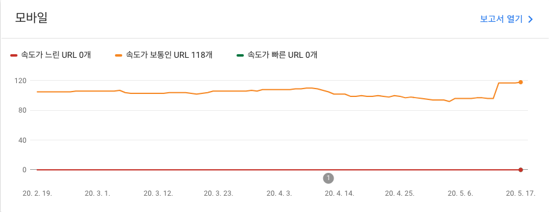
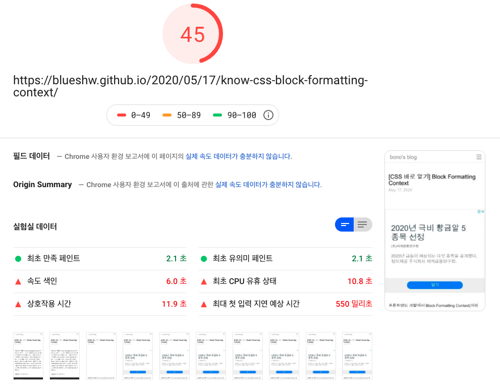
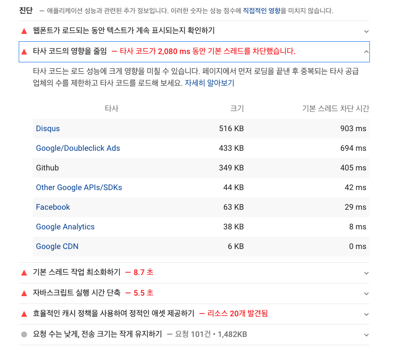
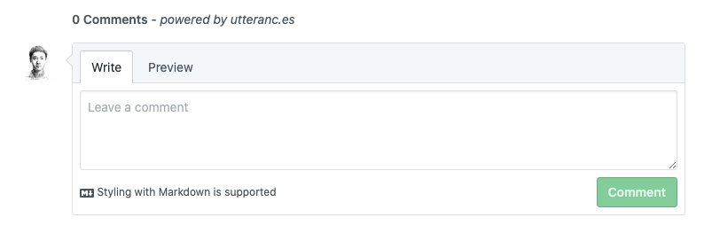
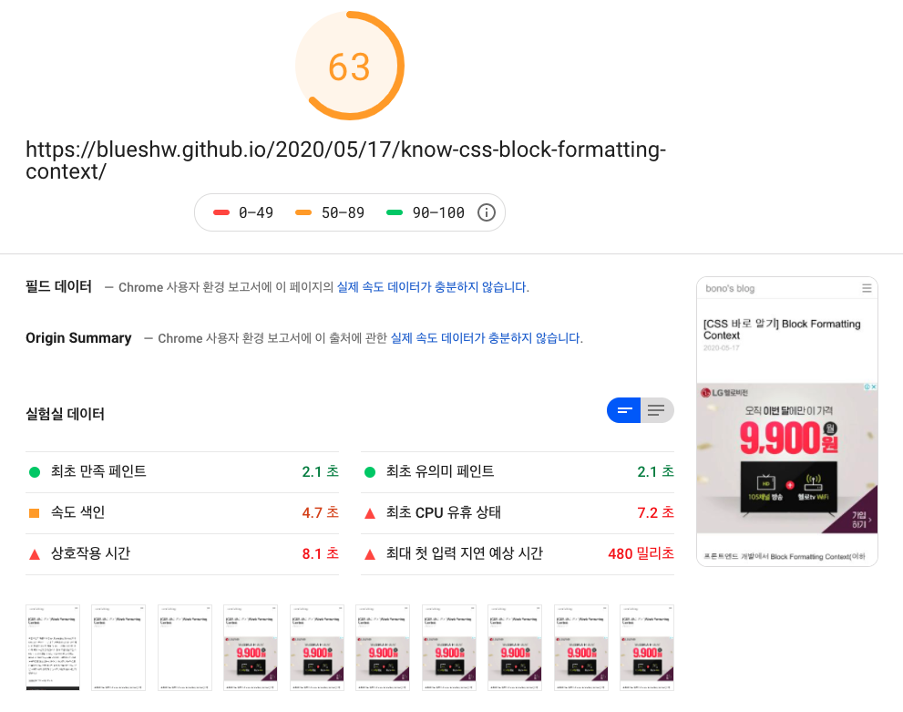

## disqus는 왜 이렇게 무거울까?

블로그의 구글 서치 콘솔(Google Search Console)을 살펴보다가 블로그가 그리 빠르지 않다는 것을 발견했다. 

<url이 왜 118개 밖에 없는거지?? 글은 150개쯤 되는데..>

gatsby를 사용하는 정적 페이지 사이트인데, 속도는 보통으로 나오고 있었다. 뭔가 이상하다. 혹시 몰라서, 구글에서 제공하는 [PageSpeed Insight](https://developers.google.com/speed/pagespeed/insights/) 서비스를 이용하여 퍼포먼스를 측정해보았다. 

Google Search Console이나 PageSpeed Insight 모두 html부터 시작해서 js 로딩이 끝나는 시점까지 속도와 퍼포먼스를 측정하는 것 같았다(당연한가?).

45점은 너무하다. 데스크탑은 그나마 나은데, 모바일은 생각보다 너무 낮게 나왔다. 페이지 로딩 속도를 느리게 만드는 다양한 요인이 있다. 그 중 내가 해결할 수 있는 부분이 있나 찾아보았다. 블로그에서 사용하는 부가 서비스에서 꽤 많은 리소스를 사용하고 있었고, 전부 합치면 대략 1.5MB정도. 여기만 줄여도 속도가 훨씬 빨라질 것 같았다.

Disqus, Adsense 순으로 리소스를 많이 사용하고 있었는데, 이 중 Disqus는 516KB의 리소스를 사용하고 있었다. 크롬 dev tool에서 확인해보면 더 많은 리소스를 사용한는걸 확인할 수 있다. 900KB가 넘는 리소스가 Disqus 하나만을 위해 사용된다. 댓글 하나 추가하는데 너무 많은 리소스가 사용되는게 아닌가 싶었다. 요즘들어 Disqus에 댓글이 하나 둘 늘어나면서 나름 재미를 느끼고 있었지만, 속도는 포기하고 싶지 않았다. 그래서 과감히 Disqus를 제거하기로 결정했다. 

Disqus의 대안이 필요했다. 가벼우면서 사용성이 편리해야 했다. 두 가지 대안을 찾았다. 하나는 facebook comments, 또 하나는 utterances다. facebook이야 말할 필요도 없다. 믿을 만한 회사에서 만든 plugin이니 마음 놓고 쓸 수 있다. utterances는 가볍고 github 이슈를 이용한 오픈소스다. facebook도 충분히 괜찮은 선택이긴 하지만, 어차피 블로그도 github page를 쓰고 있으니 댓글 관리도 github으로 하면 괜찮겠다 싶었다. 그래서 utterances를 선택했다. 

## utterances 설치하기

utterances를 적용하는 방법은 간단하다.

	0.	public repo를 준비한다(블로그 코드 저장소 사용)
	0.	[사용방법](https://utteranc.es/)을 따라 하나씩 작성한다.
	0.	GitHub repo에 utterances 앱을 설치한다(앱 설치 방법은 따로 설명하지 않는다).
	0.	노출을 원하는 위치에 만들어진 script를 붙인다.

그럼 아래와 같이 댓글 창이 나온다. 정말 쉽다.

같은 페이지의 퍼포먼스를 측정해보자. 무려 18점이나 향상되었다. 단지 댓글 라이브러리 하나 바꿨을 뿐인데 거의 대부분의 항목이 향상되었다. disqus가 얼마나 무거운 라이브러리인지 알 수 있다. 

[disqus 댓글을 GitHub 이슈로 옮기는 방법](https://lazywinadmin.com/2019/04/moving_blog_comments.html)은 있지만, 간단해 보이진 않는다. 만약 disqus에 댓글이 많다면 고려해볼 만 하지만, 나는 50개도 안된다.  이 정도면 처음부터 시작해도 될 것 같다(댓글 써주신 분들께 죄송)

