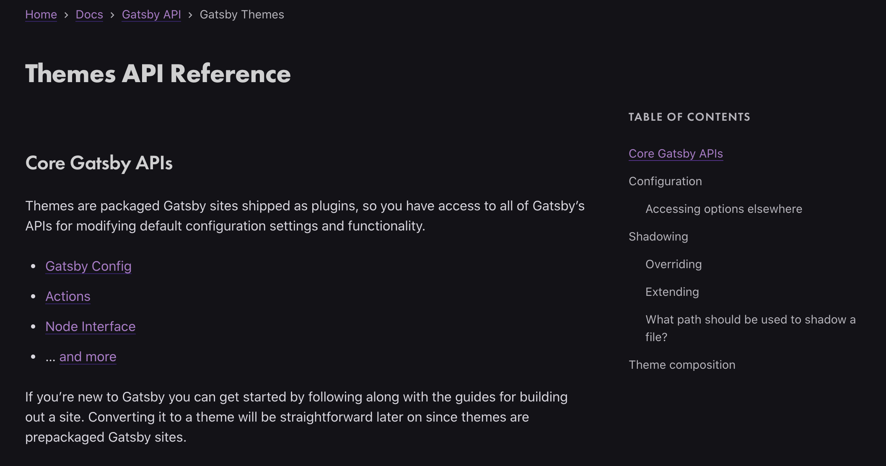

글을 작성하면 자동으로 생성되는 목차(TOC)를 만들어 보자. 간략한 스펙은 아래와 같다.

> - 글을 하단으로 스크롤 하면 Header의 위치에 맞게 하이라이트 됨
> - 항목을 클릭하면 해당 Header의 위치로 이동
> - Header 단계(# ~ ####)에 따른 depth 구분


<p align="center" style="font-style: italic; margin-top: -20px;">
  &#60; gatsby js 공식 웹사이트, 우측의 TABLE OF CONTENTS와 비슷하게 구현할 예정 &#62;
</p>

## gatsby-transformer-remark 사용

gatsby 블로그에서 markdown 문서를 컴파일(HTML로)하는 라이브러리는 크게 두 가지다. 하나는 remark를 사용하는 `gatsby-transformer-remark`, 다른 하나는 jsx를 markdown에서 사용할 수 있게 해주는 `gatsby-plugin-mdx`다. 문서와 웹사이트 종류에 따라 둘 중 하나를 선택하면 된다. 또는 사이트 내 문서 종류에 따라 두 가지 컴파일러를 모두 사용할 수도 있다.

그런데, TOC(Table of Contents)를 구현하는데, markdown 컴파일 이야기가 왜 필요할까?
이유는 `mdx`와 `remark`를 사용할 때 각각 TOC 구현 방법이 다르기 때문이다.

### gatsby-transformer-remark

[gatsby-transformer-remark](https://www.gatsbyjs.org/packages/gatsby-transformer-remark/)는 gatsby 블로그에서 사용하는 필수 라이브러리다(mdx를 사용한다면 없어도 되지만..). remark는 markdown 문서를 파싱해 HTML로 변환하는 일종의 컴파일러인데, 우리가 markdown문서를 작성하고 빌드(gatsby build 명령어)하면 remark가 markdown 문서를 HTML로 변환한다. 

### gatsby-plugin-mdx

[gatsby-plugin-mdx](https://www.gatsbyjs.org/packages/gatsby-plugin-mdx/?=mdx)를 사용하면, 마크다운 파일(.mdx 사용)에 리액트 컴포넌트를 import할 수 있다. 이전에도 import하는 방법은 있었지만, 복잡하고 사용하기 어려웠다. mdx를 사용하면 훨씬 간단히 리액트 컴포넌트를 가져와 쓸 수 있다. 그렇기 때문에 markdown에 그래프 같이 동적으로 변하는 리액트 컴포넌트를 넣을 때 유용하다.

## tableOfContents 속성 (remark vs mdx)

remark와 mdx 모두 `tableOfContents`를 기본 속성으로 가진다. 하지만, 결과 데이터는 서로 다르다. 

우선, remark를 사용하면 데이터가 `HTML text` 형태로 만들어진다. 

```JSON
// graphQL (정확한 query는 아니다)
{
  markdownRemark {
    tableOfContents
  }
}
// result data
{
  "data": {
    "markdownRemark": {
      "tableOfContents": "<ul>\n<li><a href='#fragment1'>First Heading</a></li>\n<li><a href='#fragment2'>Second Heading</a></li>\n</ul>"
    }
  }
}
```

반면에 mdx를 사용하면 데이터가 `객체` 형태로 만들어진다.

```JSON
// graphQL (정확한 query는 아니다)
{
  mdx {
    tableOfContents
  }
}
// result data
{
  "data": {
    "mdx": {
      "tableOfContents": {
        "items": [
          {
            "url": "#fragment1",
            "title": "First Heading"
          },
          {
            "url": "#fragment2",
            "title": "Second Heading"
          },
        ]
      }    
    }
  }
}
```

text로 만들어진 데이터는 이미 HTML이 구현되어 있기 때문에 간단히 사용할 수 있다. HTML 코드를 그대로 붙여주면 완성되기 때문이다. 하지만, HTML 코드가 정해져 있기 때문에 수정하려면 추가작업이 필요하다. HTML text를 파싱해서 객체로 변환하는 과정을 추가로 구현해야 한다. 반면에, 데이터가 객체 형태라면 여러 가지 변형이 가능하다. 데이터가 구조화되어 있고 원하는 방식으로 자유롭게 표현할 수 있기 때문에, text보다 확장성이 뛰어나다. 

하지만, 내 블로그는 이미 remark 기반으로 작성하고 있다. mdx가 확실히 장점이 많다. 하지만, mdx를 사용하면 수정할 부분이 많아진다. markdown 문서, gatsby 설정 및 node 실행 파일, graphQL query, 그리고 일부 컴포넌트 코드도 수정해야 한다. TOC 구현 때문에 또다른 위험을 감수하고 싶지는 않았다. 그래서 이번에는 remark를 이용해 TOC를 구현하려 한다.

## Header에 링크를 삽입하기

Header에 링크를 삽입하기 위해 [gatsby-remark-autolink-headers](https://www.gatsbyjs.org/packages/gatsby-remark-autolink-headers/) plugin을 설치하자

```shell
npm install --save gatsby-remark-autolink-headers
```

`gatsby-consfig.js` 파일에 plugin을 등록하자. 반드시 `gstsby-transformer-remark`의 plugins에 넣어야 한다.

```js
module.exports = {
  ...
  plugins: [
    ...
    {
      resolve: `gatsby-transformer-remark`,
      options: {
        plugins: [
          ...
          {
            resolve: `gatsby-remark-autolink-headers`,
            options: {
              className: `anchor-header`, // 이 class명으로 하이라이트 코드를 구현할 예정이므로 반드시 넣자.
              maintainCase: false, // 이 부분은 반드시 false로 하자. url이 대소문자를 구분하기 때문에 링크가 작동하지 않을 수 있다.
              removeAccents: true,
              elements: [`h2`, 'h3', `h4`], // 링크를 추가할 Header 종류 선택
            },
          },
        ],
      },
    },
  ],
};
```

설정은 간단하다. options의 각 항목에 대한 설명은 [gatsby 공식 페이지](https://www.gatsbyjs.org/packages/gatsby-remark-autolink-headers/)에서 확인하자.

## TOC 구현하기

post 템플릿에서 post 정보를 가져오는 graphQL query에 `tableOfContents` 항목을 추가하자.

```js
export const pageQuery = graphql`
  query BlogPostBySlug($slug: String!) {
    markdownRemark(fields: { slug: { eq: $slug } }) {
      id
      excerpt(truncate: true)
      html
      tableOfContents // 추가.
      frontmatter {
        title
        date(formatString: "YYYY-MM-DD")
      }
    }
  }
`;
```

이제, 컴포넌트에서 tableOfContents를 사용할 수 있다. 먼저 위치를 잡아주자. 본문 오른쪽에 고정되도록 `position: absolute`를 사용한다. `right` 값은 전체 창에서 우측 여백의 너비만큼 반대(음수)로 설정한다. 그래야 본문 우측에 고정으로 배치된다.
(참고로 Box는 [rebass](https://rebassjs.org/)의 기본 컴포넌트다. div로 생각하면 된다)

```jsx
<Box>
  {isTOCVisible && (
    <Box
      style={{
        position: 'absolute',
        top: 0,
        height: '100%',
        right: 'calc((100vw - 720px) / 2 * (-1))',
      }}
    >
      <TableOfContents
        items={tocItems}
        currentHeaderUrl={currentHeaderUrl}
      />
    </Box>
  )}
  {본문 코드}
</Box>
```

위치를 잡았으면, `TableOfContents` 컴포넌트를 구현하자. 이미 HTML 코드가 만들어져 있기 때문에 스타일을 위한 CSS 코드 위주로 작성한다.
(코드가 길어지기 때문에 불필요한 코드는 삭제했다. 전체 파일은 [github 저장소](https://github.com/blueshw/gatsby-blog/blob/master/src/components/tableOfContents.js)에서 확인하자)

```jsx
<Box
  width="calc((100vw - 720px) / 2 - 50px)"
  sx={{
    // 윈도우 너비가 1200px보다 작으면 TOC를 노출하지 않는다.
    display: 'none',
    '@media screen and (min-width: 1200px)': {
      // sticky 속성을 사용해서 화면에 계속 머무르도록 한다
      // sticky는 fixed와 static을 결합한 형태라고 생각하면 됨.
      position: `sticky`,
      display: 'block',
      fontSize: '14px',
    },
  }}
>
  <Box
    dangerouslySetInnerHTML={{ __html: items }}
    sx={{
      // 낮은 depth가 더 안쪽으로 들어가도록 모든 ul에 marginLeft를 부여한다.
      '& ul': {
        marginLeft: '20px', 
      },
      // currentHeaderUrl 문자열이 href 속성에 포함된다면 아래 스타일을 부여한다. 
      // 현재 스크롤에 해당하는 Header를 하이라이트 하기 위함
      [`& ul > li a[href*="${currentHeaderUrl}"]`]: { 
        fontSize: '15px',
        color: '#333333',
        fontWeight: '600',
      },
    }}
  />
</Box>
```

## TOC에 효과를 부여하자

TOC만 있어도 괜찮지만, 읽는 사람이 더 나은 경험을 할 수 있도록 효과를 부여하자. 현재 읽는 글의 위치에 따라 가장 가까운 Header가 하이라이트(highlight) 되도록 처리하자. 그리고 그 변화가 자연스럽도록 transition도 추가하자.

가장 핵심이 되는 스크롤 이벤트 핸들러 함수는 아래와 같다.

```js
const handleScroll = () => {
  let aboveHeaderUrl; // 화면 바로 위쪽에 위치한 header
  const currentOffsetY = window.pageYOffset;
  const headerElements = document.querySelectorAll('.anchor-header');
  for (const elem of headerElements) {
    const { top } = elem.getBoundingClientRect();
    const elemTop = top + currentOffsetY;
    const isLast = elem === headerElements[headerElements.length - 1];
    if (currentOffsetY < elemTop - HEADER_OFFSET_Y) {
      // 기억해둔 aboveHeaderUrl이 있다면 바로 위 header와 현재 element 사이에 화면이 스크롤 되어 있다.
      aboveHeaderUrl &&
        setCurrentHeaderUrl(aboveHeaderUrl.split(location.origin)[1]);
      // 기억해둔 aboveHeaderUrl이 없다면 첫번째 header다. 
      // 이때는 어떤 header도 active 하지 않은 상태다.
      !aboveHeaderUrl && setCurrentHeaderUrl(undefined);
      break;
    } else {
      // 마지막 header면 다음 element가 없기 때문에 현재 header를 active header라 간주한다.
      isLast && setCurrentHeaderUrl(elem.href.split(location.origin)[1]);
      !isLast && (aboveHeaderUrl = elem.href);
    }
  }
};
```

`.anchor-header` 클래스를 가진 모든 요소를 가져와 각 요소의 스크롤 위치를 체크한다. 만약 `window.pageYOffset`보다 크다면(지났다면) aboveHeaderUrl에 기억해둔다. 그리고 다음 element가 현재 위치 보다 아래에 있으면 기억해둔 aboveHeaderUrl이 `currentHeaderUrl(현재 active Header)`라 간주한다.

## 정리

작업하는 데 생각보다 시간이 오래 걸렸다. 처음에는 mdx로 다 바꾸려고 생각했다. 하지만, 작업을 하다 보니 생각보다 수정할 코드가 많아져서 remark를 그대로 이용하기로 했다. 코드 수정이 너무 많아지면 다른 곳에 예상치 못한 버그가 발생할 수 있기 때문이다.

## 참고자료

- [gatsby-plugin-mdx](https://www.gatsbyjs.org/packages/gatsby-plugin-mdx/?=mdx)
- [Add a Table of Contents with Smooth scroll using Gatsby and MDX](https://thelocalhost.blog/2020/02/13/smooth-scroll-toc-gatsby/)
- [sticky by 레진 기술블로그](https://tech.lezhin.com/2019/03/20/css-sticky)