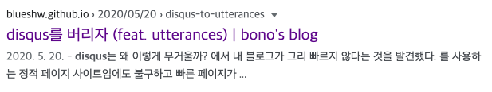
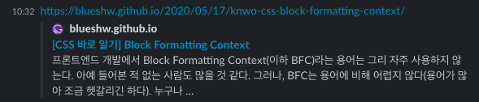
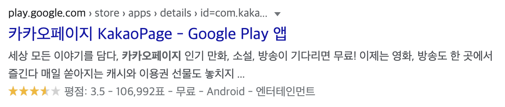
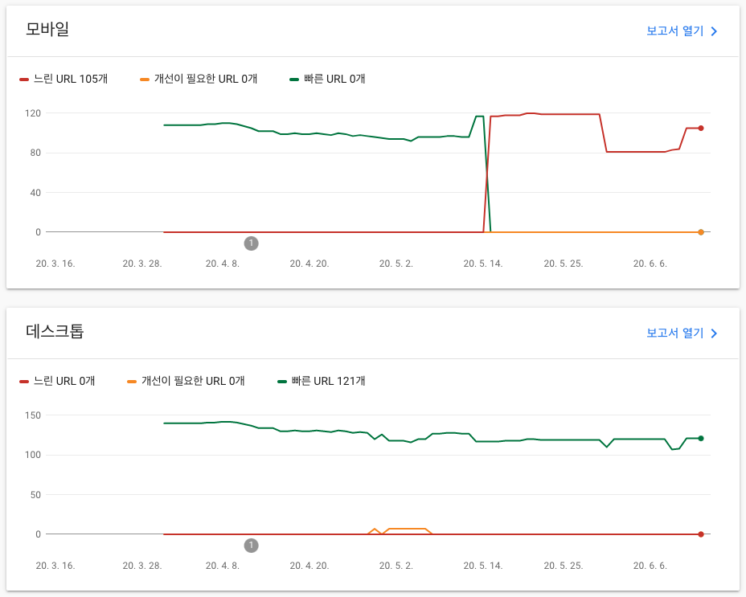
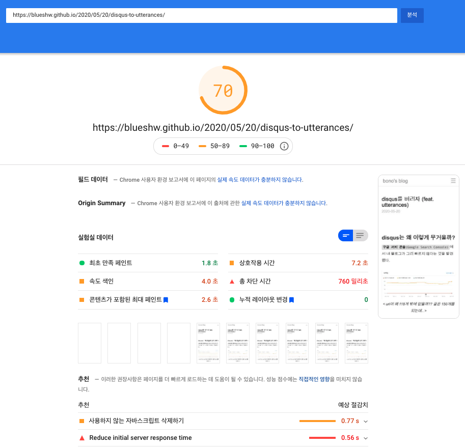

`검색엔진 최적화(SEO)`는 검색 결과 순위를 높이는 작업을 의미한다. 사용자가 구글에서 검색어를 입력하면, 검색엔진은 인덱싱해둔 수많은 웹 페이지 중 가장 적합한 순서대로 결과를 노출한다. 결과를 노출하는 순위를 결정하는 알고리즘은 공개되어 있지 않다. 하지만, 다양한 채널을 통해 가이드(ex. [구글 SEO 초보자 가이드](https://support.google.com/webmasters/answer/7451184?hl=ko))를 제공함으로써 검색엔진에 친화적인 웹사이트를 만들 수 있도록 돕고 있다.

`검색 결과 상위에 페이지를 노출하기 위해서는 콘텐츠의 질이 가장 중요하다.` 아무리 다양한 기법을 사용하더라도 콘텐츠 질이 안 좋다면 사용자는 외면한다. 사용자가 자주 방문하지 않는 페이지는 순위가 밀릴 수밖에 없기 때문에, 콘텐츠의 질을 높이기 위한 노력을 기울여야 한다. 

콘텐츠가 잘 갖춰져 있다 하더라도 사용자는 알아서 찾아오지 않는다. 검색 결과에 노출될 수 있도록 검색엔진에 적절한 정보를 제공해야 한다. 그래야 검색엔진이 페이지를 방문했을 때 적절한 인덱스를 생성할 수 있다. 검색엔진에 적절한 정보를 제공하는 것도 많은 방법이 있지만, 검색 결과 알고리즘은 수시로 바뀌기 때문에 정확한 답이 있는 건 아니다. 하지만, 누구나 할 수 있는 기본적인 방법은 필수로 적용해야 한다. 아래 9가지 기본적인 방법으로 검색엔진 최적화에 대해 알아보자. 

## title 및 메타태그 (meta tag)

`title`과 `메타태그`는 가장 중요한 항목 중 하나다. 이 두 가지가 제대로 작성되어 있지 않으면 노출하려는 정보가 제대로 표시되지 않을 수 있다. 



<p align="center" style="font-style: italic; margin-top: -20px; margin-bottom: 40px;">
  &#60; 구글 검색 결과, title과 description이 노출된다 &#62;
</p>

요즘은 SNS나 메신저에 웹페이지를 공유하는 경우가 많다. 이때, 오픈그래프 등의 메타정보가 없으면 웹페이지 정보를 미리 보여줄 수 없다. 



<p align="center" style="font-style: italic; margin-top: -20px; margin-bottom: 40px;">
  &#60; 업무용 메신저, slack에 공유했을 때 미리 보기 &#62;
</p>

메신저(또는 SNS)에 URL을 입력하면 title과 description 정보를 미리 보여준다. 메신저와 SNS마다 사용하는 메타태그가 다르기 때문에 목적에 맞도록 메타태그를 추가하자([참고](https://github.com/joshbuchea/HEAD)).

facebook open graph 예시

```HTML
<meta property="og:type" content="website">
<meta property="og:url" content="">
<meta property="og:title" content="자동으로 생성되는 목차(TOC: Table of Contents) 만들기">
<meta property="og:description" content="글을 작성하면 자동으로 생성되는 목차(TOC)를 만들어 보자. 간략한 스펙은 아래와 같다. 글을 하단으로 스크롤 하면 Header의 위치에 맞게 하이라이트 됨 항목을 클릭하면 해당 Header의 위치로 이동 Header 단계(# ~ ####)에 따른…">
```

## 시맨틱 요소 (Semantic Elements)

[이전 포스팅](https://blueshw.github.io/2020/05/09/know-html-semantic-elements/#seo%EA%B2%80%EC%83%89%EC%97%94%EC%A7%84-%EC%B5%9C%EC%A0%81%ED%99%94)에서 시맨틱 요소의 중요성에 대해 충분히 언급했다. 시맨틱 요소는 두 가지 측면에서 중요하다.

> 1. 검색엔진에 정확한 정보를 제공 할 수 있다. `div`와 `span`으로만 이뤄진 DOM은 중요한 부분과 그렇지 않은 부분을 구분하기 어렵다.
> 2. `웹 접근성` 측면에서 중요하다. 일반적인 방법으로 웹에 접근 할 수 없는 사람은 스크린 리더와 같은 기기를 사용해야 한다. 이들에게 조금이라도 편의를 제공하기 위해서는 의미로 구분할 수 있는 DOM으로 페이지를 구성해야 한다.

즉,

```HTML
<div>
  <div>
    <div>포스팅 제목</div>
    <div>작성일: 2020-06-14</div>
  </div>
  <div>Chapter 1</div>
  <span>챕터1의 내용이 들어갑니다.</span>
  <div>Chapter 2</div>
  <span>챕터2의 내용이 들어갑니다.</span>
  <div>댓글 영역</div>
</div>
```

이렇게 만들기보다는,

```HTML
<main>
  <header>
    <h1>포스팅 제목</h1>
    <time datetime="2020-06-14 20:00">작성일: 2020-06-14</time>
  </header>
  <h2>Chapter 1</h2>
  <p>챕터1의 내용이 들어갑니다.</p>
  <h2>Chapter 2</h2>
  <p>챕터2의 내용이 들어갑니다.</p>
  <footer>댓글 영역</footer>
</main>
```

이렇게 만들어야 한다.

## robots.txt, sitemap.xml

`robots.txt`는 검색엔진 로봇의 접근을 제어하고 관리한다. 이 파일이 없으면 각종 검색엔진이 웹사이트에서 찾을 수 있는 모든 페이지를 크롤링한다. robots.tsx에 크롤러 정보와 접근 허용 목록을 미리 작성해두면, 불필요한 웹페이지 크롤링을 막을 수 있다.

robots.txt 예시

```
# Group 1
User-agent: Googlebot
Disallow: /essay
Allow: /tag/

# Group 2
User-agent: *
Disallow: /tag/
Disallow: /tags
```

robots.txt 파일을 위와 같이 설정하면, `Group 1`의 규칙에 따라 `Googlebot`은 `/essay` 페이지를 크롤링할 수 없다. 그리고 `/tag/`로 시작하는 모든 페이지의 크롤링을 허용한다. `Group 2`는 Googlebot을 제외한 나머지 User-agent에게 `/tag/`로 시작하는 모든 페이지와 `/tags`의 크롤링을 허용하지 않는다
(/tag/ 뒤에 와일드카드(*)를 넣어도 결과는 동일하다). 

robots.txt는 User-Agent와 일치하는 첫 번째 그룹 하나만 연결한다. 그래서 Googlebot은 Group 2의 규칙을 적용하지 않는다. robots.txt 기본 문법과 구체적 사용법은 구글의 [robots.txt 사용법](https://developers.google.com/search/reference/robots_txt?hl=ko)을 참고하자.

`sitemap.xml`은 검색엔진에 페이지 목록 정보를 제공한다. 일반적으로 검색엔진은 대부분의 페이지를 크롤링 하지만, 쉽게 발견되지 않는 페이지를 누락하는 경우가 있다. 이때, sitemap.xml을 만들어 페이지 목록을 넣어두면, 검색엔진의 크롤링 누락을 막을 수 있다. 

 sitemap.xml 파일을 만들었다 해서 SEO 점수가 높아지는 건 아니다. 다만, 페이지 목록 정보를 검색엔진에 제공함으로써 넓은 의미에서 검색이 잘 되도록 돕는 역할을 한다. 참고로 sitemap.xml 파일은 직접 작성할 필요는 없다. `sitemap generator`로 검색해서 나오는 웹사이트에 접속해서 쉽게 만들 수 있다.
 ([예시](https://www.xml-sitemaps.com/))

## 구조화된 데이터 (Structured Data)

검색 결과에 풍부한 정보를 제공하기 위해서 `구조화된 데이터(Structured Data)`를 사용하자. 구글이 아무리 훌륭한 검색엔진이라 하더라도, 노출하고 싶은 정보를 마음대로 정하지 않는다. 그렇기 때문에 구글 검색에 추가적인 정보를 노출하려면 HTML에 적절한 정보를 추가해야 한다. 



<p align="center" style="font-style: italic; margin-top: -20px; margin-bottom: 40px;">
  &#60; kakaopage 검색 결과 &#62;
</p>

Google Play 검색 결과를 보면, 하단에 평점과 평점 입력 수, 가격, 카테고리 정보가 추가로 노출되는 것을 볼 수 있다. 우선, 링크를 눌러 페이지에 접근해 크롬 개발자 모드를 열어보자. 소스를 살펴보면, 아래와 같이 구조화된 데이터를 확인할 수 있다.

```HTML
<script type="application/ld+json" nonce="">
    {
        "@context": "https://schema.org",
        "@type": "SoftwareApplication",
        "name": "카카오페이지 KakaoPage",
        "url": "https://play.google.com/store/apps/details/%EC%B9%B4%EC%B9%B4%EC%98%A4%ED%8E%98%EC%9D%B4%EC%A7%80_KakaoPage?id\u003dcom.kakao.page\u0026hl\u003dko",
        "description": "세상 모든 이야기를 담다, 카카오페이지\n인기 만화, 소설, 방송이 기다리면 무료!\n이제는 영화, 방송도 한 곳에서 즐긴다\n매일 쏟아지는 캐시와 이용권 선물도 놓치지 마세요.\n\n1. 내가 좋아하는 작품…”,
        "operatingSystem": "ANDROID",
        "applicationCategory": "ENTERTAINMENT",
        "image": "https://lh3.googleusercontent.com/TrAr0xcudipKmudVsytGQQtiLD5l2FkRihPgqFoCFQZ5zrSkV-2sMRKRNXGIzHE1WcY",
        "contentRating": "만 12세 이상",
        "author": { "@type": "Person", "name": "Kakao Page Corp." },
        "aggregateRating": { "@type": "AggregateRating", "ratingValue": "3.4932148456573486", "ratingCount": "106992 },
        "offers": [{ "@type": "Offer", "price": "0", "priceCurrency": "USD", "availability": "https://schema.org/InStock" }]
    }
</script>
```

다양한 정보가 있지만, 검색 결과에 표시된 정보는 `operatingSystem`, `applicationCategory`, `aggregateRating`과 `offers` 항목에 포함되어 있다. 검색엔진이 구조화된 데이터를 가져가서, 검색 결과에 따라 적절한 정보를 추가로 제공한다. 구조화된 데이터를 넣었다 해서 반드시 추가 정보가 노출되는 것은 아니다. 클릭률이나 SEO 점수에 따라서 추가 정보가 노출될 수도 그렇지 않을 수도 있다. 

참고로, 구조화된 데이터를 입력하는 방식은 반드시 json 데이터일 필요는 없다. 아래처럼 DOM 요소로 추가할 수 있다. 편한 방식으로 사용하자. 

```
<a itemscope itemtype="http://schema.org/Article" href="/know-frontend">
  <span itemprop="name">frontend 바로 알기</span>
</a>
```

구글의 [구조화된 데이터 마크업 도우미](https://www.google.com/webmasters/markup-helper/u/0/)를 이용하면 간편하게 구조화된 데이터를 생성할 수 있다. 직접 데이터를 만든다면, https://schema.org/ 사이트를 참고하자.  

## canonical URL (표준 URL)
 
다음과 같이 어떤 이유로 동일한 페이지가 여러 URL을 가질 수 있다.

> - http://blueshw.github.io/a
> - https://blueshw.github.io/a
> - https://blueshw.github.io/a.html
> - https://blueshw.github.io/a/print
> - https://blueshw.github.io/b

같은 페이지가 위처럼 여러 가지 URL을 가질 때, 검색엔진은 그중 하나를 표준으로 지정한다. 그리고 나머지는 표준 URL의 복사본으로 간주한다. 하나의 URL이 표준으로 지정되면, 결과 화면에는 표준으로 지정된 URL이 노출된다. 운이 좋아 원하는 URL이 표준으로 지정될 수 있다. 만약 그렇지 않으면, 엉뚱한 URL이 검색 결과에 노출될 수 있다. 

> `https://blueshw.github.io/aaaa/bbbb/cccc/` 

보다는

> `https://blueshw.github.io/2020/05/09/know-html-semantic-elements/` 

가 낫지 않을까?

HTML Header 영역에 canonical URL을 넣으면 표준 URL을 지정할 수 있다. 

> <link rel="canonical" href="https://blueshw.github.io/a" />

위의 link 태그가 추가되면, 검색엔진은 위 URL을 표준으로 인식한다. 그리고 검색 결과에 해당 URL을 노출할 것이다. 표준 URL을 지정하는 방법은 `rel=“canonical”`이 가장 일반적이지만, `sitemap.xml`에 표준 페이지 정보를 지정할 수도 있다.  

## 적절한 URL

페이지 URL을 정하는 건 만드는 사람 마음이다. 개발이 편하도록 만들 수 있고, 관리하기 편한 방법으로 만들 수도 있다. 하지만, 검색해서 링크를 클릭하는 유저 입장을 생각하면 URL도 어떤 `의미`를 가지는 것이 좋다. 

> https://blueshw.github.io/xRdxj23h/ghdS3ds

보다는,

> https://blueshw.github.io/2020/05/30/table-of-contents/

처럼 의미가 분명한 URL이 좋다. 

URL에 어떤 의미를 부여한다 해서 SEO 점수가 높아지는 것은 아니다. 다만, 유저 입장에서 검색 결과에 노출되는 URL이 수상하다 싶으면, 클릭률이 떨어질 수 있다. 클릭률이 떨어진다는 것은 SEO 점수가 떨어진다는 것과 같다. 그렇기 때문에, 넓은 의미에서 URL에 의미를 부여하는 것이 SEO에 좋은 영향을 끼친다고 말할 수 있다.

## 꾸준한 업로드

검색엔진은 웹페이지를 주기적으로 크롤링한다. 뉴스나 커뮤니티처럼 업로드가 잦은 웹 사이트는 1분에도 몇 번씩 크롤링 된다. 최신 기사, 또는 최신 정보는 구글 검색에 빠르게 노출되어야 하기 때문이다. 반면에 오랫동안 변화가 없는 웹사이트의 크롤링 주기는 점점 길어진다. 심하면, 몇 달에 한 번 크롤링 된다. 그렇기 때문에, 검색 결과에 상위에 콘텐츠를 노출하기 위해서는 꾸준히 업로드하고 관리해야 한다.

블로그 운영자라면 한 달에 한 번 여러 개의 콘텐츠를 업로드하기보다는, 일주일에 하나씩 또는 일주일에 두 개씩 정해진 요일에 업로드하는 것이 SEO 측면에서 효율적이다.

## 페이지 로딩 속도

페이지 로딩 속도는 SEO 점수에 큰 영향을 준다. 로딩 속도가 직접적으로 점수에 영향을 주는지는 잘 모르겠지만, 로딩이 늦은 웹페이지는 SEO 점수가 점점 낮아질 수밖에 없다. 왜냐하면, 로딩이 오래 걸리는 페이지는 유저 이탈률이 높기 때문이다. 이탈률이 높은 웹페이지는 유저에게 점점 외면는다. 그래서, SEO 점수가 낮아져서 검색 결과 순위가 낮아질 것이다.

전체 페이지의 로딩 속도는 `Google Search Console` 페이지에서 확인할 수 있다.



<p align="center" style="font-style: italic; margin-top: -20px; margin-bottom: 40px;">
  &#60; 왜 모바일 페이지가 갑자기 느려졌을까? &#62;
</p>

각 페이지의 로딩속도에 대한 상세 정보를 알고 싶다면, [PageSpeed Insight](https://developers.google.com/speed/pagespeed/insights/?hl=ko)에서 확인하자.



<p align="center" style="font-style: italic; margin-top: -20px; margin-bottom: 40px;">
  &#60; 각 페이지의 속도는 느리지 않은데, 느린 URL이 많은 이유를 모르겠다 &#62;
</p>

페이지 로딩 속도가 느린 데는 다양한 이유가 있겠지만, 개선할 수 있는 부분은 모두 확인해보자. 

> - `불필요한 자바스크립트` 모듈을 삭제하자.
> - 불필요한 `HTTP request`를 줄이자(힘들다면, HTTP/2를 사용하자).
> - `너무 많은 DOM 요소`를 사용하지 말자(페이지를 복잡하게 만들수록 로딩 속도는 느려진다).
> - SPA라면(아래 항목 참고) `SSR`을 사용하자.
> - 가능하다면, `정적 HTML`로 서비스하자(ex. Gatsby JS).
> - `캐싱`을 적절히 활용하자.
> - `webP` 등의 이미지 압축을 활용하자.

[disqus를 버리자](https://blueshw.github.io/2020/05/20/disqus-to-utterances/) 포스팅에서 언급했지만, disqus나 광고처럼 많은 리소스가 필요한 플러그인을 사용하면, 페이지 로딩이 느려진다. 광고가 꼭 필요하다면, 너무 많은 광고를 노출(이미지가 많아 로딩이 느려질 수 있다) 하지 말자. 그리고, disqus 같은 무거운 플러그인은 가급적이면 제거하도록 하자.

## 서버사이드 렌더링(SSR)

일반적인 `SPA(Single Page Application)`는 빈 HTML에 javascript로 렌더링 한다. 웹 페이지에 접속하면, 초기에 모든 리소스를 다운로드하고, 이후에는 API 서버와 통신하면서 부분적으로 DOM을 갱신한다. 그래서 초기 로딩 속도는 조금 느리다. 하지만, 그 이후에는 부분적으로 갱신되기 때문에 빠르고 다이내믹하게 웹을 만들 수 있다. 

장점이 있으면 단점도 있는 법. SPA로 속도가 빠르고 다이내믹한 웹을 만들 수 있지만, `SEO에 취약`한 단점이 있다. 검색엔진은 모든 페이지를 방문하면서 HTML을 취득(크롤링) 하고, 그 정보를 바탕으로 인덱싱한다. 그런데 SPA는 초기에 HTML이 비어 있기 때문에 검색엔진에 적절한 정보를 제공할 수 없다. 구글과 같은 검색엔진은 크롤링 과정에서 javascript 실행 결과까지 알 수 있다고 한다. 하지만, 아직은 부분적인 수준에 불과하다. 그래서 검색엔진에 정보를 제공하기 위해 별도의 처리가 필요하다.

SPA의 검색엔진 최적 위해서는 `SSR(Server Side Rendering)`을 적용해야 한다. SSR은 서버에서 미리 일부 정보를 렌더링 한다. 그렇기 때문에, 검색엔진에 적절한 정보를 제공할 수 있다. 그리고, HTML 일부를 서버에서 미리 렌더링 하기 때문에 초기 로딩이 느리다는 SPA의 단점도 개선할 수 있다.

SSR을 구현하는 방법도 다양하지만, 직접 구현하려면 신경 써야 할 부분이 많다. 대신, React 웹앱이라면 [Next](https://nextjs.org/)를 사용하고, Vue 웹앱이라면 [Nuxt](https://ko.nuxtjs.org/)를 사용해 SSR을 구현하자.

## 참고자료

- [구글 SEO 초보자 가이드](https://support.google.com/webmasters/answer/7451184?hl=ko)
- [SPA SEO](https://snipcart.com/spa-seo)
- [Google robots.txt 소개](https://support.google.com/webmasters/answer/6062596?hl=ko)
- [HEAD on github](https://github.com/joshbuchea/HEAD)
- [SEO Best Practices for Canonical URLs](https://moz.com/blog/rel-canonical)
- [중복 페이지 통합](https://support.google.com/webmasters/answer/139066?hl=ko)
- [PageSpeed Insight](https://developers.google.com/speed/pagespeed/insights/?hl=ko)