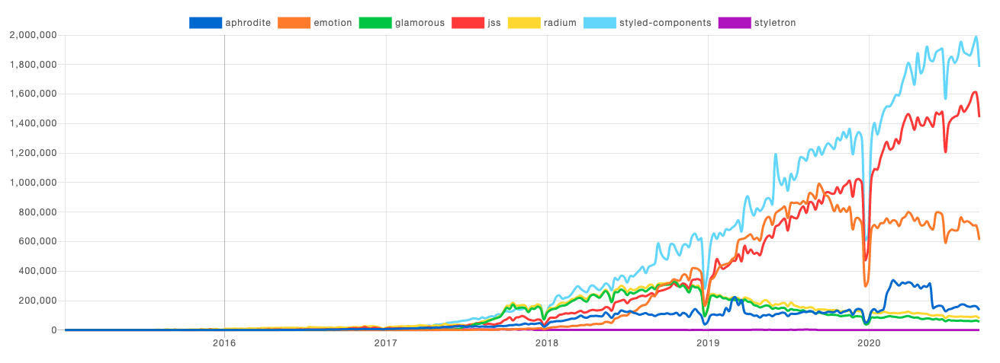

`CSS(Cascading Style Sheets)`는 쉽지 않다. 처음 배울 때는 ‘이 정도쯤이야?’라는 생각이 들 정도로 쉬워 보인다. 실제로 러닝커브가 그리 높지는 않다. 그래서 과거에는 주로 신입이나 경력이 짧은 사람에게 맡기는 경우가 많았다. 당시에는 프론트엔드 영역이 명확히 나뉘어 있지 않았고, 약간의 HTML, CSS와 약간의 JS면 충분한 시기였다. 그나마 조금 큰 기업은 HTML과 CSS만 전문적으로 사용하는 퍼블리셔라는 직종을 별도로 두기도 했다. 하지만, 웹이 점점 복잡해지고 동적 기능의 요구가 증가하면서 퍼블리셔의 코드만으로는 화면의 모든 스타일을 제어할 수 없는 지경에 이르렀다. 

JS를 주로 다루던 프론트엔드 개발자들도 이제는 HTML과 CSS 코드 작성 역량을 필요로 하게 되었다. CSS를 전문적으로 설계하고 작성해본 경험이 별로 없던 개발자들은 명쾌하지 않은 CSS 작업에 혼란을 느꼈다. sass(SCSS)와 같이 모듈 구조와 몇 가지 추가 문법을 제공해주는 전처리기(preprocessor)가 등장했지만, 약간의 도움을 줄 뿐, 근본적인 해결책은 아니었다. 그러던 중, 2014년 페이스북 개발자인 Vjeux의 `CSS-in-JS` 발표는 CSS 코드 작성의 새로운 대안으로 떠올랐다. 이 발표에서 Vjeux는 다음의 항목을 들어 CSS를 작성하는 어려움을 설명하였다.

> -	Global namespace: 모든 스타일이 global에 선언되어 별도의 class 명명 규칙을 적용해야 하는 문제
> -	Dependencies: css간의 의존관계를 관리하기 힘든 문제
> -	Dead Code Elimination: 기능 추가, 변경, 삭제 과정에서 불필요한 CSS를 제거하기 어려운 문제
> -	Minification: 클래스 이름의 최소화 문제
> -	Sharing Constants: JS의 상태 값을 공유할 수 없는 문제
> -	Non-deterministic Resolution: CSS 로드 순서에 따라 스타일 우선 순위가 달라지는 문제
> -	Isolation: CSS와 JS가 분리된 탓에 상속에 따른 격리가 어려운 문제

## CSS-in-JS는 모든 문제를 해결한다?

이 발표를 시작으로 2017년부터 본격적으로 `CSS-in-JS`가 주목받기 시작했다. 



> CSS-in-JS 성장세는 여전하다. 2017년 이후부터 지금까지 주가 다운로드 수는 계속해서 증가하는 추세다. 가장 많이 사용하는 `styled-components`는 일주일에 200만 건 가까이 다운로드 되고 있다. (출처: [npm trends](https://www.npmtrends.com))

`CSS-in-JS` 방법으로 CSS를 작성하면 위에 나열된 CSS 작성 문제는 대부분 해결된다.

> -	Global namespace: 
>   => class명이 build time에 유니크한 해시값으로 변경되기 때문에 별도의 명명 규칙이 필요하지 않다.
> -	Dependencies: 
>   => CSS가 컴포넌트 단위로 추상화되기 때문에 CSS 파일(모듈)간에 의존성을 신경 쓰지 않아도 된다.
> -	Dead Code Elimination: 
>   => 컴포넌트와 CSS가 동일한 구조로 관리되므로 수정 및 삭제가 용이하다.
> -	Minification:
>   => 네임스페이스 충돌을 막기위해 BEM 같은 방법론을 사용하면 class 명이 길어질 수 있지만, CSS-in-JS는 짧은 길이의 유니크한 클래스를 자동으로 생성한다.
> -	Sharing Constants: 
>   => CSS 코드를 JS에 작성하므로 컴포넌트의 상태에 따른 동적 코딩이 가능하다.
> -	Non-deterministic Resolution: 
>   => CSS가 컴포넌트 스코프에서만 적용되기 때문에 우선순위에 따른 문제가 발생하지 않는다.
> -	Isolation: 
>   => CSS가 JS와 결합해 있기 때문에 상속에 관한 문제를 신경 쓰지 않아도 된다. 

와~ 완벽하다. 모든 문제를 해결하고 있다. 더는 CSS 때문에 고통받지 않아도 될 것 같다.  

```js
const Title = styled.h1`
  color: black;
`;

const Wrapper = styled.section`
  display: flex;
  justify-content: center;
  padding: 20px;
`;

const Button = styled.button`
  background: ${(props) => (props.primary ? "black" : "white")};
  color: ${(props) => (props.primary ? "white" : "black")};
  margin: 16px;
  border: 1px solid lightgray;
  border-radius: 4px;
`;

function App() {
  return (
    <Wrapper>
      <Title>Hello World!</Title>
      <Button primary>OK</Button>
      <Button>OK</Button>
    </Wrapper>
  );
}
```

위와 같이 작성하면 아래와 같이 변환된다. 

```HTML
...
<style data-styled="" data-styled-version="4.4.1">
   .fvBIug{color:black;}
   .clhVMo{display:-webkit-box;display:-webkit-flex;display:-ms-flexbox;display:flex;-webkit-box-pack:center;-webkit-justify-content:center;-ms-flex-pack:center;justify-content:center;padding:20px;}
   .iSmpeC{background:black;color:white;margin:16px;border:1px solid lightgray;border-radius:4px;}
   .fweqGX{background:white;color:black;margin:16px;border:1px solid lightgray;border-radius:4px;}
</style>
...
<div id="root">
  <section class="sc-bwzfXH clhVMo">
    <h1 class="sc-bdVaJa fvBIug">
      Hello World!
    </h1>
    <button class="sc-htpNat iSmpeC">
      OK
    </button>
    <button class="sc-htpNat fweqGX">
      OK
    </button>
  </section>
</div>
...
```

이쯤 되면, CSS-in-JS가 완벽한 해결책인 것처럼 보인다. 하지만, 세상에 공짜는 없다. 장점이 있으면 단점도 있는 법. 유행하는 기술이라고 무비판적인 수용은 위험한 법이다. CSS-in-JS를 사용하면 어떤 장점이 있는지 아는 것도 중요하지만, 반대로 어떤 단점을 감수해야 하는지 확인하고 사용해야 한다. 

그렇다면, CSS-in-JS를 사용했을 때 어떤 단점이 있을까?

## 번들 크기가 커진다

콘텐츠가 중요한 프로젝트라고 생각해보자. 가장 중요한 것은 콘텐츠를 빠르게 보여주는 것이다. 뉴스 웹사이트가 그렇다. 사람들은 기다려주지 않는다. 조금이라도 늦다고 생각하면 읽기도 전에 사이트를 이탈한다. 그래서, 가급적 콘텐츠를 빠르게 보여줄 수 있는 방법으로 사이트를 만들어야 한다. 불필요한 다운로드를 제거해 콘텐츠를 빠르게 보일 수 있도록 처리해야 한다. 

만약 이런 웹사이트에 개발하는데 CSS-in-JS를 사용하기로 결정했다고 생각해보자. styled-components와 같은 별도의 라이브러리를 추가로 설치해야 하고 필요하다면 관련된 라이브러리의 추가 설치가 필요하다(회사 프로젝트에서는 styled components, styled system, rebass까지 CSS 작성을 위해 여러 라이브러리를 사용중이다). 반면에, CSS-in-CSS 는 별도의 라이브러리가 필요 없다. 브라우저가 CSS를 해석할 수 있기 때문에 CSS를 그대로 작성하면 된다. 

라이브러리 추가는 곧, 번들 사이즈 크기가 커진다는 말과 같다. 번들 사이즈가 커지면, 다운로드 시간이 길어지므로 초기 진입이 느려진다. 게다가 CSS-in-JS의 경우 JS가 모두 로딩된 후에 CSS 코드가 생성되기 때문에 더욱 느려질 수 밖에 없다. 

`SSR(Server Side Rendering)`을 적용하면 괜찮지 않냐 반문할 수 있다. 맞다. SSR을 적용하면 초기 진입 시 완성된 HTML을 다운로드하기 때문에, 번들 파일을 내려받기 전에 콘텐츠를 볼 수 있다. 뉴스 웹사이트라면 이렇게 해결하면 된다. 하지만, 뉴스가 아닌 동적 인터랙션이 필요한 웹사이트라면 상황은 달라진다. 번들이 다운되고 인터랙션에 필요한 CSS가 삽입되기 전까지 제대로 된 인터랙션이 적용되지 않을 수 있다. 

또한 SSR을 적용하려면 `critical CSS`를 추출해서 삽입하는 과정이 별도로 필요하다. 이렇게 추출된 CSS는 번들파일에도 포함되어 있기 때문에 결국, 번들 사이즈를 크게 하는 요인이 된다. 

## 인터랙션이 늦다

위에서도 잠깐 언급했지만, CSS-in-JS를 사용하면 인터랙티브한 웹페이지의 성능을 저하시킨다. CSS-in-CSS는 모든 상태에 맞는 스타일을 전부 만들어두기 때문에 컴포넌트의 상태가 변경된다 하더라도 바로바로 적용이 가능하다. 하지만, CSS-in-JS의 경우, 상태가 변경되면 우선 JS의 CSS 코드를 읽어와서 파싱하는 단계부터 시작하기 때문에 아무래도 늦어질 수 밖에 없다. 

개발자 입장에서 불편한 것은 사실이다. 컴포넌트 단위로 관리되는 React와 별도로 CSS 코드를 관리해야 하기 때문에 관리 포인트가 하나 더 늘어난다. 컴포넌트와 동떨어진 구조로 CSS를 관리하다 보니, 어떤 스타일이 어떤 요소에 적용되는지 확인하기 위해서는 프로젝트 전체를 검색해야 하기 때문이다. 컴포넌트에 CSS 코드가 존재한다면 이런 불편은 사실상 확실히 개선된다. 

하지만, 우리는 개발자를 위해 서비스를 만드는 것이 아니다. 우리는 사용자 입장에서, 사용자가 더 빠르고 쾌적하게 느낄 수 있도록 작업하는 것이 먼저다. 사람마다 생각하는 정도와 우선순위는 다르겠지만, 사용자에게 조금이라도 더 나은 경험을 제공할 수 있다면 개발자의 불편은 어느 정도 감수해야 한다고 생각한다.

컴포넌트의 상태에 따라 CSS가 동적으로 바뀌는 기능이 있다 가정해보자. 모든 상태에 맞는 CSS코드가 미리 만들어져 있지 않다면, 상태가 변경됨에 따라 새로운 CSS를 만들어야 한다. 상태가 변경되면, JS에 포함된 CSS 코드를 읽어와 parsing하고 새로운 CSS 코드블록을 생성한 다음 HTML에 넣어주는 일련의 과정이 필요하다. 아무래도 속도면에서 불리하다. 반면에 CSS-in-CSS 방식은 모든 CSS가 HTML에 이미 포함되어 있기 때문에, 위와 같은 별도의 과정이 필요 없다. 바로바로 CSS 코드가 적용되기 때문에 CSS-in-JS 방식에 비해 훨씬 나은 퍼포먼스를 보여준다. 

 [애플 웹사이트](https://www.apple.com/kr/iphone-se/)를 보자. 스크롤에 따라 요소의 크기가 커지고, 위치가 바뀌고, 다른 요소로 전이되고 변형된다. 마우스를 스크롤(또는 터치)하고 있다 보면, 마치 하나의 영상을 보고 있는 착각이 드는 정도다. 만약 애플 웹사이트에 CSS-in-JS 방식으로 작업을 했다고 생각해보자. 스크롤 위치가 바뀔 때마다 JS에서 CSS가 재생성 된다. 아무래도 느릴 수 밖에 없다. 

인터랙션이 필요한 코드는 상태에 따라 CSS를 바꾸지 않고 `global style`에 미리 정의해두면 괜찮지 않을까 반문할 수 있다. 그렇다. 필요한 경우 CSS-in-JS 방식과 별도로 관리하는 것도 나쁘지 않다. 하지만, CSS를 관리하는 포인트가 늘어나는 문제가 있다. 또한, 인터랙션이 많아지면 오히려 global style이 복잡해지는 문제도 발생한다.

## sass(SCSS)와 CSS Modules를 사용하자

요즘처럼 거대한 웹 서비스를 만들 때, pure CSS를 사용하는 것은 다소 무리가 있다. 관리하기도 어려울뿐더러, 개발자의 작업 효율도 떨어진다. CSS도 점점 발전하고 있지만, JS에 비해 느린 것도 사실이다. 그래서 sass같은 전처리기를 사용하여 최대한 분리해서 사용할 필요가 있다. 

[css-loader]나 [sass-loader] 같은 로더를 사용하면 js 파일에서 CSS 파일을 import할 수 있다. JS에서 CSS 파일을 import 한다고 해서 컴포넌트 단위로 관리가 가능한 것은 아니다. 다만, 최소한 class명이 충돌하는 문제는 쉽게 해결된다. 

## 결론

요즘은 워낙에 CSS-in-JS가 유행하다 보니, `CSS-in-JS` 방식이 해결책이라고 생각하는 사람이 많다(SPA가 그렇듯). 하지만, CSS-in-CSS와 CSS-in-JS 중 어떤 방식이 더 낫다고 쉽게 말할 수는 없다. 중요한 것은 용도에 맞는 선택이다. 지금 만들려는 웹 서비스가 어떤 용도로 사용되는지 정의하고 그에 맞는 방법을 선택해야 한다. 
 
인터랙션이나 속도가 중요한 웹사이트라면 CSS-in-JS보다는 CSS-in-CSS를 방식이 바람직하다. 반대로 관리자 페이지나 위키같이 정적인 웹사이트라면 CSS-in-CSS보다는 CSS-in-JS를 사용하는 것이 더 낫다. 사용자가 많지 않고 속도가 그렇게 중요한 요소는 아니기 때문에 개발 효율성에 더 초점을 맞출 수 있다. 

도구를 선택하는 것은 중요하다. 닭 잡을 때 소잡는 칼을 사용하면 안되듯이, 유행한다고, 모두 사용한다고 해서 반드시 그 방법을 선택할 필요는 없다. 사용하려는 도구가 어떤 장점을 가지고 어떤 단점이 있는지 정확히 파악한 후에 그에 걸맞은 방법을 선택하는 것이 바람직하다. CSS를 작성하는 것이 불편하다 해서 CSS-in-JS 방식을 맹목적으로 따른다면, 결국 서비스의 품질을 떨어뜨리는 결과를 만들 수도 있다.

## 참고자료

- [Styled components V4: the good, the bad, and something completely different.](https://medium.com/ansarada-thinking/styled-components-v4-the-good-the-bad-and-something-completely-different-e891139e0138)
- [[번역] CSS-in-JS에 관해 알아야 할 모든 것](https://d0gf00t.tistory.com/22)
- [모던 CSS : 1. CSS-in-JS](https://medium.com/@okys2010/%EB%AA%A8%EB%8D%98-css-1-css-in-js-c1c53d9bbbc9)
- [CSS-In-JS Vs Traditional CSS — Which Should You Use?](https://www.cbinsights.com/research/team-blog/css-in-js-traditional-css/)
