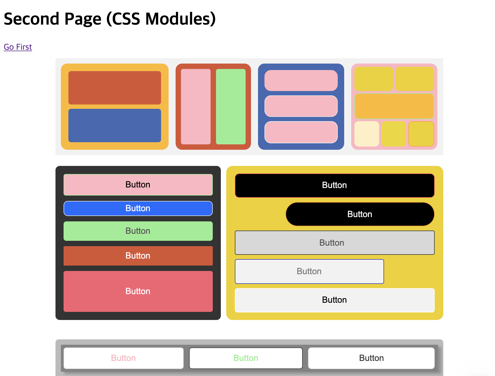
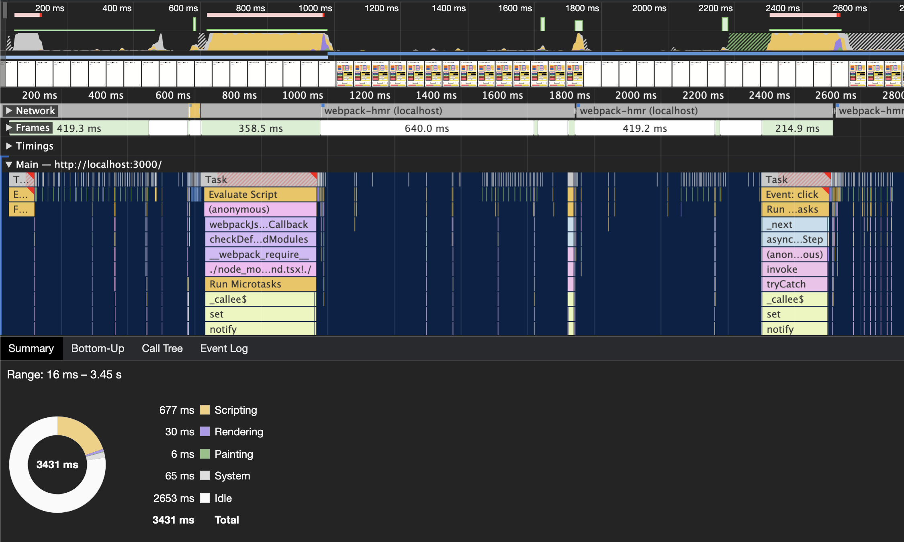
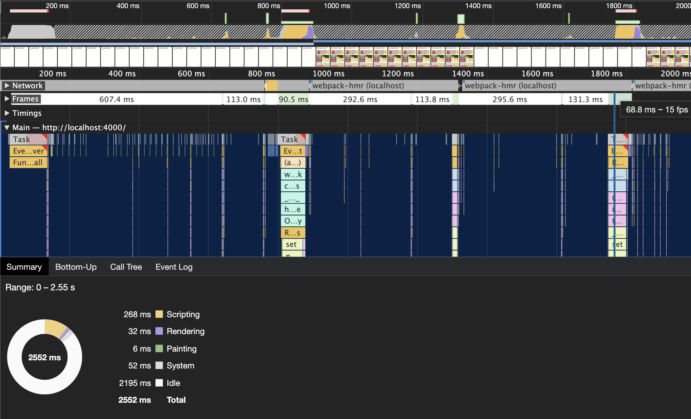
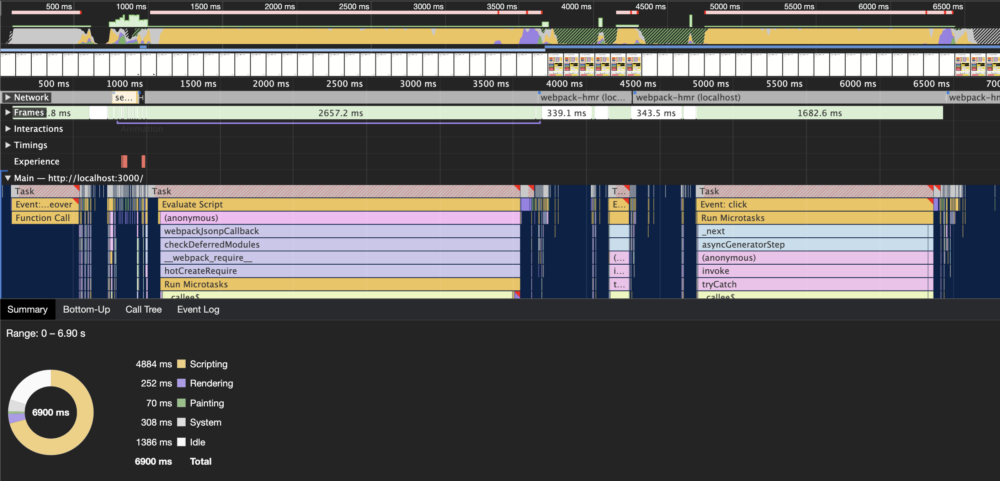
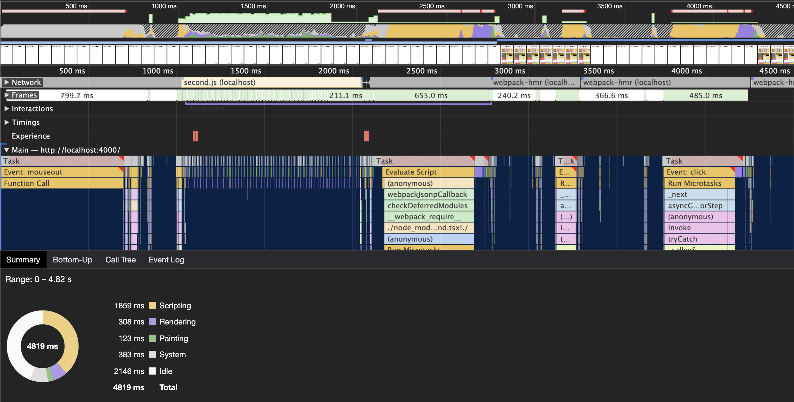

[지난번 포스팅(CSS-in-JS에서 CSS-in-CSS로 바꿔야 하는 이유)](https://blueshw.github.io/2020/09/14/why-css-in-css/)에는 CSS-in-JS에서 CSS-in-CSS 방식으로 변경해야 하는 이유에 대해 설명했다. 요약해보면, 다음과 같다. 

> 성능에 초점을 맞춘다면 `CSS-in-CSS`, 개발 생산성에 초점을 맞춘다면 `CSS-in-JS`를 사용하는 편이 낫다. 어떤 방식이 더 낫다고 단정할 수는 없으며, 서비스의 용도와 목적에 따라 적절한 선택이 필요하다.

지난 포스팅에 이어서 이번에는 두 방식(CSS-in-JS vs CSS-in-CSS)의 성능 차이를 비교해 보고자 한다. CSS-in-JS의 대표로는 `Styled Components`, CSS-in-CSS의 대표로는 `CSS Modules`를 사용한다. 사실, CSS 방식 차이만으로 성능을 비교하는데는 다소 무리가 있다. JS가 평가된 다음 렌더링 될 때 까지, 영향을 끼치는 요소는 다양하다. 예를 들어, 호출 API, 비즈니스 로직, 인터랙션 등이 있다. 하지만, 이 모든 요소를 확인하기는 사실상 어렵다. 그래서 페이지 전환시 CSS 처리 소요시간만을 비교하여 성능을 측정할 생각이다. 

## 프로젝트 구성

프로젝트 뼈대는 `nextjs`를 사용하고, 성능 비교 도구로는 크롬 개발자도구의 `performance 탭`을 사용한다. 

> 참고로  nextjs 9.3버전 부터 `CSS Modules` 을 기본으로 채택하고 있다. 이전 버전까지는 `styled jsx`를 기본으로 채택하였다.



주로 flexbox를 활용하여 layout을 생성하였고, 다양한 컬러와 border를 사용하였다. 크게 세 개의 row가 하나의 컨테이너를 구성되고, 각 컨테이너를 15번 반복해서 그린다. 

페이지는 두 개로 구성한다. `_app.js`에는 theme가 추가된다. theme는 색상 값 및 버튼에서 사용하는 variants(style set)를 포함한다. 

```
—- pages
    |-- _app.js
    |—- index.js     
    |—- second.js
```

첫 페이지인 index.js에는 페이지 제목과 `/second` 페이지로 이동하는 링크가 전부다. 여기는 CSS 사용이 거의 없다. 그래서 실제로 CSS 코드가 삽입되지 않는다. `/second` 링크를 클릭해서 실제로 페이지가 이동되는 순간에 대량의 CSS가 삽입된다. 우리는 이 부분의 시간이 얼마나 소요되냐를 측정함으로써 두 방식 간의 성능을 비교하고자 한다.

> Styled Components의 ThemeProvider는 사용하기 전에 스타일이 추가되지 않는다. 반면에 CSS Modules를 사용하는 경우, _app.js에서 import한 global CSS는 사용 여부와 관계없이 CSS 코드가 삽입된다. 

## 소스 코드 비교

동일한 화면을 각각 적합한 형태로 구현해 보았다. 사실, 동일한 화면을 만드는데 방법은 무궁무진하다. 내가 만든 코드보다 훨씬 효율적으로 작성할 수도 있다. 하지만, 효율적인 코드를 짜는데 중점을 둔 작업이 아니라 단순히 성능 비교를 위한 목적이기 때문에 이 점은 감안하길 바란다.
(물론, 효율적으로 코드를 생성하면 성능에 영향을 줄 수도 있지만, 그 차이는 미미할 것이라 판단했다)

[전체 소스코드 확인하기](https://github.com/blueshw/styled-components-vs-css-modules)

### CSS-in-JS

CSS-in-JS 방식에서 가장 많이 이용되는 [Styled Components v5](https://styled-components.com/)와 Styled System을 기반으로 만들어진 react 기본 구성 요소인 [rebass v4](https://rebassjs.org/)를 사용한다.

#### theme 생성하기

우선 _app.js에 `theme`을 삽입한다. 

```js
import { ThemeProvider } from "styled-components";

class KakaopageApp extends App {
  render() {
    const { Component } = this.props;
    return (
      <ThemeProvider theme={STYLED_COMPONENT_THEME}>
        <Layout>
          <Component />
        </Layout>
      </ThemeProvider>
    );
  }
}

const STYLED_COMPONENT_THEME = {
  colors: COLORS, 
  buttons: BUTTONS,
}

export default KakaopageApp;
```

Layout을 `ThemeProvider`로 감싸고 theme에 `colors`와 `buttons` 같은 스타일 정보 객체를 넣어준다. 이외에도 `breakpoints`, `fontSizes` 등 여러가지 요소를 추가로 사용할 수 있다. 여기서 알아둘 것은, _app.js에 theme를 삽입했다고 해서 CSS 코드가 생성되는 것은 아니다. 어떤 요소에서 theme의 요소를 사용하면 그 요소에 theme의 정보가 추가로 삽입되는 방식이다. 

#### second 페이지 소스코드

second.js 파일의 jsx 코드는 다음과 같이 생성한다. 

```js
const SecondPage = () => (
  <>
    ...
    <StyledThirdRow index={number} mb="20px" sx={{ borderRadius: "6px" }}>
      <StyledFlex>
        <Button variant="white_lightGrey1" sx={{ padding: "10px" }}>
          <Text color="pink">Button</Text>
        </Button>
        ...
      </StyledFlex>
    </StyledThirdRow>
    ...
  </>
);
const StyledThirdRow = styled(Flex).attrs({ flexDirection: "column" })<{
  index: number;
}>`
  margin-top: ${props => props.index * 20}px;
  padding: 0;
  background: ${props =>
    props.index % 3 === 0
      ? COLORS.grey3
      : props.index % 3 === 1
      ? COLORS.grey4
      : COLORS.grey5};
  & > div {
    box-shadow: ${({ index }) => {
      return `${(index % 3) * 4 + 2}px ${(index % 3) * 3 + 1}px 5px #44444460`;
    }};
  }
`;
const StyledFlex = styled(Flex)`
  margin: 10px;
  padding: 0px;
  & > button {
    margin: 5px;
    flex: 1 0 auto;
  }
  background: rgba(0, 0, 0, 0.3);
`;
```

CSS 코드를 생성하는데 어느 정도 영향이 있는지 확신할 수 없지만, 가급적 실제 프로젝트처럼 다양한 방법으로 스타일 코드를 생성했다. Box, Flex, Button, Text와 같이 rebass에서 제공하는 기본 컴포넌트를 사용했고, `StyledThirdRow`와 같은 커스텀 Component도 만들어 보았다.

### CSS Modules

Next JS 9.3부터 CSS Modules를 기본으로 지원하기 때문에 별도로 설치할 패키지는 없다. 다만, sass(SCSS) 문법을 사용하려면, `sass` 패키지를 설치해야 한다. 

#### common style 추가하기

Styled Components에서는 ThemeProvider를 사용하였다. 비슷하게, color와 버튼 variants 스타일을 포함하는 `common.scss`를 만들어 _app.js에 import 하였다. 여기서 `module`을 사용하지 않은 이유는, button 태그와 같은 선택자에 스타일을 적용하기 위함이다. module에 포함된 scss 파일에는 반드시 id 또는 class가 하나 이상 포함되어야 한다. 

```js
import "../src/css/common.scss";

class KakaopageApp extends App {
  render() {
    const { Component } = this.props;
    return (
      <Layout>
        <Component />
      </Layout>
    );
  }
}

export default KakaopageApp;
```

theme에 해당하는 common.scss는 앱 전반적으로 사용하는 global 스타일이기 때문에 module을 빼고 만들었다. 대신, 사용하는 곳에서는 반드시 문자열을 사용해서 스타일을 적용해야 한다.

```scss
@each $name, $value in $colors {
  .bg_#{$name} {
    background: $value;
  }
}
```

이렇게 정의해 둔 스타일은,

```js
<div className={cn(s.box, "bg_green")} />
```

위와 같이 `"bg_green"`처럼 문자열을 사용해 가져온다.

#### second 페이지 소스코드

second.js의 코드 일부를 확인해보자. 비교를 위해 Styled Components의 코드와 동일한 부분을 가져왔다.

```js
const SecondPage = () => (
  <>
    ...
    <div className={cn(s.flex, s[`third_row_${number}`], s.mb_20)}>
      <div className={cn(s.flex, s.m_10, s.p_0, s.third_wrapper1)}>
        <button className={cn("btn_white_lightGrey1", s.p_10)}>
          <div className={cn(s.text, "pink")}>Button</div>
        </button>
        ...
      </div>
    </div>
    ...
  </>
)
```

scss 코드는 아래와 같다. 

```scss
@mixin third_row($index) {
  margin-top: $index * 20px;
  padding: 0;
  border-radius: 6px;
  flex-direction: column;
  @if $index % 3 == 0 {
    background: getColor("grey3");
  }
  @if $index % 3 == 1 {
    background: getColor("grey4");
  }
  @if $index % 3 == 2 {
    background: getColor("grey5");
  }
  & > div {
    box-shadow: ($index % 3) * 4 + 2px ($index % 3) * 3 + 1px 5px #44444460;
  }
}

@for $i from 1 through 15 {
  .third_row_#{$i} {
    @include third_row($i);
  }
}

.third_wrapper1 {
  background: rgba(0, 0, 0, 0.3);
  & > button {
    margin: 5px;
    flex: 1 0 auto;
  }
}
```

## 퍼포먼스 비교


<p align="center" style="font-style: italic; margin-top: -20px; margin-bottom: 40px;">
  &#60; Styled Components 페이지 전환 &#62;
</p>


<p align="center" style="font-style: italic; margin-top: -20px; margin-bottom: 40px;">
  &#60; CSS Modules 페이지 전환 &#62;
</p>

`/index` 페이지에서 `/second` 페이지로 전환하는 부분을 중점적으로 살펴보자. /index 페이지에서 렌더링 완료된 /second 페이지 사이에 script가 평가되는 노란색 부분이 있다. 이 영역에서 js에 포함된 CSS 코드가 추출되고, HTML 문서에 삽입된다. 

첫 스크린샷은 `Styled Components`에서 확인한 결과다. 첫 번째 페이지 전환 시, `358ms`정도 소요되었다. 그리고 `/index`로 돌아와 다시 `/second`로 이동할 때는 약 `215ms`의 시간이 필요했다. 두 번째 이동 시에는 이미 CSS가 DOM에 삽입되었기 때문에 더 적은 시간만으로 렌더링이 가능하다(그래도 짧지 않은 시간이다).

두 번째는 CSS Modules에서 확인한 결과다. 첫 번째 페이지 전환 시, `90.5ms`가 소요되었다. Styled Components에 비해서 비약적으로 시간이 줄어들었다. 그리고 두 번째 페이지 전환에서는 조금 줄어든 `69ms` 정도 소요되었다. 당연한 결과다. CSS-in-JS는 js 파일에 CSS 코드를 포함하기 때문에, 페이지 전환 또는 컴포넌트 업데이트 시 js에서 CSS를 추출해야 한다. 반면에, 빌드타임에 CSS 파일이 추출되는 CSS Moduels 방식은 js 평가 과정이 따로 없기 때문에 훨씬 빠르게 페이지가 전환된다. 

또 한가지, Styled Components의 theme은 실제 사용되는 순간(/second로 전환되는 순간) CSS가 생성되기 때문에, 첫 번째 페이지(/index)에서 style은 비어있다. 반면에 CSS Modules의 경우, _app.js에서 import한 `common.scss`는 `/index`가 로드되면 CSS 코드가 삽입된다. 즉, Styled Components가 페이지 전환시 더 많은 CSS 코드를 생성한다는 말과 같다. 하지만, 아무리 그렇다하더라도 위에서 보여준 소요 시간 차이는 확실히 너무 크다.

이번에는 크롬의 performace 탭에서 CPU 속도를 떨어뜨려서(6x slowdown) 테스트해보자.


<p align="center" style="font-style: italic; margin-top: -20px; margin-bottom: 40px;">
  &#60; Styled Components 페이지 전환 (CPU 6x slowdown) &#62;
</p>


<p align="center" style="font-style: italic; margin-top: -20px; margin-bottom: 40px;">
  &#60; CSS Modules 페이지 전환 (CPU 6x slowdown) &#62;
</p>

차이는 더 벌어졌다. Styled Components는 페이지 전환에 `2657ms`의 시간이 필요했고, CSS Modules는 `655ms`의 시간이 소요되었다.

## 결론

이번에는 Styled Components와 CSS Modules 방식의 페이지 전환 시 소요되는 시간을 측정해 보았다. 위에서도 언급했지만, CSS 삽입 시간만 두고 퍼포먼스를 측정하는 데 다소 무리가 있다. API 호출이나 비즈니스로직을 평가하는데도 꽤 오랜 시간이 소요되기 때문이다. 하지만, 그렇다 하더라도 두 방식은 꽤 큰 차이를 보이고 있다. 가볍고 인터랙션이 별로 없는 정적인 서비스를 만든다면 어떤 방식을 선택하더라도 크게 무리는 없다. 다만, 인터랙션이 풍부하거나 페이지 하나가 포함하는 컴포넌트 수가 많은 경우에는 Styled Components와 같은 CSS-in-JS 방식이 아닌, CSS Modules와 같은 `CSS-in-CSS` 방식으로 작업하기를 권장한다.

## 참고자료

- [Styled Components Docs](https://styled-components.com/docs)
- [rebass](https://rebassjs.org/)
- [CSS Modules github](https://github.com/css-modules/css-modules)
- [sass Docs](https://sass-lang.com/)