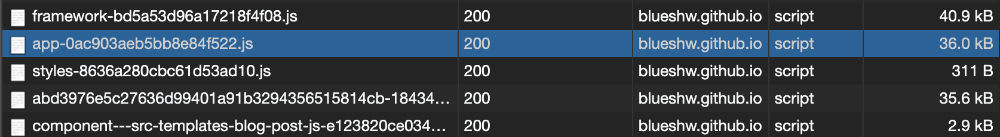
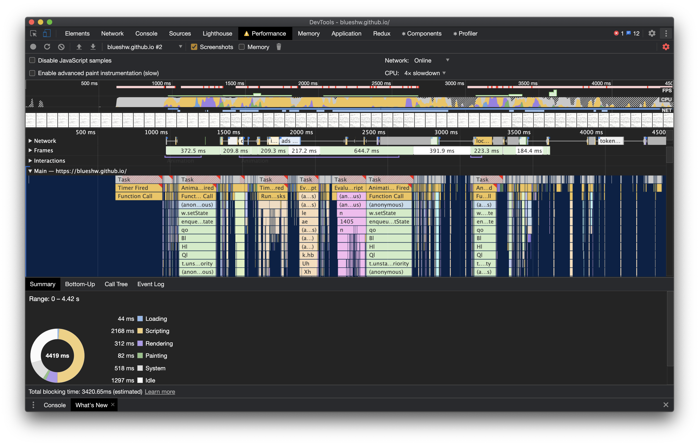
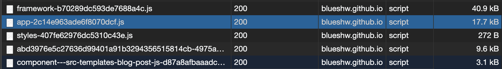
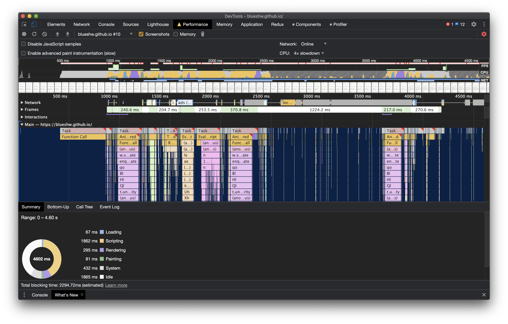

지금껏, 이 블로그는 `styled components + rebass`로 CSS를 작성하고 있었다. 대표적인 CSS-in-JS 방식이다. 블로그는 스타일 코드가 많지 않기 때문에 CSS-in-JS로 만들어도 충분하다. 하지만, 조금이라도 빠르게 만들어보기 위해 CSS Modules 방식으로 변경해 보았다. 

이번 포스팅에서는 실제 서비스에서 CSS-in-CSS 방식으로 변경했을 때, 어느 정도 성능이 변했는지 확인해보자.

확인하려는 항목은 다음과 같다.

> - 번들 사이즈
> - 페이지 로딩 속도(with [Google Page Speed Insights](https://developers.google.com/speed/pagespeed/insights/?hl=ko))
> - 페이지 전환 속도

## 기존 방식 (styled components + rebass)

대표적인 CSS-in-JS 방식인 [styled components](https://styled-components.com/)와 styled system 기반의 react 기본 구성 요소를 제공하는 [rebass](https://rebassjs.org/)를 사용하였다. 

### 번들 사이즈

`gatsby build` 명령으로 만들어지는 번들 파일은 여러 개지만(캐싱 등의 이유로), `app-[contenthash].js`와 `[name(abd~)]-[contenthash].js` 두 가지 파일만 확인하면 된다. 

> 참고로 gatsby build로 만들어지는 파일에 대해서 알아보자 ([gatsby 공식문서 참고](https://www.gatsbyjs.com/docs/production-app/))
> 
> - app-[contenthash].js: 웹팩 entry 포인트(production-app.js)의 결과물. 애플리케이션 코드가 들어감.
> - webpack-runtime-[contenthash].js: 웹팩 runtime에 필요한 번들.
> - framework-[contenthash].js: React를 포함한 프레임웍을 포함한 번들.
> - commons(최신버전에서는 name인듯)-[contenthash].js: 모든 페이지에서 사용하는 라이브러리가 번들된 파일 (최신 버전에는 commons가 붙지 않는 것 같다). 최초 접근에 한 번 다운로드.
> - component--[name]-[contenthash].js: 각 페이지에 대한 분리된 번들. 페이지 전환 시마다 해당 페이지의 번들을 다운로드.

`app-[contenthash].js` 파일은 `36kB`, `[name]-[contenthash].js` 파일은 `35.6kB`다. 큰 사이즈는 아니지만, 빠른 로딩을 위해서 조금이라도 번들 사이즈를 줄여야한다.

### 페이지 로딩 속도

나쁜 점수`(72점)`는 아니지만(mobile, PC는 거의 100점에 가깝다), 정적 페이지 블로그인걸 생각하면 개선이 필요하다. 

### 페이지 전환 속도

index 페이지를 열고 리스트 항목을 선택했을 때, 이동하는 속도를 측정한다. 번들 파일에서 CSS를 추출하고, style 태그에 삽입하기까지 대략 `372.5ms`의 시간이 소요되었다. 그리고 뒤로가기 버튼을 누른 후, 다시 같은 항목을 선택했을 때 `223.3ms`의 시간이 소요되었다.
(참고로, 차이 확인을 위해 CPU를 4x slowdown한 뒤 테스트하였다)

## 개선한 방식 (CSS Modules)

이번에는 CSS Modules로 변경한 결과를 살펴보자.

### 번들 사이즈

`app-[contenthash].js`는 `17.7kB`, `[name(abd~)]-[contenthash].js`는 `9.6kB`로 상당부분 사이즈가 줄었음을 확인할 수 있다. 두 패키지를 합치면 대략, `45kB` 가 작아졌다. styled components, rebass 등 CSS를 위한 라이브러리가 삭제되었고, CSS 코드는 번들에서 별도로 분리되었기 때문이다.

### 페이지 로딩 속도

72점에서 `88점`으로 점수가 대폭 향상되였다. 큰 점수 차이가 아니라 체감할 정도는 아니겠지만, 네트웍 상황이 안 좋다면 얘기는 달라진다. 

### 페이지 전환 속도

마지막으로 페이지 전환속도를 비교해 보자. 첫 번째 전환 시에는 `240.6ms`, 두 번째는 `217.0ms`가 소요되었다. 번들 사이즈나 페이지 로딩 속도에 비해서는 드라마틱할 정도의 차이는 아니지만, 그래도 어느 정도 빨라진 모습을 보인다. 

## 코드 수정

마지막으로 수정한 코드를 살펴보자. CSS-in-JS 방식에 비해서 불편한 것은 사실이다. jsx(or tsx) 파일 하나에서 마크업, 스타일, 로직을 작성할 수 있었다. 반면에 CSS-in-CSS 방식은 여러 파일(js, css 등)을 열어놓고 작업해야 하는 번거로움이 있다.

예제를 살펴보자.

### 기존 코드

~~~js
// List.js 코드 일부
import { Flex, Button } from 'rebass/styled-components';
import styled from 'styled-components';

export default function List() {
  return (
    ...
    <Flex mt="70px" width="100%" justifyContent="center">
      <StyledShowMoreButton
        fontSize="18px"
        fontWeight="400"
        color="#999"
        p="5px 10px"
        bg="transparent"
        onClick={() => setShowCount(showCount + 25)}
      >
        show more
      </StyledShowMoreButton>
    </Flex>
    ...
  );
}
const StyledShowMoreButton = styled(Button)`
  border-radius: 4px;
  border: 1px solid #dedede;
  cursor: pointer;
  transition: all 0.7s;
  outline: none;
  &:hover {
    background-color: #bbb;
    color: #fff;
    border: 1px solid transparent;
  }
`;
~~~

### 수정된 코드

~~~js
// List.js 코드 일부
import s from './css/List.module.scss';

export default function List() {
  return (
    ...
    

      <button
        className={s.moreButton}
        onClick={() => setShowCount(showCount + 25)}
      >
        show more
      </button>
    

    ...
  );
}
~~~

~~~SCSS
// List.module.scss 코드 일부
.moreWrapper {
  display: flex;
  justify-content: center;
  width: 100%;
  margin-top: 70px;
  .moreButton {
    font-size: 18px;
    font-weight: 400;
    color: color.getColor('grey04');
    padding: 5px 10px;
    background-color: transparent;
    border-radius: 4px;
    border: 1px solid #dedede;
    cursor: pointer;
    transition: all 0.7s;
    outline: none;
    &:hover {
      background-color: #bbb;
      color: #fff;
      border: 1px solid transparent;
    }
  }
}
~~~

이전 코드는 `List.js` 파일 하나만 보면서 작업할 수 있었지만, 이제는 `List.js`와 `List.module.scss`를 같이 보며 작업해야 한다. 확실히 불편해졌다. 현재 프로젝트에는 typescript가 적용되어 있지 않지만, 만약 typescript를 사용한다면 타입이 적용되지 않기 때문에 실수할 가능성이 커진다.

## 결론

이전 몇 번의 포스팅에서 재차 언급했지만, `CSS-in-CSS`, `CSS-in-JS` 두 가지 방식 중 어느 것이 더 낫다고 단정 지을 수는 없다. CSS-in-CSS 방식은 퍼포먼스에서 CSS-in-JS보다 뛰어나다(이 간극은 점점 좁혀지고 있다). 반면에 CSS-in-JS는 개발 효율이나 타입 정의 등에 장점이 있기 때문에 생산성 측면에서 장점이 있다. 중요한 것은 개발하는 프로젝트의 성격이 어떠냐에 달려있다. 백오피스 프로젝트나 퍼포먼스가 크게 중요하지 않다면, `CSS-in-JS`를 사용하는 편이 낫다. 반면에 유저 대상으로 하는 서비스의 경우 퍼포먼스가 중요하기 때문에(대부분은), 가능하다면(여유가 된다면) `CSS-in-CSS` 방식이 더 나은 선택이다.

성능이 확실히 좋아졌다. 다만, 유지보수는 좀 더 신경 써야 할 것 같다.

## 참고자료

- [Building the JavaScript App (Gatsby 공식 문서)](https://www.gatsbyjs.com/docs/production-app/#commons-contenthashjs)