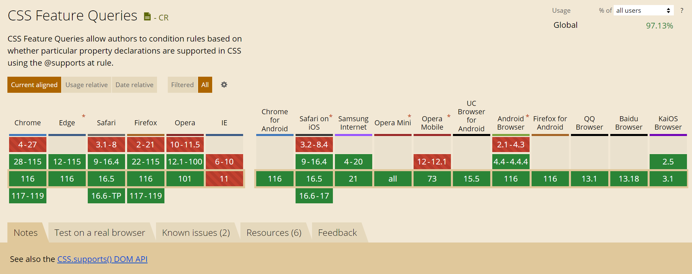

웹 디자인 및 개발에서 크로스 브라우저 호환성은 항상 큰 주제입니다. CSS의 `@supports` 규칙은 이 문제를 해결하는 데 큰 도움을 줍니다. 이 규칙을 사용하면 특정 CSS 기능이 브라우저에 의해 지원되는지 여부를 확인하고 조건부로 스타일을 적용할 수 있습니다.

### **@supports란?**

`@supports` 규칙은 CSS의 기능 쿼리입니다. 이는 미디어 쿼리와 유사하지만, 화면 크기나 장치 유형 대신 CSS 속성 및 값의 지원 여부를 테스트합니다.

### **기본 사용법**

기본적인 사용법은 다음과 같습니다:

```css
@supports (display: grid) {
  /* 그리드 레이아웃을 지원하는 브라우저에만 적용될 스타일 */
  .container {
    display: grid;
  }
}
```

위의 예에서, 브라우저가 `display: grid`를 지원하는 경우 `.container`에 그리드 레이아웃 스타일이 적용됩니다.

### **조건 연산자 활용**

`and`, `or`, `not`와 같은 논리 연산자를 사용하여 복잡한 조건을 만들 수 있습니다:

```css
@supports (display: grid) and (grid-gap: 10px) {
  .container {
    display: grid;
    grid-gap: 10px;
  }
}
```

### **@supports 활용 사례**

#### **그리드 레이아웃 백업 스타일**

`@supports`를 사용하면 그리드 레이아웃이 지원되지 않는 브라우저에 대한 백업 스타일을 제공할 수 있습니다:

```css
.container {
  display: flex;
}

@supports (display: grid) {
  .container {
    display: grid;
  }
}
```

#### **변수(fonts, colors 등) 사용 가능 여부 확인**

```css
@supports (color: var(--main-color)) {
  body {
    background-color: var(--main-color);
  }
}
```

### **주의사항**

모든 브라우저가 `@supports` 규칙을 지원하지는 않습니다. 그러나 대부분의 최신 브라우저는 지원하며, 이 규칙을 지원하지 않는 브라우저에서는 `@supports` 블록 내의 스타일을 단순히 무시하게 됩니다. 따라서 그 자체로 안전하게 사용할 수 있습니다.



### 참고
- [CSS Feature Queries](https://caniuse.com/css-featurequeries)