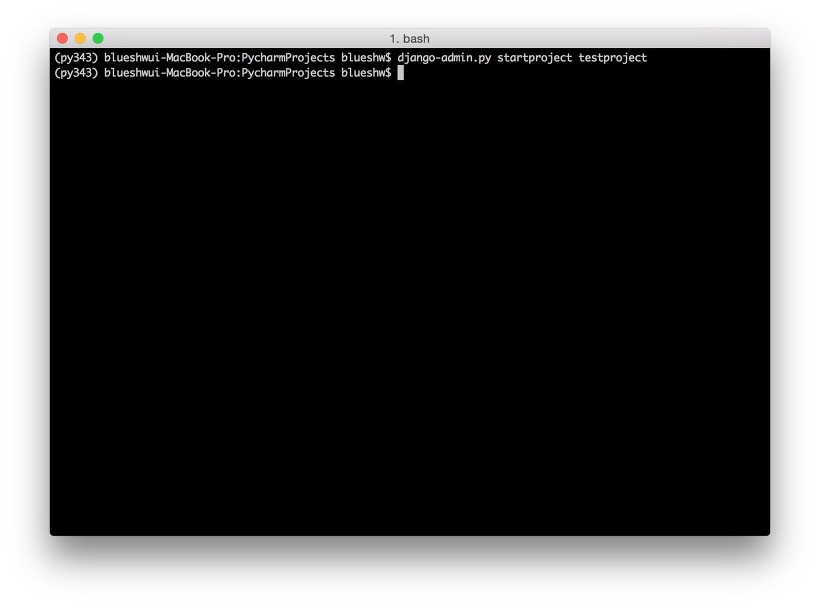
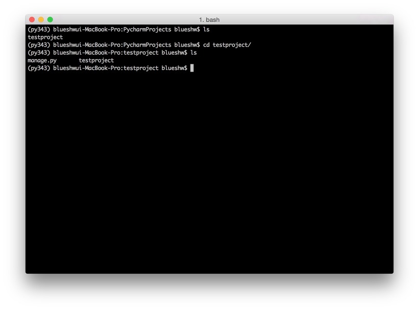
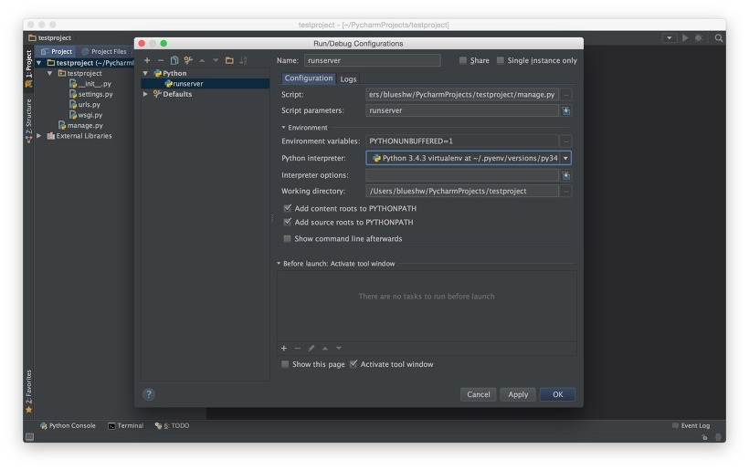

파이썬(python) + 장고(django)로 프로젝트를 진행하려고 하면, 우선 개발도구를 정해야 합니다. 콘솔 + VI 로 작업해도 무관합니다만 장고를 지원해주는 IDE 가 있다면 그 기능을 이용하는 것이 좋겠죠. 더불어 자동완성 등 다양한 기능을 사용할 수 있으니 작업 능률을 향상 시켜 줄수 있습니다. 몇가지 사용 가능한 IDE 가 있겠지만, 파이썬(또는 장고) 프로젝트로 사용하기에는 Pycharm(Pycharm 다운로드)만한 게 없다고 생각합니다. 그런데 유료죠. 이클립스 처럼 무료면 참 좋을텐데, [JetBrains](https://www.jetbrains.com/)에서 만드는 자바 IDE 인 intelliJ 또한 꽤 비싼 편이죠.

비싸다고 좌절할 필요 없습니다. 저희에게는 무료버전인 파이참 커뮤니티 버전(Pycharm Community Version)이 있기 때문이죠. 비록 자바스크립트 하이라이팅, 다국어 파일 지원, html 파일 링크 등 몇가지 기능을 제외한다면 충분히 이 무료버전으로 장고 프로젝트를 진행 할 수 있습니다. 제가 처음 장고 프로젝트를 시작할때는 무료버전으로 장고 설정하는 방법에 관한 마땅한 자료를 찾지 못해서 꽤나 시간을 보냈기에 저와 같은 분이 없었으면 하는 마음에 글을 남겨봅니다.

과정은 다음과 같습니다.

### STEP 1. 장고 프로젝트 생성

파이썬 가상환경이 설치(pyenv)되어 있고, 장고가 설치(가상환경 내에서 pip install django)되어 있다 가정합니다.
참고로 pip 는 파이썬 모듈을 설치하는 패키지 관리자입니다.
위 부분이 막힌다면 다른 글들을 찾아보고 오시는게 좋을 것 같네요(나중에 저도 따로 포스팅 하려고 합니다).

```
django-admin.py startproject testproject
```



이제 프로젝트가 생성되었습니다. 프로젝트 안으로 들어가보면 testproject 라는 기본 앱(장고 프로젝트는 앱의 모임)과 manage.py 가 있군요. manage.py 는 장고 프로젝트에서 사용할 명령어들을 위한 파일이라 생각하시면 됩니다(ex. 서버 실행이 python manage.py runserver).



### STEP 2. 파이참에서 장고 프로젝트 열기

다운받은 [파이참 커뮤니티 버전](https://www.jetbrains.com/pycharm/download/#section=mac)을 실행합니다.
오른쪽 화면의 명령 중 open 을 클릭해서 터미널에서 생성한 testproject 를 클릭합니다.


폴더 구조는 잠깐 말씀드린대로, testproject 라는 프로젝트 안에 testproject 라는 기본앱이 있구요. manage.py 명령 파일이 있습니다. 앱은 필요한 만큼 얼마든지 추가가 가능하니 앱이 필요한 경우에는 역시 터미널로 가서

```
manage.py startapp 앱이름
```

을 입력해주시면 됩니다.


### STEP 3. 서버실행(Run) 설정

거의 다 왔습니다. 프로젝트가 만들어 졌으나 바로 실행이 가능한 건 아니고(커뮤니티 버전이니까..) 간단한 실행 설정이 필요합니다.
우선 상단 메뉴를 열어서, 아래 메뉴를 클릭해줍니다.

> Run > Edit Configurations...


다음과 같은 화면이 나타납니다.
좌측 상단의 '+' 버튼을 클릭하고 Python 을 선택합니다.


Name 을 적당하게 입력해주고,
Script 부분은 manage.py 의 경로를 입력합니다(우측의 '...' 버튼을 이용합시다).
Script parameters 에는 runserver 를 입력합니다.
Python interpreter 에서 자신이 실행하고자 하는 파이썬 버전을 클릭해줍니다.
실제 터미널에서 서버를 실행하는 것과 동일하다 생각하시면 됩니다.

```
manage.py runserver
```

이렇게요.



### STEP 4. 실행(Run)

이제 설정은 끝입니다. 벌써 끝인거야? 라고 생각하실지 모르겠지만 파이썬 가상환경이나 모듈(패키지) 설치 등은 다 건너뛰었기 때문에 막히는 부분이 발생할 수도 있습니다. 가상환경과 모듈 설치에 대한 부분은 따로 포스팅하겠습니다.

> Run > Run 'runserver'(이렇게 바뀌어 있네요)

를 클릭합니다.


아래처럼 파이참 콘솔에 로컬 8000 번 포트로 프로젝트가 실행되었다는 로그가 뜨면 제대로 성공한 것입니다.


웹에서 확인해 보시면 아래와 같은 화면이 나타날 겁니다.
만약 이런 화면을 볼 수 없다면 차근차근 다시 해보시거나 가상환경, 패키지 설치법 등을 다시 한번 살펴보시기 바랍니다.


그럼 재미있는 장고 프로젝트 진행하시길~
