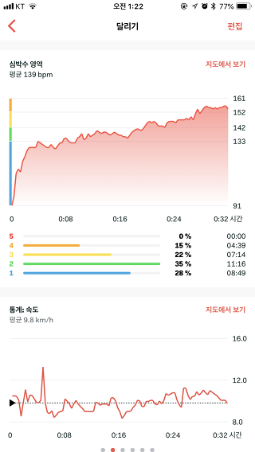

마라톤이 20 여일 앞으로 다가왔다. 등록하고 2 주가 지났는데, 그 동안 6 번정도 달려보았다. 마음먹고 달려본지가 몇년은 더 된거 같다. 절대 무리해선 안된다. 이제 팔팔한 20 대 청년도 아니고, 잘못하다가는 오히려 약값이 더 들지도 모른다. 가급적 무리하지 않는 선에서 하루에 4~5Km 정도만 달리기로 결정했다. 조금씩 거리를 늘려가다가 대회 며칠전에 8~10Km 정도를 한번 뛰어보는것으로 계획을 잡았다. 처음 뛸때는 정말 1Km 만 뛰어도 숨이 턱 밑까지 차서 죽을것만 같았다. 서너번 뛰고나니 어느정도 몸이 적응한건지, 3Km 정도까지는 쉬지않고 한번에 뛸 수 있었다. 하지만 대회는 10km 다. 10Km 면 아무나 다 뛸수 있다고 말하는 사람이 있지만, 한번도 해보지 않았기 때문에 준비해서 나쁠건 없다. 그런데 몇번 뛰다보니 과연 이런식으로 10Km 완주가 가능할지 의문이 들었다. 왜냐하면 2~3Km 뛰고 걷고, 또 뛰고 걷는걸 반복하다보니 체력이 급속도로 고갈되는 느낌이 들었기 때문이다.

마라톤 경험이 있는 친구에게 조언을 구해보았다.

"내가 뛴 기록인데, 한번 봐줘"

그 친구는 내가 뛴 기록을 훑어 보더니,

"음... 이런식으로 뛰면 10Km 못 뛰어요"

라고??

"그럼 어떻게 해야하냐?"

"처음에 천천히 뛰셔야죠"

라네...

이 친구의 조언을 듣기 전 뛰었던 결과는 아래와 같다.

< 초기의 기록: 심장이 터질거 같다 >

위의 그래프는 초기에 4Km 를 뛴 결과의 일부를 발췌했다. 윗부분의 심박수 영역을 보면, 최고 심박수가 거의 190 이다(심장 터지는거 아냐?). 10 분도 안되서 심박수가 190 에 도달했다. 문제가 있는거겠지? 아마 처음부터 너무 빠르게 뛰어서 몸이 갑자기 힘들어한것 같다. 아랫부분의 속도 그래프를 보면, 좀더 명확하게 드러난다. 확실히 초기에 빠르게 뛴게 보인다. 속도가 거의 15Km/h 에 가깝다. 15Km/h 가 엄청나게 빠른 속도는 아니지만, 나처럼 오랜만에 뛰기 시작하는 사람에게는 충분히 빠른 속도다. 초반을 지나고 시간이 지날 수록 속도는 점점 느려진다. 심박수가 너무 높게 올라가니 어쩔수 없다. 걸어야한다. 그래서 두번에 걸쳐 속도가 확 떨어진 구간이 보인다. 걷는것도 문제지만 전체적으로 봐도 페이스가 점점 떨어지고 있다. 이렇게 뛰어서는 정말 그 친구 말대로 10Km 완주가 힘들지도 모르겠다(도착은 하겠지만, 많이 힘들것 같다. 기록도 나쁘겠지).

그럼, 조언을 듣고나서 뛴 결과를 보자.

< 페이스 조절한 뒤 기록: 그래프 이쁘네 >

친구가 조언해준 내용을 잘 상기하면서 처음에 천천히 달렸다. 위쪽 그래프의 속도를 보면 초반에 거의 14Km/h 정도가 되는데, 이번 그래프의 초반 속도는 대략 10~11Km/h 정도밖에 안된다. 확실히 느려졌다. 초반 속도가 느려지긴 했지만, 전체적으로 일정한 속도로 달렸다. 오히려 시간이 지날수록 약간 속도가 올라간걸 볼 수 있다. 그리고 중요한 점은, 걷는 구간이 없다!!! 이전에 뛸때는 4Km 구간밖에 안되는데도 불구하고 두번이나 걸었다. 그런데 이번에는 지난번보다 1.2Km 정도 더 늘어난 5.2Km 구간을 뛰었다. 그럼에도 한번도 쉬지 않고 뛰었다. 당연히 전체 기록도 더 빨라졌다.

내가 몇번 더 뛰었다고 체력이 늘었다고 볼 수는 없다. 몸이 조금 적응했을지는 모르지만, 갑자기 오래 달릴 수 있다는건 말도 안된다. 이건 페이스 조절을 했기 때문에 가능한 변화다. 마라톤에는 페이스 조절이 필수다. 마라톤은 단시간에 승부를 내는 운동이 아니다. 오랜 시간을 두고 천천히 완주하는게 목표인 운동이다. 42.195Km 를 뛰는 선수들 조차 페이스 조절이 힘들어서 별도의 페이스 메이커를 두는 경우가 있다. 하물며 마라톤의 '마'자도 모르는 생초보가 체력 안배를 위한 페이스 조절 없이 완주 하겠다는건 어불성설에 가깝다.
